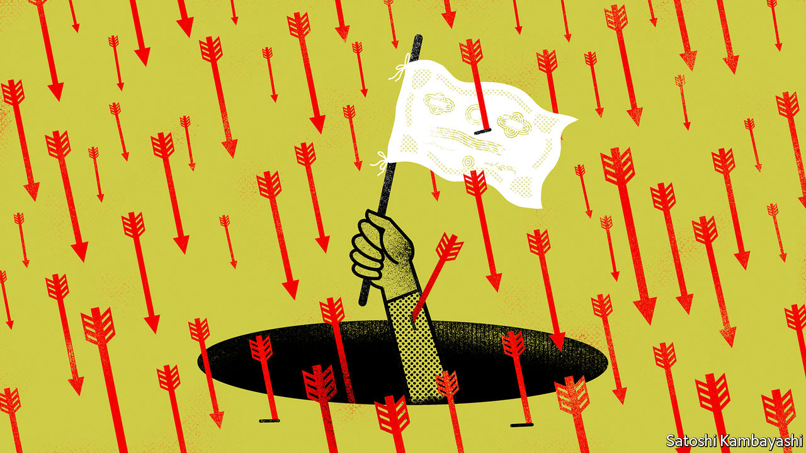

###### Buttonwood

# What past market crashes have looked like 

##### “Capitulation”, the last phase of a rout, can seem like a sort of mania 

 

> Jun 30th 2022 

Looking back, it is easy to think of stockmarket crashes as abrupt shocks. And some of the most dramatic of them were indeed abrupt. At the onset of the covid-19 pandemic, the s&amp;p 500 index of American stocks plummeted by 34% in a little over a month. The last time Russia defaulted on its debt, in 1998, the index took six weeks to travel from zenith to nadir, nearly taking Long-Term Capital Management and the rest of Wall Street with it. Quickest of all was the lightning bolt of October 19th 1987, or “Black Monday”, which wiped 20% off the market in a single day.

The biggest downturns, though, have tended to be much more drawn-out affairs. The bloodbath in equities that accompanied the financial crisis of 2007-09 was no single, vertiginous plunge: it played out over 17 months. Talk of the dotcom bubble “bursting” in the early 2000s can obscure the fact that the journey from peak to trough took two and a half years. The greatest crash of all, beginning in 1929, took nearly three years to run its course.

In each case, losing streaks were interspersed by rallies lasting weeks and fitful days when not much of anything happened. If not quite months of boredom punctuated by moments of terror, they were long, uncertain slogs. Today, six months after America’s equity market started falling in the face of persistent inflation and tighter monetary policy, another slog might lie ahead. But when the bottom finally arrives, what will it look like?

Like a bubble, capitulation—investors’ jargon for the final, frenzied phase of a rout—is accompanied by a kind of mania. It is the part of the crash when something snaps in the collective consciousness and everyone who is going to give up and sell does. Perhaps they are retail investors who kept their nerve after losing a third of their capital but, seeing another 20% of value vanish, conclude that it really might go to zero and rush to the exit. Perhaps they are professionals who know full well it’s a bad time to sell, but can’t get their risk manager (or their clients) off their back. Either way, it is the violence of the shake-out itself that creates the market bottom: those who refuse to sell at the height of the panic are unlikely to lose their cool further down the line. After the frenzy is over, prices start to climb again.

So much for recognising capitulation in hindsight. Spotting it as it happens is harder. Perhaps some clues can be gleaned from how historical crashes have played out. Start with the crudest measures: the length of the crash and the size of the drop from peak to trough. Excluding this year, the s&amp;p 500 has notched up 14 bear markets—falls of more than 20% compared with a recent peak—since the second world war. The average downturn took a little over 11 months and resulted in a decline of more than 32%. Both measures suggest that this year’s losses, which hit 23% in June before rebounding a little, may have some way yet to run. 

For a more granular picture, consider the rout in March 2020. One lesson from it is that trading volumes spike as the market plummets. Towards the end of the crash, shares in the s&amp;p 500 were changing hands at more than double their average rate in the weeks running up to it. Volumes for stocks in Britain’s ftse 100 tripled. Another signal is that a large proportion of stocks in an index plunge in value. While the downturn in 2020 was at first led by a handful of stocks, by the last phase pretty much everything was flashing red. True capitulation is reached when contagion spreads not just from one stock to another, but across indices and asset classes. 

Set against those measures, this year’s bear market is yet to reach its culmination. Investors are gloomy, but not so much that they have sold their favourite risky assets. Downward lurches have begun to include defensive stocks, but many of those in sectors including pharmaceuticals and telecoms are still up on the year. And the drops do not yet smack of panic: the s&amp;p 500’s worst day this year was its 39th-worst since the turn of the century. Trading volumes, for the most part, suggest a market that is just about holding its nerve.

If capitulation is tricky to pinpoint as it arrives, profiting from it is harder still. How many prices need to be plummeting in lockstep before it becomes time to buy? Trading volumes might have spiked, but have they peaked? Are you sure that you will keep your head when all around you are losing theirs? Studying historical crashes is one thing. Putting their lessons into practice is entirely another.


