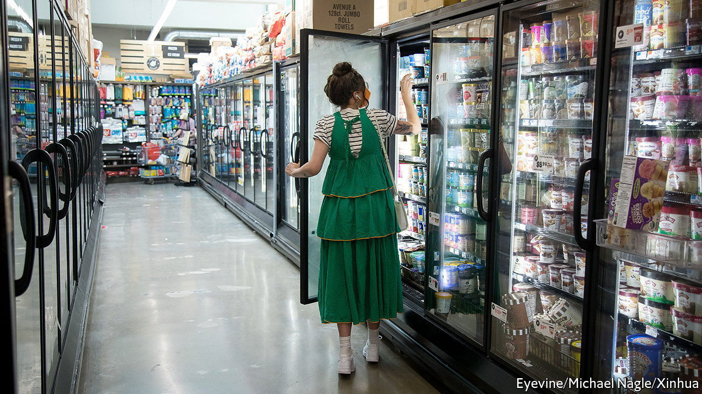
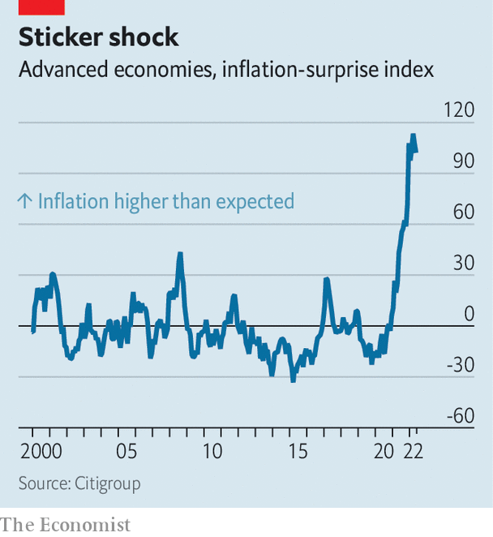
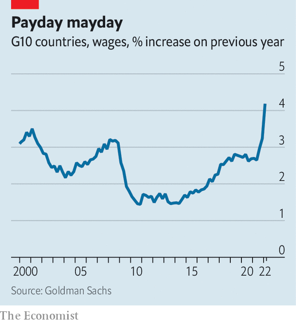

###### The top of the hill

# Why inflation looks likely to stay above the pre-pandemic norm 

##### Even as supply-chain snarls ease, wage growth and price expectations are ticking up 

 

> Jun 26th 2022 

The bad news on inflation just keeps coming. At more than 9% year on year across the rich world, it has not been this high since the 1980s—and there have never been so many “inflation surprises”, where the data have come in  than economists’ forecasts (see chart). This, in turn, is taking a heavy toll on the economy and . Central banks are raising interest rates and ending bond-buying schemes, crushing equities.  in many places is now even lower than it was in the early days of the covid-19 pandemic. “Real-time” indicators of everything from housing activity to manufacturing output suggest that economic growth is slowing sharply.

What consumer prices do next is therefore one of the most important questions for the global economy. Many forecasters expect that annual inflation will soon ebb, in part because of last year’s sharp increases in commodity prices falling out of the year-on-year comparison. In its latest economic projections the Federal Reserve, for instance, expects annual inflation in America (as measured by the personal-consumption-expenditures index) to fall from 5.2% at the end of this year to 2.6% by the end of 2023.

You might be forgiven for not taking these prognostications too seriously. After all, most economists failed to see the inflationary surge coming, and then wrongly predicted it would quickly fade. In a paper published in May, Jeremy Rudd of the Fed made a provocative point: “Our understanding of how the economy works—as well as our ability to predict the effects of shocks and policy actions—is in my view no better today than it was in the 1960s.” The future path of inflation is, to a great extent, shrouded in uncertainty. 

 


Indeed, some indicators point to more price pressure to come in the near term. Alternative Macro Signals, a consultancy, runs millions of news articles in several languages through a model to construct a “news inflation pressure index”. The results, which are more timely than the official inflation figures, measure not just how frequently price pressures are mentioned, but also whether the news flow suggests they are building up. In both America and the euro area the index is still well above 50, indicating that pressures are continuing to accumulate. 

Inflation worrywarts can point to three other indicators suggesting that the rich world is unlikely to return to the pre-pandemic norm of low, stable price growth any time soon: rising wage growth, and increases in the  of both consumers and companies. If sustained, these could together contribute to what the Bank for International Settlements, the central bank for central banks, described in a report published on June 26th as a “tipping point”. Beyond it, warned the bis, “an inflationary psychology” could spread and become “entrenched”. 

Evidence is mounting that workers are starting to bargain for higher wages. This could create another round of price increases as firms pass on the extra costs. A survey by the Bank of Spain suggests that half of collective-bargaining deals signed for 2023 contain “indexation clauses”, meaning that salaries are automatically tied to inflation, up from a fifth before the pandemic. In Germany ig Metall, a trade union, has asked for a 7-8% pay rise for nearly 4m workers in the metals and engineering sector (it will probably get about half that). In Britain rail workers went on strike as they sought a rise of 7%, though it is unclear whether they will succeed. 

 


All this will make wage growth hotter still. Already, a tracker for the g10 group of countries compiled by Goldman Sachs, a bank, is rising almost vertically. A measure of pay pressure from Alternative Macro Signals is similarly animated. And wage floors are rising, too. The Netherlands is bringing forward an uplift to the minimum wage; earlier this month Germany passed a bill increasing its minimum by one-fifth. Australia’s industrial-relations agency has raised the wage floor by 5.2%, more than double last year’s increase. 

Faster wage growth in part reflects the public’s higher expectations for future price rises—the second reason to worry that inflation might prove sticky. In America near-term expectations are rising fast. The average Canadian says they are braced for inflation of 7% over the next year, the highest figure of any rich country. Even in Japan, the land where prices only rarely change, beliefs are shifting. A year ago a survey by the central bank found that just 8% of people believed that prices would go up “significantly” over the next year (consumer prices, indeed, rose by only 2.5% in the year to April). Now, however, 20% of people reckon that will happen. 

The third factor relates to companies’ expectations. Retailers’ inflation expectations are at an all-time high in a third of eu countries. A survey by the Bank of England suggests that clothes prices for Britain’s autumn and winter collections will be 7-10% higher than a year ago. The Dallas Fed does find tentative evidence that customers are less willing to tolerate price increases than before; a respondent in the rental and leasing business complained that “it is getting tougher to pass on the 20-30% price increases we have received from manufacturers.” But that merely points to a lower level of high inflation. 

The big hope for lower inflation relates to the price of goods. Fast increases in the prices of cars, fridges and the like, linked in part to supply-chain snarls, drove the initial inflationary surge last year. Now there is some evidence of a reversal. The cost of shipping something from Shanghai to Los Angeles has fallen by a quarter since early March. In recent months many retailers spent big on inventories in order to keep their shelves full. Many are now cutting prices to shift stock. In America car production is at last picking up, which could unwind some of the outrageous price increases for used vehicles seen last year. 

Falling goods prices could, in theory, help douse the inflationary flames in the rich world, easing the cost-of-living crisis, giving central banks breathing room and buoying financial markets. But, with enough indicators of future prices pointing the other way, the odds of that happening have lengthened. Don’t be surprised if inflation roars for a while yet. ■


