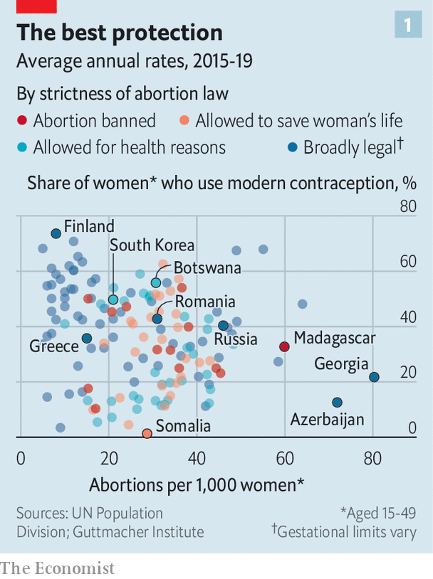
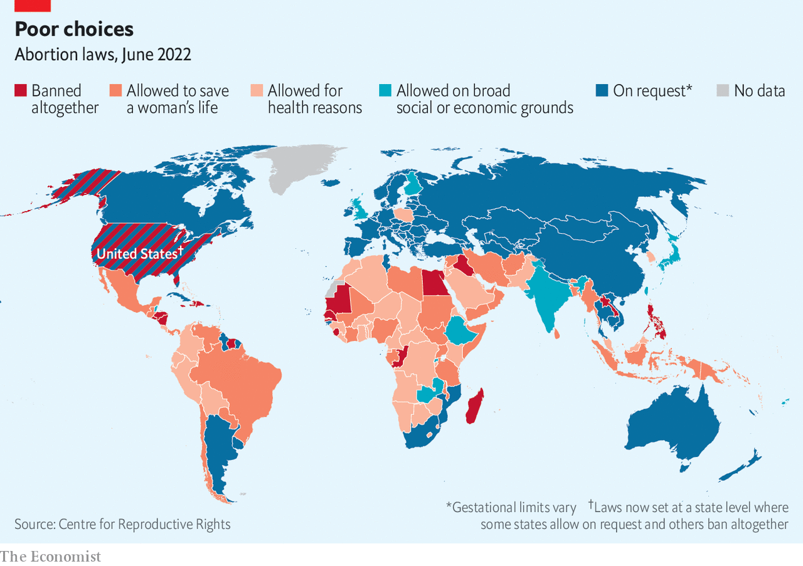
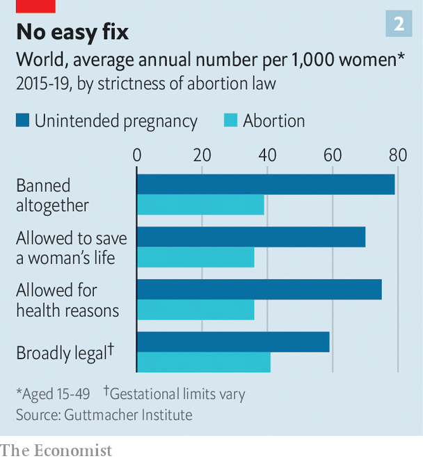

###### Severe complications

# Around the world, bans do not make abortion much rarer 

##### But they can make care for all pregnancies worse 

 

> Jun 30th 2022 

Laura buckingham could have died three times. Ms Buckingham, 37, has one son. She has also had 11 planned pregnancies that have gone wrong. In one case a miscarriage led to an infection, requiring emergency treatment. In another she had an ectopic pregnancy, lodged outside her uterus, which can cause internal bleeding. She also had a molar pregnancy in which two sperm fertilised one egg, which can sometimes lead to cancer. On each occasion prompt medical attention in Britain, where she lives, has kept her healthy. Without it, she says, “I might not be here.”

On June 24th America’s Supreme Court restored to the 50 states the power to pass their own abortion laws, which it had taken away in 1973. Within a week seven states had banned abortion (with some exemptions, such as when a woman’s life is in danger). These changes buck a global trend towards more permissiveness. Since the early 1990s more than 50 countries have loosened laws on abortion. Only 5% of women of reproductive age live in countries where abortion is completely banned. Some 36% live in places with no restrictions, at least during the first trimester.

Global evidence suggests that banning abortion tends not to reduce by much the number of abortions that occur. However, by slowing or hindering treatment in obstetric emergencies, such as those suffered by Ms Buckingham, abortion bans can make every pregnancy less safe.

Even as legal abortions have become easier to obtain, the global rate of abortion has barely changed since the 1990s, according to estimates published in 2020 in the , a medical journal. More use of contraceptives has cut the number of unwanted pregnancies. However, a higher share of these pregnancies now end in abortion. Reasons for this include a growing preference for smaller families and a trend towards starting them later in life.

At least a quarter of women in America, Canada, Britain and Australia will probably have an abortion at some point. Increasingly, that is happening when women are older—in their late twenties or thirties—and when they have already had children. Teenage pregnancies are falling steadily. That is because of better sex education and because teenagers are having less sex, and are starting later.

 


Abortion rates tend to be highest wherever use of contraceptives is low. That is especially true where people forgo the most effective methods of contraception, such as intrauterine devices (iuds) and hormonal drugs (see chart 1). In a few rich places myths about the supposed dangers of contraceptives keep usage lower even than in bits of Africa, where they can be hard to get. In Greece only half of married women use modern contraceptives. Withdrawal and condoms are popular methods. But these fail about a fifth of couples who use them for a year. A Greek woman in her 40s says that every woman she knows has had an abortion. 

 


Abortions are also quite common even in countries such as Britain, where contraceptives are available free and widely used. Each year nearly 2% of British women aged 15-44 undergo an abortion. One reason is that even the best contraceptives do not always work. Tubal ligation (a form of sterilisation) fails in one out of 200 women. Among women using contraceptive pills, 9% get pregnant in any given year. The failure rate of iuds is 1-2%. “Those are the people we see in the abortion clinic,” says Jonathan Lord from msi Reproductive Choices, a non-profit that provides family-planning services. A study in America found that most women seeking second-trimester abortions had only just found out that they were pregnant (the failure of contraceptives was a common reason for it). Irregular periods, which are common, can easily mask a pregnancy.

Few women choose to have abortions after the first trimester. Those are primarily for medical reasons or because “something calamitous” has happened, says Dr Lord. Some women have been bullied into staying pregnant by abusive partners and take time to find the courage to go to a clinic. “The later the gestation the more desperate the situation is and the more heart-rending the stories are,” he says.

Only 1% of abortions in England in 2021 were after 20 weeks of gestation. In 41% of those there were serious abnormalities with the fetus. “I call it our no-choice choice,” says Rose Losardo, a 31-year-old British woman, about the termination of her pregnancy. A scan in the first trimester showed that the baby’s head had not formed properly and amniotic fluid was eating away at its brain. The prognosis was that she would miscarry or that the baby would die within an hour of being born. “It was so painful being pregnant, knowing what was going to happen to the baby. I wanted it over as quickly as possible.”

Countries that retain tight restrictions on abortion have become more likely to make exceptions for such cases. That is part of a broader trend towards more liberal rules. Lately Argentina, Thailand, Mexico, South Korea and New Zealand have all either legalised abortion or eased restrictions on it. Most recently, Colombia made abortion legal on demand until the 24th week of pregnancy. 

Ways and means

Abortion rates are somewhat similar in countries with and without bans (see chart 2). These days abortion pills, which work in more than 95% of cases when taken during the first ten weeks of pregnancy, can be ordered online. In Brazil they are sold by illicit drug dealers. Officials in poor countries often turn a blind eye to private clinics that provide abortions in spite of the law. And many desperate women resort to backstreet ones. The World Health Organisation estimates that 23,000 women die from unsafe abortions each year. 

 


Women who live in strict jurisdictions can often escape them, as Kentucky and Alabama will soon discover. Since 2018, when a referendum in Ireland legalised abortions, doctors there have performed around 6,600 each year. But this may not be much different from the number of Irish women who were obtaining abortions before the reform. In the final year during which abortion was illegal nearly 3,000 women who got an abortion in England gave an Irish address. To that must be added an unknown number of Irish women who gave the addresses of relatives or friends in Britain, or who went elsewhere. In the years leading up to the repeal, many Irish women also obtained abortion pills over the internet, or through activist groups, without having to travel. Organisations such as Women on Web, a group based in Canada, post the pills to women around the world.

Poland only allows abortions in cases of rape, incest or to save the woman’s life. In 2020 only 23 abortions were permitted because of these circumstances. federa, a Polish campaign group, reckons there could be 150,000 illegal abortions a year. Many are done using pills. Women also go to clinics in neighbouring countries. In 2021, when Poland tightened its rules by banning abortions even in cases of severe fetal abnormalities, a clinic for late-term abortions in the Netherlands treated about 400 Polish women. That was five times the number it had seen in previous years. In America mobile abortion clinics are setting up near the borders of states with bans. Activists are helping women in those states get hold of abortion pills.

All this suggests that new rules in America will not prevent most women who want an abortion from getting one (though the task will become more onerous and expensive). But global experience also suggests the bans could lead to worse care for women suffering serious complications of pregnancy, such as those that cause miscarriage. Three problems in particular can cause danger in the second trimester of pregnancy: a rupture of the amniotic sac (when a woman’s waters break prematurely, which can lead to infection); a problem with the placenta (which leads to bleeding); and pre-eclampsia (when blood pressure rises to dangerous levels). 

All these can require what doctors call “evacuation of the uterus” to save the mother’s life. The same procedure is used in abortions. Trainees often hone their skills in abortion clinics, which have lots of patients and pre-scheduled appointments. When there are no abortions, the volume of procedures they can do when they are training drops dramatically. One academic in Texas has resorted to using a small watermelon as a stand-in for a uterus to teach residents how to manage the loss of a pregnancy. 

Almost all abortion bans, including the new ones in America, make an exception when the procedure will save the mother’s life. But applying these rules can be messy. Doctors in America worry about being accused of breaking the new abortion laws if they are deemed to have acted too early. Carrie Cwiak of the Emory University School of Medicine in Atlanta says that most of the women who visit her hospital while undergoing a miscarriage get there before their life is at risk. Removing fetal tissue in a timely manner stops them getting deathly ill. But every case is different and some women get sick much faster than others. “Doctors are going to be in this limbo of trying to predict how sick they have to allow their patients to become in order to comply with the law,” says Cassing Hammond from the Northwestern University Feinberg School of Medicine in Chicago.

Poland’s recent tightening of abortion rules has had a “chilling effect” on doctors, says Kamila Ferenc from federa. At least three women have recently died of pregnancy complications because doctors waited too long. Ms Ferenc says some doctors have stopped treating ectopic pregnancies. These account for 1-2% of all pregnancies and are typically removed because there is a risk that they cause ruptures, internal bleeding and infection. Even when an infection that results from such complications is treated successfully, the damage that it creates can cause infertility.

As rules tighten, American women experiencing common complications of pregnancy may suffer harm from delayed or inexpert care. Some will probably die as a result. As in Poland, doctors providing life-saving treatments for pregnant women may find that doing their jobs becomes even more of a stretch. ■

