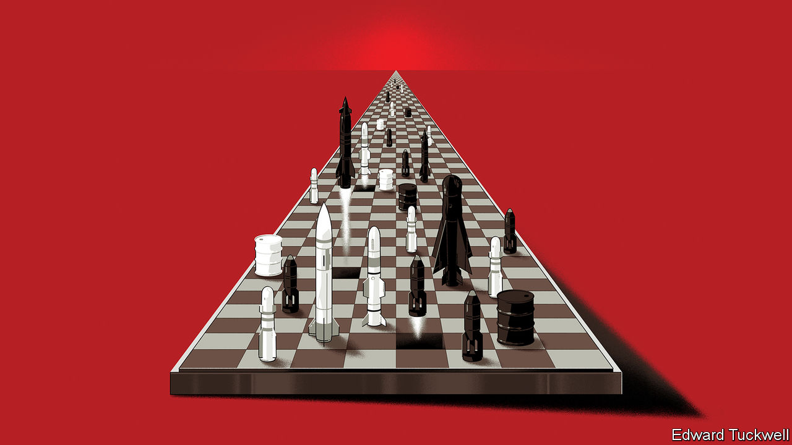

###### Russia advances in Donbas

# How to win Ukraine’s long war 

##### After doing well early in the war, Ukraine is losing ground. What next? 

 

> Jun 30th 2022 

Ukraine won the short war. Mobile and resourceful, its troops inflicted terrible losses and confounded . Now comes the long war. It will drain weapons, lives and money until one side loses the will to fight on. So far, this is a war that Russia is winning. 

In recent days its forces have taken the eastern city of . They are advancing on Lysychansk and may soon control all of Luhansk province. They also threaten Slovyansk, in the north of next-door Donetsk. Ukrainian leaders say they are outgunned and lack ammunition. Their government reckons as many as 200 of its troops are dying each day.

Fortunately for Ukraine, that is not the end. The Russian advance is slow and costly. With nato-calibre weapons, fresh tactics and enough financial aid, Ukraine has every chance of forcing back Russia’s armies. Even if lost territory will be hard to retake, Ukraine can demonstrate the futility of Vladimir Putin’s campaign and emerge as a democratic, Westward-looking state. But to do so it needs enduring support. And that is still in doubt.

On the face of it, a long war suits Russia. Both sides are using huge amounts of ammunition, but Russia has vastly more. The Russian economy is much larger than Ukraine’s and in far better shape. In pursuit of victory, Russia is willing to terrorise and demoralise the Ukrainians by committing war crimes, as it did by striking a shopping mall in Kremenchuk this week. If needs be, Mr Putin will impose grievous suffering on his own people. 

However, the long war does not have to be fought on Mr Putin’s terms. Potentially, Ukraine has vast numbers of motivated fighters. It can be supplied by the West’s defence industry. In 2020, before sanctions, the economies of nato were more than ten times bigger than Russia’s. 

Ukraine’s turnaround begins on the battlefield, by stopping and reversing the . Mr Putin’s generals will continue to have more weapons, but the sophisticated nato systems now arriving have longer range and greater accuracy. By adopting tactics devised in the cold war, when nato too was outnumbered by the Red Army, Ukraine should be able to destroy Russian command posts and supply depots. Ukraine scored a success on June 30th, when it used nato weapons to drive Russian forces off Snake Island, a strategic prize in the Black Sea. It should aim to impose a “hurting stalemate”, in which it takes back similarly symbolically important territory, such as the city of Kherson, imposing a heavy price on Russia.

If Russia starts to lose ground on the battlefield, dissent and infighting may spread in the Kremlin. Western intelligence services believe that Mr Putin is being kept in the dark by his subordinates. He has a habit of replacing his commanders—reportedly including General Alexander Dvornikov, brought in after the invasion’s first chaotic weeks. The West can raise the cost to Russia of a long war by continuing to press sanctions, which threaten lasting harm to Russia’s economy. It can split Russia’s elites from Mr Putin by welcoming dissenters from business and politics, and encouraging them to see that their country should not throw away its future on a pointless and costly campaign.

Will the West stay the course? At a summit on June 23rd, the European Union awarded Ukraine candidate status, promising a deep level of engagement over the next decade. At another summit in Germany this week, the g7 affirmed and strengthened sanctions against Russia. And at a third in Madrid,  acknowledged the Russian threat by substantially increasing its presence on the alliance’s eastern front. 

Yet Ukraine is a heavy burden. Western defence industries are formidable, but struggle to produce large volumes, especially of ammunition. Ukraine’s government has a monthly deficit of $5bn and the country will need rebuilding after the war. Public support for Ukraine in the West will be buffeted by a host of pressures, from inflation to elections—including, as soon as 2023, campaigning in America that may involve a presidential bid by that Ukrainophobic Putin admirer, Donald Trump. 

And the global costs of a long war will grow. Mr Putin has been blockading exports of grains and sunflower oil from Ukraine’s ports, which will cause unrest and starvation in poorer importing countries. He seems to be trying to create  this winter by preventing members from building stocks over the summer. If unity falls apart over energy, as eu states hoard gas, it will disintegrate over Ukraine, too. To complicate matters further, nato members worry that if Ukraine gains the upper hand, Mr Putin will escalate. That could draw them into a catastrophic war with Russia. 

You can see where Mr Putin is heading. He will take as much of Ukraine as he can, declare victory and then call on Western nations to impose his terms on Ukraine. In exchange, he will spare the rest of the world from ruin, hunger, cold and the threat of nuclear Armageddon. 

To accept that deal would be a grave miscalculation. Ukraine would face permanent Russian aggression. The more Mr Putin believes he has succeeded in Ukraine, the more belligerent he will become. He set out his ambitions in a speech this month, smirking as he talked about how Peter the Great seized parts of Sweden. He will fight tomorrow with whatever weapons work for him today. That means resorting to war crimes and nuclear threats, starving the world and freezing Europe.

The best way to prevent the next war is to defeat him in this one. Leaders need to explain to their people that they are not only defending an abstract principle in Ukraine, but also their most fundamental interest: their own security. The eu needs to shore up its energy markets so that they do not fracture next winter. Ukraine must have more weapons. The risk of escalation today is real, but if a bad peace is forced on Ukraine Mr Putin’s nuclear threats will not stop. They will only become more dangerous, especially if Russia’s conventional forces are at a disadvantage. 

In the long war ordinary Russians will suffer and Ukrainians endure unspeakable pain for Mr Putin’s vanity. To prevail means marshalling resources and shoring up Ukraine as a viable, sovereign, Western-leaning country—an outcome that its defiant people crave. Ukraine and its backers have the men, money and materiel to overcome Mr Putin. Do they all have the will? ■


