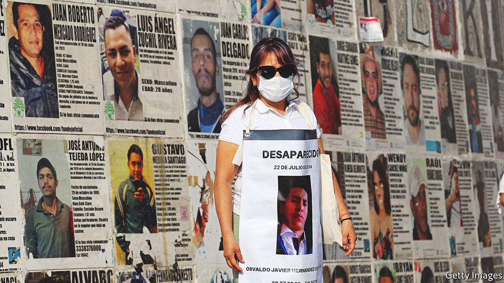

###### Mexico’s shame

# Staggering numbers of Mexicans are vanishing. Here’s how to save them 

##### End the war on drugs, and investigate disappearances properly 

 

> Jun 30th 2022 

The numbers would be shocking in a war-torn dictatorship, let alone a peaceful democracy. In May Mexico’s official tally of  exceeded 100,000. That cumulative total does not include those who have subsequently been found, either alive or dead. Some 52,000 unidentified corpses lie in morgues across the country. Hardly any cases result in justice for the victims or their families. 

The root of the problem is drug prohibition. Narcotics are popular but illegal nearly everywhere. Mexico has a long land border with the United States, the world’s biggest market. Control of smuggling routes generates vast profits, which criminal gangs fight to control. Some seek to intimidate rivals by dumping fresh corpses in the street. But most prefer a more discreet approach. Victims are abducted, murdered and buried in lonely patches of desert. All their families know is that they have a hole in their midst. 

The problem is getting worse. Each day 25 people are reported missing, up from one a day in 2006. Some 80% of reported disappearances have occurred since that year. The pace at which Mexicans went missing rose sharply after Felipe Calderón, president from 2006 to 2012, stepped up the war on drugs by sending the army to fight criminal gangs and kill their leaders. The newly leaderless gangs splintered: the number of criminal groups more than doubled between 2010 and 2020. With more gangs fighting over the same turf, the number of murders soared—and so did the number of unsolved disappearances. 

These are a symptom of the impunity enjoyed by Mexico’s criminal underworld, as is the state’s failure to investigate them properly. The victims are mostly poor, and many are gangsters. Voters and officials have long dismissed them as people who chose “the wrong path”, though plenty were witnesses or, increasingly, women who were kidnapped and trafficked. The only people who have doggedly tried to find the disappeared are their mothers. Groups of relatives have clubbed together to interview witnesses, search for mass graves and fill the gap left by an indifferent state. It was only after 43 student teachers vanished in 2014 (and were apparently murdered with the collusion of corrupt officials) that the government set up a national commission to search for missing people and required police to accept reports of disappearances promptly. 

Andrés Manuel López Obrador, Mexico’s president since 2018, has taken a different approach to the drug war, which has also failed. Under the slogan “hugs not bullets”, he has told the army not to confront drug gangs. In effect, he has left them to get on with their business. The violence has intensified and the pace of disappearances has increased. In May the government passed a law to set up a forensic centre and national dna database to identify bodies of the missing. Mr López Obrador has increased the National Search Commission’s budget, but at $37m a year it is just 1% of what he is spending on a new tourist railway in 2022.

Until the United States legalises drugs, Mexico will always have a gang problem. Yet it could reduce the harm if it did more to end impunity for murder. A good start would be to investigate every disappearance properly. That means hiring more forensic experts, building more laboratories and cleaning out corrupt police forces. By one estimate it could take 35 years just to clear the backlog of unidentified bodies. The time to start is now. ■

