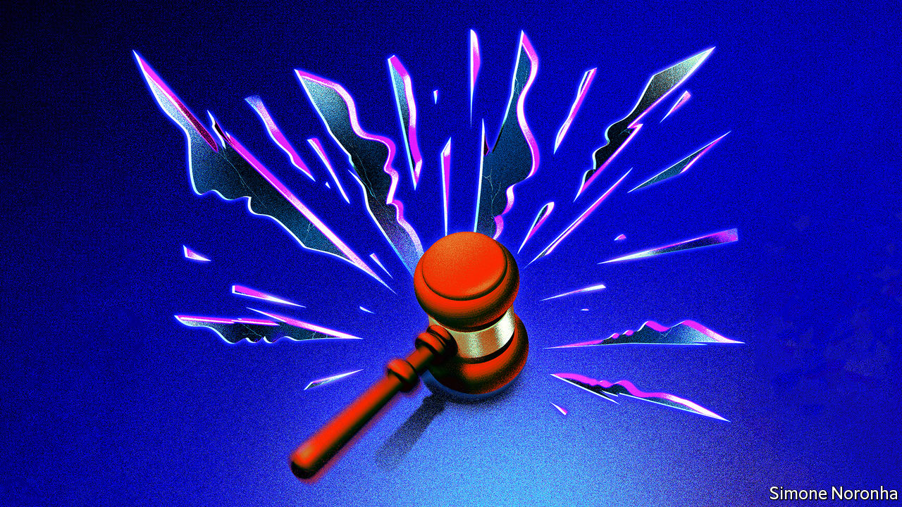

###### Rights and wrongs

# The Supreme Court’s judicial activism will deepen cracks in America 

##### The country needs to find a better way of resolving its thorniest issues 

 

> Jun 29th 2022 

It was hardly a surprise. The Supreme Court’s move to , the decision in 1973 that American women had a constitutional right to abortion, had been expected since a draft majority opinion  in early May. And drama from the court was almost inevitable after Donald Trump seated three justices, giving it a 6-3 conservative supermajority instead of the 5-4 balance, with a swing vote in the middle, that had prevailed since the 1970s. Even so, when  in  came on June 24th, it was a shattering blow to those, like this newspaper, who believe in the right to abortion. Chief Justice John Roberts, who cautioned against a “dramatic step”, could not prevent the court from withdrawing a right that Americans had relied on for nearly half a century and which a majority of them have consistently supported. 

The ruling is the most striking of the court’s decisions in its current term, but abortion is not the only area where it has radically tipped the scales. The justices have also loosened gun laws and eroded the separation of church and state (see United States section). If their final big verdict goes as expected, they are about to limit the Environmental Protection Agency’s ability to regulate emissions from power plants, undermining the Biden administration’s hopes of halving climate-changing carbon-dioxide emissions by 2030. Just 25% of Americans have confidence in the court, an all-time low, according to recent Gallup polling. That has not deterred the justices from embarking on a spree of judicial activism that will further deepen cracks in America.

The impact of the abortion ruling is immediate and severe. The court has sent the matter back to the states, 13 of which have trigger laws that ban abortion or will do so soon. Women in conservative states have for years had to make  to find health care that in most of the rich world is available free and close to home. The sudden disappearance of abortion provision in more than a dozen states will cause the most harm among the poorest women, and those suffering complications in pregnancy (see International section). One consequence may be a further rise in America’s maternal-mortality rates, already the highest by far among rich countries. 

It is true that  rested on shaky legal arguments. This left the right it sought to enshrine open to repeated legal attack by a highly motivated minority. The resulting fight has poisoned politics and dragged the court into the partisan mire. It has also now put other cherished rights at risk. The rulings that established the rights to contraception and same-sex marriage, for example, rest partly on the same interpretation of “due process” under the 14th Amendment that underpinned the right to abortion. In his opinion last week Clarence Thomas, the most conservative justice, made it clear that he believes these are ripe for reversal. 

Thankfully, America is not about to ban gay sex or same-sex marriage. Too many voters would resist any such effort, and the court does not seem to have an appetite for it. Samuel Alito, the justice who wrote the opinion for the conservative majority overturning , sought to throw cold water on the idea: “Nothing in this opinion should be understood to cast doubt on precedents that do not concern abortion,” he wrote. Yet Justice Alito and Justice Thomas noted in 2020 that they would like to overturn the 2015 decision that established a constitutional right to same-sex marriage. Those rights no longer look quite so secure.

The repercussions of the court’s activism will play out over years, and the response should be calibrated accordingly. The short-term priority for defenders of abortion rights must be to help women in states where it is now banned or hard to obtain. That means support for travel to states where abortion remains legal. It also means making sure women have ready access to a method of abortion that did not exist at the time of : , which allows women to end pregnancies at home safely up to 11 weeks. The Food and Drug Administration has dropped a requirement that obliged a woman to collect one of the two drugs involved from a health-care provider. But it still imposes unnecessary rules on supply of the drugs. They should go. Better access to contraception, resisting conservative efforts to restrict funding for reproductive health, would help reduce demand for abortions in a country that has a high rate of unintended pregnancies compared with many others in the West. 

The Justice Department rightly plans to push back against states that try to prevent access to abortion medication. But however tempting it may be, the Biden administration cannot use its majority to force through new national rules by ending the filibuster in the Senate (which requires 60 of the 100 votes to pass most laws), because such a move itself lacks support. Packing an expanded court with liberal justices would be no way to settle complex arguments, and could rebound badly once political power changes hands.

In the medium term it would be nice to think that the justices, mindful of the court’s diminishing reputation, will start to exercise more self-restraint, including an embrace of term limits for themselves. Sadly, there is little sign that they will be in a mood for that. It will instead fall to voters to signal to conservatives that there are costs to running amok, and to influence the laws, state by state, that better reflect what Americans really want on the thorniest issues such as abortion—which one side believes to be murder and the other a fundamental right for women. A polarised country seems poorly prepared for the sort of debate this requires. But it is what America needs, and in some of the more finely balanced states it is possible to imagine the re-emergence of the art of compromise.

Never surrender

That points to the longer-term solution, which is federal legislation to fill the vacuum that sucks in the justices. The conventional view is that this cannot happen, because of congressional gridlock. Yet that is not necessarily so, as  just signed by President Joe Biden shows—the most significant gun-control legislation in nearly three decades, passed by the Senate on the day that the Supreme Court moved in the opposite direction on guns. With sufficient pressure from voters, even Congress could, eventually, stir itself into action. ■


