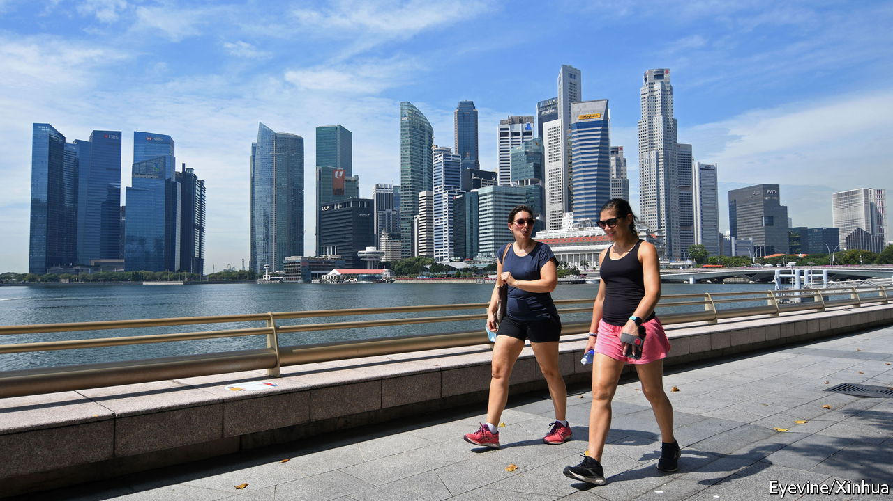

###### Global business centres

# The biggest risks to Singapore’s primacy in Asian finance are at home 

##### The pecking order of financial centres is changing 

 

> Jun 30th 2022 

International financial centres play a crucial role in the world economy. They act as launching pads for ideas and bring together expertise, capital and entrepreneurs. Right now the map of  is being redrawn. The city-state of Singapore looks to be the main beneficiary—provided it can handle some of the downsides of being a global centre for other people’s business. 

Asia makes up more than a third of global gdp and its weight in the world economy is continuing to rise. The role of entrepots is especially important in the region, which hosts a baffling mix of political and legal systems. Plenty of economies are smothered by their regulatory regimes, and the region’s two emerging giants, China and India, have partial capital controls.

As a result, businesses operating in Asia have a high demand for places that are open and which transcend national differences. In the past 200 years many hubs have played this role, including Calcutta (now Kolkata) in India and Penang in modern-day Malaysia. In the 1980s Tokyo had hopes of becoming top dog, but they were dashed by Japan’s financial crisis. 

Now the options are shrinking. As China grows more authoritarian, the chances of Shanghai resuming its pre-1949 role as a global hub have receded. In a recent survey by the American Chamber of Commerce in Shanghai, only one American firm in the 133 that were surveyed planned to increase its investment in China. Even after this week’s announcement that China’s quarantine rules are being relaxed, memories of Shanghai’s draconian lockdown linger. Hong Kong is suffering, too. This week marks the 25th anniversary of its return to Chinese sovereignty. Many of its freedoms have been torn up by thuggish Communist Party rule. In commerce there are growing doubts over the independence of its judiciary and institutions. 

Singapore is best placed to benefit. It has an effective and predictable government, a reliable legal system and a business-friendly regulatory environment. The government’s long commitment to a neutral role in international affairs allows it to act as a hub for both Western and Chinese capital and businesses. The city has improved its ability to identify dodgy money. Speech is still more curtailed than in America or Europe, but is far freer than in mainland China—or, sadly, Hong Kong. 

Reflecting this, companies ranging from BlackRock, an American asset-management giant, to Sinovac, a Chinese pharmaceutical firm, are expanding in Singapore. Over 100 family offices have domiciled their wealth there this year, bringing more capital from the West, China and the rest of Asia to the city.

Singapore is also becoming a tech centre. It hosts both American firms building a base in Asia, and Chinese tech contenders launching their international operations. Alphabet, Meta and Microsoft, and Alibaba, Tencent and TikTok have all made the little red dot their regional or global home. By contrast,  prevents its cities from becoming bases for global tech firms. Hong Kong has also floundered over technology. The city’s intellectual-property payments and high-tech exports as a share of total trade are ranked 54th and 121st in the world respectively. By contrast, Singapore comes 15th and 1st respectively on the same two measures. 

Small and dutiful

Singapore faces risks, inevitably. The Chinese government could come to its senses and reverse the policies stifling its own international hubs. India may deregulate and open up to international capital flows, giving Mumbai a greater role in global finance. 

For all its strengths in asset management and hosting multinationals, Singapore is relatively puny in share trading and in banking. Maintaining diplomatic neutrality as America and China clash will be fiendishly difficult. And , though stable by global standards, faces a leadership succession in the ruling party and resentment towards wealthy expatriates as the island grows more crowded. Still, the city-state possesses rare and valuable attributes. A bigger role in the region is there for the taking. ■

