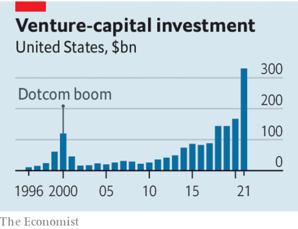

###### Technology investing

# Venture capital’s reckoning 

##### Why there won’t be a rerun of the dotcom crash 

 

> Jun 30th 2022 

The venture-capital bull run of the past two decades transformed what was once a cottage industry in Silicon Valley into a huge machine for building globally dominant companies. Over $600bn of venture funds were invested worldwide last year, nearly ten times the level a decade ago. Venture capital (vc) spread into new sectors, drew in new participants and became more global. Valuations rocketed as a sense took hold that the good times would never end.

Now the war in Ukraine, China’s purging of its tech industry and rising interest rates mean  machine is earthbound. Public markets were the first to be hit. The nasdaq index, which is weighted towards technology companies, has fallen by nearly 30% so far this year in a gruesome reckoning. The amount of capital raised through initial public offerings so far in 2022 is down by about 50% globally and by more than 70% in America compared with the same period last year. 

The public-market bloodbath is inevitably hurting the vc world. Losses in end-investors’ public portfolios put pressure on their private ones. Pension funds and endowments that committed large amounts of “dry powder” to private markets are trying to preserve cash by asking vcs to slow their pace of investing. Because there are more crossover funds, such as Tiger Global Management, which invest in several corners of the capital markets, the connection between public and private valuations has strengthened. Global investments made by vc funds in startups in May were worth $39bn, about 30% less than the monthly average for 2021. Already, 68% of vc funds are reporting markdowns of valuations in their portfolios.

 


Startups that rely on vc cash are, unsurprisingly, feeling the pain. Fledgling firms with little cash saved, especially in competitive sectors such as food delivery, will fare worst. And after a long boom, expect some dubious behaviour to be revealed. One concern is how interlinked tech firms might be. Some apparently profitable startups are earning money by providing services, from digital marketing to cloud computing, to other startups that are losing money and that in turn rely on endless blank cheques from their vc sponsors. 

Pessimists note that vc slumps take years to bottom out. Downturns caused by inflation and an oil shock meant the amount of money flowing into vc funds fell by 94% between 1969 and 1975. After the peak of the dotcom bubble, the rate at which vc funds deployed capital fell for more than two years. 

Yet despite all this, the correction will not be as bad as the crash of 2000-01. For one thing, plenty of startups have built up war chests and so have healthy balance-sheets. Assuming a typical cash-burn rate, all but three of the 70-odd biggest software startups have raised enough funds to last until 2025.

The vc industry is more institutionalised, too.  from Europe to Asia are less dependent on flighty American capital and have enduring links to local financial firms and entrepreneurs. End-investors such as pension funds and endowments have experienced enough of tech’s transformative effect on the economy to know not to run away. 

Most important, the opportunity for innovation remains vast. The potential market for technology products has expanded hugely, beyond the bastions of business and consumer computing, to affect all parts of the business world, from biotech to supply-chain monitoring. What emerges from the chaos will be a leaner and more efficient industry—and one that will remain a powerful force. ■

