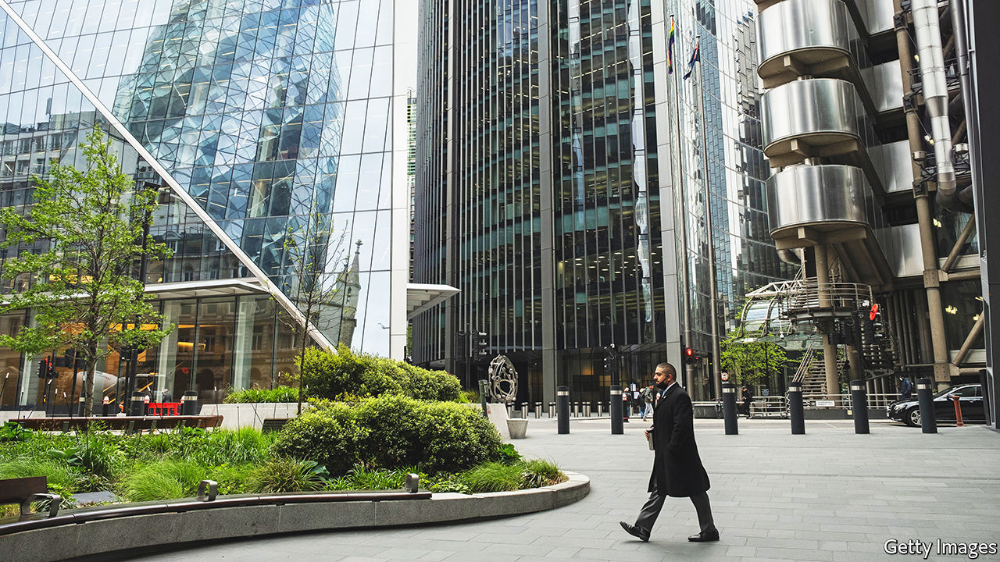

###### On artificial intelligence, greener buildings, inventory cycles, the subjunctive, cheap wine

# Letters to the editor 

##### A selection of correspondence 

 

> Jun 30th 2022 

Lower expectations for AI

Your briefing on the charismatic foundational models in artificial intelligence obscured what aspect of ai is actually useful (“”, June 11th). The technologies you covered will provide little value in optimising energy production, securing the next generation of telecommunications infrastructure, or proving the safety of an aeroplane. These are the everyday problems on which we must today focus our efforts in applying ai. As a comparison to our being misled, we might count the years in which fully autonomous driving has been predicted to arrive soon. 

A vanishingly small number of firms have internet-scale data along the lines of Meta or Amazon. For everyone else, what is needed are the construction of provably compositional systems using a combination of deterministic ai working alongside the more flashy Hollywood-ready developments you highlighted. 

The trendy foundational models of deep learning are not software composable. This is a limitation of the models and means that they will always have weaknesses that are more appropriate to jobs with low-consequence outcomes. Deploying this tech alone in life-critical environments is not currently solvable with just bigger models. Apparently, the promise is that I might “soon” model any industrial problem as long as I have the computer-processing power of Sweden, the electrical capacity of Africa, and the entire storage capacity of Google. This is likely to have as much practical application to most people’s business problems for the next decade as the physics of string theory.

eric daimler

Chief executive

Conexus ai


The writing of computer code only accounts for a small portion of the time required to develop software. As Fred Brooks stated in his classic essay, “No Silver Bullet”, written in 1986, “the hard thing about building software is deciding what one wants to say, not saying it.”

So, even if programmers have new tools that let them write computer code in plain English, we will still be spending all of our time trying to figure out how to express the thoughts in our head. Perhaps programmers may require the help of editors in the future?

dan mcnulty


 


ai systems are now so sophisticated that they “possess a grasp of language”, you say (“”, June 11th). However, Global Witness has been conducting field tests of Meta’s artificial-intelligence systems and found them to perform appallingly, despite the fact that Meta says its computers’ ability to understand language is industry-leading. 

We made our tests as easy as possible. We picked countries on Facebook which Meta says it has prioritised (Myanmar and Ethiopia), used the most widely spoken languages in those countries (Burmese and Amharic) and tested their ability to detect the most extreme form of hate speech, including calls to genocide, all of which were stated in shockingly clear language. We conducted the tests by submitting these real-life examples of hate speech to the company in the form of adverts, a methodology that allowed us to record whether Facebook approved the ad for publication or not and then delete it before it was actually published. Facebook failed to detect every single hate-speech ad we submitted. 

Why is it that one of the world’s richest companies, which says that it has trained machine-learning systems to detect hate speech in Burmese and Amharic, can’t do the task? Is it that none of their systems is up to this, or is it that they have not invested enough in non-English languages? 

rosie sharpe

Global Witness


Maybe it’s just me, but the AI-created cover art of your American and Asian editions bears a striking resemblance to Seven of Nine, the Borg drone character of Star Trek: Voyager. Seven was born human, captured and assimilated by the Borg as a child, then ultimately severed her connection to the Borg hive mentality and re-established some of her human individuality, although she never completely lost certain Borg traits. Jeri Ryan, the actor who played Seven, said that “combining non-human qualities with an attractive human appearance” was significant to the character’s success in the show.


Interesting that some 27 years later, your AI foundational model, having been “trained” using “millions or billions of examples of texts, images or sound clips” somehow managed to produce the face of Seven of Nine to represent itself.


LORÉ McLAREN


 


Conserving buildings

Regarding efforts to make the building industry greener (“”, June 18th), the use of manufacturing materials accounts for more than 10% of global emissions, much more than aviation. Although “low-carbon” concretes and steels are being sold today, they work either by substituting virgin materials for waste products (none of which exist in volumes even close to what is required to decarbonise the industry), or are based on technical innovations that are still in the lab and not yet proved at scale.

Instead, the building industry must focus on using materials more efficiently, particularly in the richer countries of the world, where we currently use far more material than is necessary to meet our safety codes. This is often done in the name of simplifying designs to minimise labour costs, or enabling extravagant architectural visions. We also demolish buildings that could be kept, reinsulated and extended, an option that would lead to carbon savings in almost every instance.

The Netherlands introduced laws in 2013 that limit carbon emissions per square metre of construction. It is time that countries like America and Britain followed suit.

will arnold

Head of climate action

Institution of Structural Engineers


Architects (of which I am one) must also share the blame for the ponderously slow uptake of ecologically advanced design by the construction industry. Too often preoccupied tinkering with cosmetic glassy facades on high-rise offices with cookie-cutter floor plans, they forget that buildings and their occupants form organisms with their own metabolism and impact on the environment, good or bad, but mostly bad.

It is a matter of making an effort and, sadly, putting palm trees in entrance lobbies is about as far as many of them can be bothered to go. There are notable exceptions but they are few and far between.


DAVID NIXON


 


Inventory flows

Buttonwood’s column on the return of the inventory cycle () noted that, in times of frequent supply-chain disruptions, companies respond by increasing inventory levels, and that such stockpiling could lead to higher volatility in corporate earnings. Recent government regulations, such as the eu’s Late Payment Directives, that limit the duration of trade credit add another layer of complication. Although such regulations are intended to alleviate the financial burden on smaller businesses, our research has shown that as trade credit is an indispensable source for companies to finance their inventory, simply limiting payment terms could result in more frequent out-of-stock situations and lower retail revenue.

We must prepare for the challenging environment that companies face in financing a healthy level of inventory. That means more innovative financing mechanisms, such as technology-enabled inventory financing, and supply-chain finance solutions that allow companies in a supply chain to share their working capital more efficiently. 

s. alex yang

Associate professor

London Business School

 


I wish it were not so

Johnson’s column on the history of the subjunctive in British and American English () reminded me of a radio-show guest on the bbc whose father, he said, relished British B-movies of the late 1940s and early 1950s. In one such film a bad guy points a gun at a policeman, who says: “I wouldn’t do that if I were you.” The bad guy responds: “Why are you using the subjunctive, inspector?” 

mike gordon


Not-so-cheap plonk

Your article on American supermarkets mentioned Trader Joe’s and its $2 range of wines (“”, June 4th). I regret to inform you that Two Buck Chuck is now $3.49 a bottle. Oh woe is us. Inflation took away a nice cheap wine. Or should that be whine? 

ted fisk


