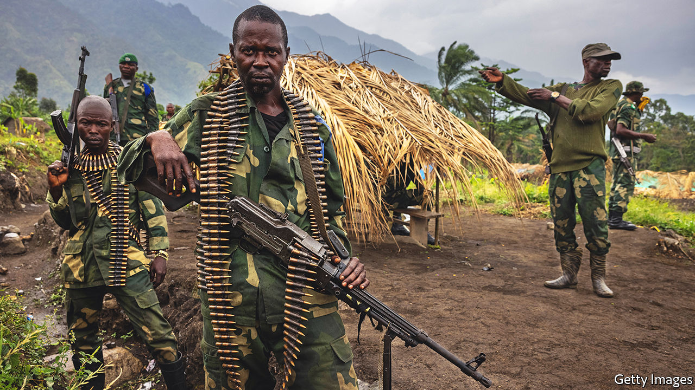
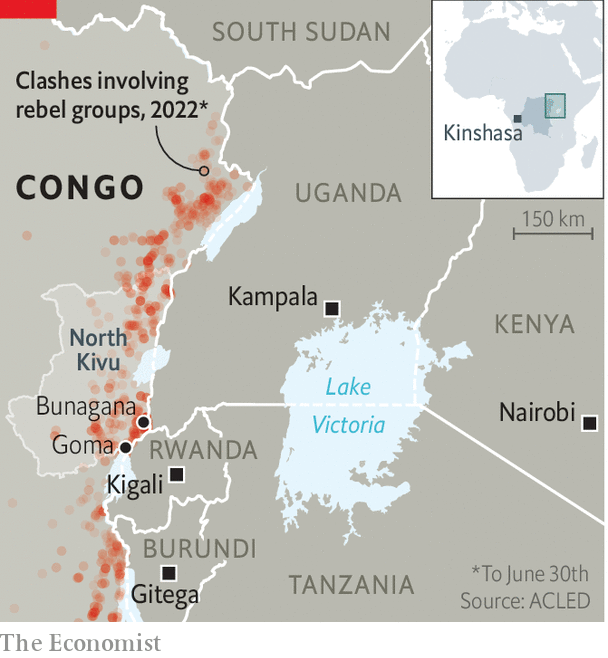

###### Echoes of war

# A resurgence of regional rivalries imperils eastern Congo 

##### Meddling neighbours add to the mayhem 

 

> Jun 30th 2022 

The blood-soaked east of Congo can seem depressingly complex. More than 120 armed groups—a few with political aims, most mineral-hungry bandits with ak-47s—make life miserable for millions in a vast region stretching from South Sudan to Tanzania (see map). Congo’s neighbours, especially Rwanda and Uganda, have a history of fighting on its soil and looting the minerals beneath it. During the second Congo war (1998-2003), anywhere from 800,000 to 5m people died, mostly of war-related hunger or disease. 

To simplify things, consider that it is almost 1,600km from Kinshasa, the capital of Congo, to Goma, the main city in the east. Nine other African capitals are closer. Maps show roads linking Congo’s east and west, but on the ground they are often not there. The government in Kinshasa struggles to find out what is happening in the east, let alone govern it. 

Such geographical constraints did not stop Félix Tshisekedi from pledging to pacify the region when he became Congo’s president in 2019, after a rigged election. Yet today the army is in danger of being overrun in the east by just one rebel outfit, known as m23. Though no one expects a third great war, few predict peace, either. 

 


m23’s attacks in recent weeks have displaced tens of thousands of people, and led to fears that the group intends to capture Goma, a city of about 2m. The rebels began their offensive in November, emerging from hideouts in a volcanic mountain range tucked into a corner of Congo that borders both Rwanda and Uganda. Since May they have attacked army bases and captured more territory. On June 13th they seized Bunagana, a town on Congo’s border with Uganda where they have been “taxing” cross-border trade.

m23 is led by ethnic Tutsis, Rwanda’s minority group and the main victims of the genocide in 1994, which was perpetrated by Rwanda’s then Hutu-controlled government. The militia emerged in 2012 with the backing of Rwanda and soon captured Goma. That prompted the formation of a un intervention force, which attacked its bases in Congo, and international pressure on Rwanda to cut its supply lines. 

After Congolese and un troops defeated m23 in 2013, the group splintered and fled into Rwanda and Uganda. Both of Congo’s neighbours refused to extradite the group’s commanders, enabling them to escape justice for war crimes. In 2017 its members slipped back into Congo.

m23’s latest offensive has been confined to a small patch of North Kivu province, where thousands of un troops are stationed. Things could get worse. The un says m23 has sophisticated firepower and the ability to target aircraft, adding weight to accusations it downed a un helicopter in March, killing eight peacekeepers. Congo’s army has had to redeploy troops who had been fighting jihadists affiliated to Islamic State and calling themselves the Allied Democratic Forces (adf). This group was responsible for bomb attacks in Congo and Uganda’s capital, Kampala. “Tshisekedi looks like he may lose control over large parts of the east,” says a fretful diplomat.

More importantly, though, the resurgence of m23 signals renewed meddling in eastern Congo by its neighbours as well as fresh sparring between them to control its mineral wealth. Congo’s government accuses Rwanda of once again backing m23 (which Rwanda strongly denies). Rwanda’s president, Paul Kagame, retorts that Congo’s army is enlisting the support of a Rwandan rebel group originally formed by Hutus accused of involvement in the genocide. As tensions between Congo and Rwanda ratchet up, so too does ethnic hatred. Angry mobs in Kinshasa and in the east are looking to lynch people they think might be Tutsi.

Some argue that Congo’s president is to blame because he invited foreign meddling. “He subcontracted the security of his country,” says Martin Fayulu, the candidate who actually won the election that Mr Tshisekedi stole in December 2018. In 2019 Mr Tshisekedi allowed Rwandan forces to target Hutu rebels in Congo. That upset Uganda, perhaps because it worried Rwanda might muscle in on networks smuggling coltan and Congolese gold, which is a big export-earner for Uganda. 

After the adf bombings in Kampala, Mr Tshisekedi allowed Uganda to send troops across the border to attack that group. But Rwanda’s hackles were raised when the Ugandan army protected road-building projects in Congo that will probably draw Congolese trade (and perhaps smuggling) towards Uganda and away from Rwanda. m23 re-emerged soon after this. Now that the group is back in business, Congolese officials suspect it is also getting support from Uganda, which hopes to weaken Rwanda’s influence over it.

In other words, after Mr Tshisekedi asked Rwanda and Uganda to suppress some rebels on his behalf, they spurred the rise of another, deadlier group. So Mr Tshisekedi is once again trying to subcontract his problems. At a summit in Kenya on June 20th he authorised the deployment within Congo of a Kenyan-led force with troops from members of the East African Community, the regional bloc (though on the condition that Rwanda is not part of it). 

“The regional force has its limitations,” says Jason Stearns, the author of “The War that Doesn’t Say Its Name”. He adds that it may not add many troops to the thousands already stationed there by the un and others. “But once you deploy troops you also get political involvement and interest.” That, he argues, could lead to others in the region, including Kenya, pressing Rwanda and Uganda to isolate m23. 

Western countries, which have long backed Mr Kagame as a force for stability in the region after he ended Rwanda’s genocide, are losing patience with him now that he is spreading chaos instead. “This is a real moment of truth for Kagame,” says a Western diplomat.

It is also one for Mr Tshisekedi, who is still hoping that outsiders will take responsibility for pacifying eastern Congo. It might be better for Congo if he cleaned up the Congolese army. Its troops are notoriously brutal and corrupt, often selling their guns to the armed groups they are supposed to be fighting. Without a competent army, Congo will remain at the mercy of its predatory neighbours. ■

