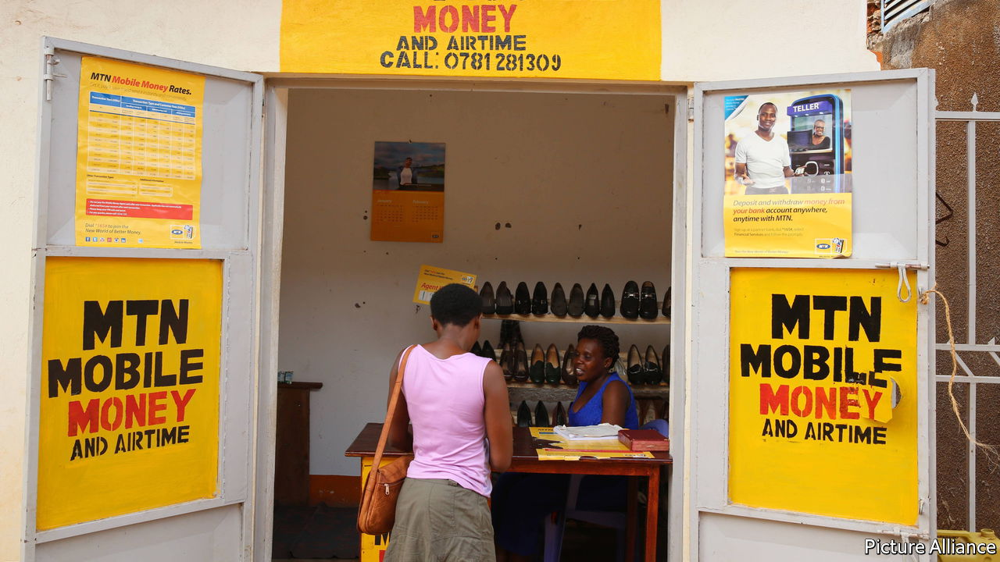

###### Digital stevedores

# Africa’s mobile money agents face an uncertain future 

##### Their numbers are growing faster than the transactions they handle 

 

> Jun 30th 2022 

A decade ago Jackline Muheirwe was the only mobile-money agent in her patch of Kampala, the Ugandan capital. These days there are ten others within a minute’s walk, taking in and giving out cash from shopfronts or colourful kiosks. “You can’t make money out of it now,” she sighs. Business is down, despite her prime spot outside a courthouse. Since 2018 a tax on withdrawals has made things worse. She is lucky to earn 500,000 shillings ($133) a month in commission, less than half of what she once made.

Mobile money is a system that allows people without bank accounts to transfer money using their phones. Agents are its stevedores, loading and unloading cash. There are now 3m of them in Africa, roughly as many as the number of atms in the world. Mobile operators pay them a commission on transactions, rather than employ them directly, placing agents in a contradiction: the more that money goes digital, the more uncertain their future.

Agents are more than mere cash handlers. They must carefully manage the balance between the electronic float on their account and the physical cash they hold. In the countryside that might entail three trips a week of 20 kilometres to the nearest bank, according to a survey in four countries by the Boston Consulting Group in 2018. The same study estimated that agents spend more than $1,000 to set up their business, a sum which takes an average of ten months to recoup. In effect, agents shoulder the financial risks of building a mobile-money network. Their local relationships also cement trust in the system.

Their rewards are dwindling. Although the volume of transactions is increasing, the number of agents is rising faster. The average monthly amount of money cashed in and out by agents in sub-Saharan Africa fell from $11,700 in December 2016 to $9,900 five years later, according to the gsma, which represents mobile operators. In Ivory Coast the number of mobile-money accounts serviced by each agent shrank by two-thirds over the same period.

Covid-19 slowed these trends in some places and accelerated them in others. In the first year of the pandemic the number of agents on m-pesa, Kenya’s dominant service, grew by 75,000 (43%), perhaps because other work dried up. The average commission they earned fell 17% to just 2,182 Kenyan shillings ($19) a week. “I don’t mind having 20 agents in a street,” says Sitoyo Lopokoiyit, the chief executive of M-Pesa. He argues that agents still gain because many of them own small shops and mobile money is a product that “pulls traffic into the store”.

A longer-term threat to agents comes from digital payments. In some countries mobile money can pay for everything from electricity bills to a takeaway meal. If it keeps circulating within the system, never being turned back into cash, then the role of agents diminishes. In 2012, for every dollar that was cashed into mobile-money systems worldwide, 88 cents were cashed out. By 2021, that figure had dropped to 67 cents. The value of mobile-money payments to shops or online retailers has doubled in the past year alone.

 Agents will still be needed to take in cash, and they also have time to diversify, notes Edward Obiko of MicroSave Consulting, perhaps by exploiting new opportunities to distribute welfare payments or sell financial products such as insurance. But the main winners from change are consumers and the mobile operators themselves, who earn higher margins on digital transactions than on “cash-in, cash-out” services. Agents, who have little bargaining power because they are scattered and largely unorganised, made the mobile-money revolution possible. Its success may be their undoing. ■

