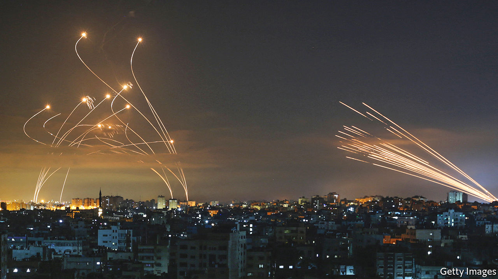

###### One shield to guard them all?

# Israel’s unexpected military alliance in the Gulf 

##### Fear of Iran is turning former enemies into allies 

 

> Jun 30th 2022 

When america and its Arab allies talked breathlessly in 2017 of forming a defence alliance that Donald Trump dubbed an Arab nato, which would have stretched from Egypt to Oman, the idea seemed doomed from the start. Some of the countries in it, such as Saudi Arabia and Qatar, were not on speaking terms. Few Arab leaders felt they could rely on America, after successive American presidents said they wanted to “pivot” forces away from the region. After a few meetings, enthusiasm for the proposed Middle East Strategic Alliance vanished as quickly as conscripts handed a weekend pass.

Now an even bigger alliance, including Israel and stretching from Morocco all the way to the United Arab Emirates (uae), seems to be in the making. If so, it would be a remarkable realignment for countries such as the uae and Morocco, which until the signing of the Abraham Accords in 2020 had refused to have diplomatic relations with “the Zionist entity”.

On June 20th Israel’s defence minister, Benny Gantz, gave the first official confirmation of this alliance when he told members of the Knesset, Israel’s parliament, that he had been working with America on a programme for strengthening defence co-operation between Israel and Arab countries. This included building a Middle East Air Defence (mead) system “against Iranian attempts to target countries in the region using rockets, cruise missiles and uavs [unmanned aerial vehicles]”. More startling still, he added, “This programme is already operating, and has already led to thwarting Iranian attempts.”

Israel and its new chums have released few details of mead publicly, though Israeli politicians privately say it will consist of a region-wide network of radar systems alongside batteries of missile interceptors. In future, they claim, the network might even extend to outer space, using surveillance satellites and lasers modelled on the “Star Wars” missile-defence system proposed by America during the 1980s. 

There are plenty of reasons for all parties to form an alliance. Israel, which sees Iran’s nuclear programme as an existential threat, would benefit from greater intelligence-sharing and early warning of Iranian attacks from allies positioned across the Gulf from Iran. American forces based in Qatar already use intelligence and tracking data gathered by allies to intercept airborne threats. On February 14th American jets shot down two Iranian drones in Iraqi airspace as they were heading towards Israel. Israel may even want covert access to airbases near Iran, should it decide to bomb Iranian nuclear facilities.

Arab members of the alliance, meanwhile, are keen to obtain Israeli missile-defence systems like its Iron Dome (pictured) to protect themselves from attacks by Iran and its proxies, such as the rockets fired at the uae this year by its adversaries in Yemen’s civil war. Israel has signed a deal to sell a $500m missile-defence system to Morocco, which has testy relations with neighbouring Algeria. A series of airlifts between Israeli bases and the uae suggest that military hardware could have been shipped there as well. 

Some Israeli experts caution against lofty expectations. “We shouldn’t be using the term alliance,” says Tamir Hayman, a former commander of military intelligence and now the head of Tel Aviv University’s Institute for National Security Studies. “An alliance is the highest level of security relations between countries that also necessitates taking offensive action. What we have is the potential for defensive co-operation against a joint threat.”

Moreover, some of the purported members of mead, such as Saudi Arabia, do not have open relations with Israel. And even friendly Arab leaders cannot ignore the feelings of their citizens, many of whom are critical of Israel’s treatment of Palestinians. For instance, after King Abdullah of Jordan said in a television interview that he supported the formation of a Middle Eastern nato, his foreign minister insisted just a few days later that there was no talk of Israel being involved. If the new mead alliance is indeed to flourish, it may have to remain secret for a while longer. ■

