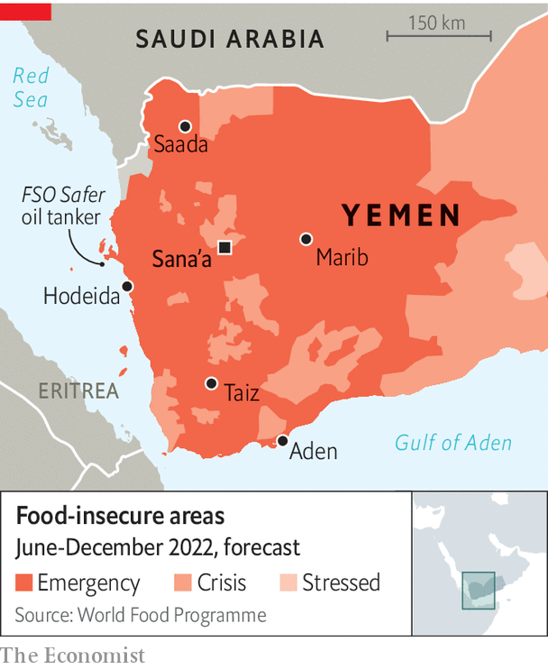

###### Safer at last

# The UN will finally defuse a floating bomb in the Red Sea 

##### It still needs more money to avert a famine in Yemen 

 

> Jun 30th 2022 

The sailors on board the  will be happy to be out of a job. Anchored since 1988 near Hodeida, on Yemen’s Red Sea coast, the tanker was used as a floating oil-storage and export terminal. But since 2015 war has made it impossible to maintain the almost half-century-old ship.

A skeleton crew of seven has laboured to keep the thing afloat, and to keep its cargo, 1.1m barrels of oil, from causing an environmental disaster. Rough seas and salt have rusted its single-walled hull. Machines that pump inert gas into storage tanks to prevent a fire stopped working years ago. Officials say it is miraculous that the tanker has survived this long.

The un hopes to remove this floating time-bomb by year’s end. It has reached a deal with the Houthis, a Shia rebel group that controls much of Yemen, and the internationally recognised government, which has been fighting alongside a Saudi-led coalition. Officials say the Houthis, who refused for years to allow maintenance workers to board the ship, have at last recognised the danger it poses.

 


An oil spill four times bigger than the one in Alaska caused by the  in 1989 would cost an estimated $20bn to clean up. It would also put fishermen out of work for a generation.

Compared with that, the $144m price tag to make the  safe seems a steal. In the first stage workers will offload the oil and ready the ship for salvage. The un hopes to start work before the start of rough winter weather and plans to get it done by smit, a Dutch firm that last year helped dislodge the , a cargo ship that ran aground and blocked the Suez canal for a week. The weather “is not a problem for the salvage company. It’s just a question of whether the vessel will make it through one more season,” says David Gressly, a un humanitarian official.

But before work can start, the un needs more money. It has received pledges for $60m of the $80m required for the first stage. Earlier this month the un took the unusual step of announcing a crowdfunding campaign to raise another $5m. “Everyone’s looking for somebody else to do it,” says Mr Gressly.

This is a recurring problem in Yemen. The warring parties agreed in April to a two-month truce, which was later extended until August 2nd. There have been no coalition air strikes since March. More civilians have been killed this spring by mines and other unexploded ordnance than by fighting—a grim statistic, but a sign that the ceasefire is holding.

As per the truce agreement, the Saudis have allowed 18 oil tankers to offload cargo at Hodeida. That has helped ease a severe fuel crisis in Houthi-controlled areas. There are fewer petrol queues, which were common a few months ago. Businesses, like a cement factory in Sana’a that employs around 5,000 people, can fuel their generators and resume work.

Yemenis are grateful for the respite. Yet in many ways life is still getting worse. Hunger and poverty, already dire, are growing: fully 17m Yemenis do not get enough to eat. The un expects that number to climb to 19m by year’s end.

Donors are giving less, and aid agencies are stretched thin by other demands, from the war in Ukraine to a looming global food crisis. The un says it will need around $4bn for humanitarian work in Yemen next year. It expects to get half that sum. Hard choices will follow. The World Food Programme (wfp) cut rations in January for 8m Yemenis. On June 26th the agency announced further cuts. It said 5m people would receive only about half of their daily needs, and the other 8m just a quarter.

Yemen’s currency, the rial, which before the war traded at 250 per dollar, now goes for almost 1,100 in areas controlled by the Saudi-backed government. (It trades at a more favourable rate in Houthi-controlled areas.) That is painful for a country that imports 90% of its food. The cost of a basket of staples has increased by 120% over the past year. It will continue to rise—assuming firms can even find enough grain to import. Most of Yemen’s wheat was previously bought from Russia and Ukraine. With those markets cut off by war, importers are scrambling to find new suppliers. “The country is secured until August,” says one businessman. “But it may be catastrophic after that.” ■

