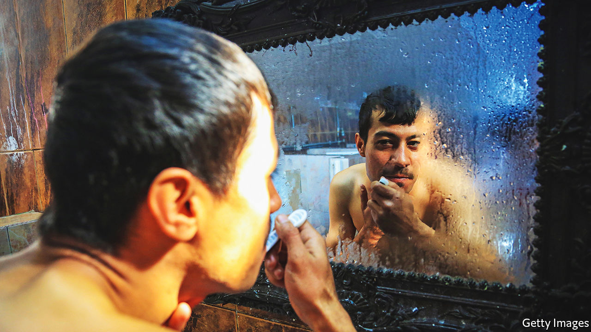

###### Bristling with power

# Why Iraqi moustaches are making a comeback 

##### Facial fur is again a matter of style, not safety 

 

> Jun 30th 2022 

A moustache can be many things: a source of pride; a prickly annoyance; a trap for crumbs. In Iraq it could be the difference between life and death.

During the despotic rule of Saddam Hussein, his thick black moustache was widely emulated by members of his inner circle. Even today men with moustaches are often assumed to work for the army or intelligence service. In the violent period after Saddam was toppled, that made it dangerous to sport one, so many Iraqis reluctantly shaved. Nowadays Iraq is relatively peaceful, and the moustache is making a comeback. 

The way Iraqi men cut their facial hair still tends to indicate their religiosity or sect. Salafists, harking back to the early days of Islam, sport bushy beards with no moustache, emulating the prophet. Shia Muslims go for a mix of smart and scruffy: a neat line running from ear to mouth, clean-shaven above it and prickly below. Moustaches that are bushy and droopy are a trademark of the Kakais and Yazidis, minority sects that follow syncretic religions. Alas, this distinctive facial feature made them an easy target for genocide by Islamic State. 

When the jihadists ruled a chunk of Iraq (2014-17), they forced Muslim men to grow beards. Some were tortured and killed for refusing to. “Islamic State made us hate beards,” says Rafat, a mechanic in Mosul, once the heart of the self-proclaimed “caliphate”. He shaved his beard the day he fled from the city. Now, he is proudly moustachioed again. 

For many Iraqis moustaches are a mark of machismo and authority. Men often swear by their moustache. Saying “when I shave off my moustache” is the equivalent of saying “when pigs fly”. Threatening to shave off another man’s moustache is an insult. Prisoners are clean-shaven to humiliate them. 

A bristling army officer reckons that 80% of his peers have similar moustaches. His jealous wife wants him to shave his off, because it signals he has a big job, which makes him alluring to other women. “I’d rather be slaughtered than shave it off,” he jokes. “The security situation is stable in Iraq now. But if officers start getting targeted, I would shave it.”

Members of the mainly Shia militias known as Hashd al-Shaabi (Popular Mobilisation Forces), which played a big part in vanquishing Islamic State, were integrated into the regular army, which does not allow soldiers to have beards. But most still wear them as a mark of sectarian loyalty. “I know I’m at a Hashd checkpoint when the guy has a beard,” says a wary Iraqi.

A growing number of younger men, however, seem less keen to emulate the facial style of their fathers and grandfathers—or to show allegiance to a particular sect. Outlandish, stiffly gelled hairdos are becoming popular. Ditching the moustache for reasons of style rather than security is a small sign that Iraq is becoming a shade more normal. 

