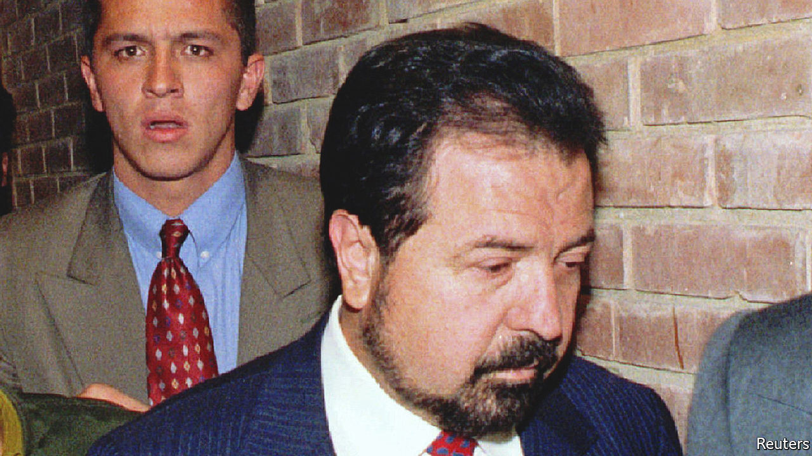

###### King of cocaine

# Gilberto Rodríguez Orejuela once ran 80% of the world cocaine market 

##### The boss of the Cali cartel died on May 31st, aged 83 

 

> Jun 30th 2022 

On the streets of Cali, in southern Colombia, Gilberto Rodríguez Orejuela was not, at first glance, noteworthy. He was clearly well-off, but not ostentatiously so. His air was that of a banker or professor. His suits and ties were smart, but not exclusive. No showy accessories gleamed on his wrists. At dinners in his house he served the soup and quoted poetry, putting guests at ease. He liked to watch car-racing and football, sometimes with both his mistresses and his wife. His car was a Mazda. An “honest drugstore magnate” was his own description of himself. 

This was true, up to a point. As the owner of Drogas La Rebaja (Discount Drug) he ran a chain of 400 pharmacies across the country, employing 4,000 people. That was his first and real vocation. As a boy of 13 he had run deliveries for a local pharmacy, cycling in the stupefying heat of siesta hour to take medicines to an elderly woman on a ranch. It brought in money for the family, struggling as they were to get by on his father’s sporadic work as a sign-painter. By the age of 25 he had saved up enough to buy his own small drugstore and expand from there. 

Yet it was not Drogas La Rebaja that made him a billionaire, and later caused people in restaurants to avoid him. His power and wealth came from his position as head of the Cali cartel, which by the early 1990s was supplying 80% of the world’s cocaine. His networks spread all over the United States and Europe, employing roughly 3,000 narcotraffickers as well as processors and spies. The cartel shipped cocaine in planks, lead ingots, frozen fish, ceramic tiles, coffee, whatever they could; and the money that poured in, $7bn a year at the peak, was laundered through property, ranches, financial instruments and building projects. At one stage he was responsible for 40% of commercial development in Cali, owned several radio stations and richly sponsored América de Cali, the highest-flying local team. If he needed complaisant banks, he bought them. If he needed political allies he tried to buy those, too, donating $6m to the campaign of Ernesto Samper Pizano in 1994 for the presidency of Colombia. Money could buy anything. 

He had started early on this path, altering drug prices in his delivery-boy days. Friends then persuaded him to try car theft, then marijuana-trafficking, then cocaine. When he saw how vast that market was, it tickled his ambition to make money not merely for himself but for the family, as before. It was a valid enough reason. 

Cali was in fact a family business; not, he insisted, a cartel. His brother Miguel oversaw day-to-day operations, while he himself was the strategist. His nickname was , the Chess-Player. It was he who travelled to Spain in 1984, ostensibly on holiday, to set up his networks in Europe as the American market glutted. It was he who made lucrative distribution alliances with the Russian and Italian Mafias. Most of all, he set the tone. Rather than being showy and violent, like the rival Medellín cartel, he called himself a man of peace, doing nothing to attract attention. Rather than shooting or bombing judges and politicians, Escobar-fashion, he bought them off. His fund for bribes was limitless, and his aim was to make the authorities so beholden to him that they were, in effect, his business partners. Then they would protect him. 

The peaceful image often cracked. He stood apart from killings only because his well-paid and vigilantes did them for him. When enemies were tortured, shot or dismembered between suvs he made sure he was not there to see it. Once, at a dinner where he was playing the gracious host as usual, he seized a silver fork to gouge out a guest’s eyes for being a Medellín spy, but soon put it down again. His soul was always moved, he said, by a look of genuine contrition. 

At first, following his cooler instincts, he and Medellín had co-operated. A prominent member of that cartel, Jorge Luis Ochoa, went with him to Spain. Pablo Escobar, the boss of Medellín, treated him pragmatically. They fell out mostly over the New York market, and by 1987 were such enemies that Medellín bombs blew up 85 of his stores. His strategy after that was to help the authorities track that “dangerous psycho” down, mostly by tapping his phone, until in 1993 Escobar was killed and the whole Colombian market became his own. At that point, he offered the government a deal: if Cali’s legally-come-by property and wealth were left intact, they would all abandon the business within six months. Fearing for his family and feeling too much pressure, he wanted out. 

Yet neither his operatives nor the state agreed. Instead the authorities, urged on by the United States, turned their full police attention to him. He had managed lucky escapes before. Arrested in Spain for trafficking when he went there, he was found not guilty back in Colombia. Pursued by police at a house party in 1993, he pretended to be an unruly drunk and escaped through the kitchen. Finally arrested two years later—found hiding in his underwear in a wardrobe—he continued to run the business from a prison equipped with cable tv and mobile phones and ever-open to visitors. After serving only half his sentence, he was let off for good behaviour. At last, however, he was rearrested and, in 2004, extradited to the United States, to a federal prison in Butner, North Carolina from which he did not re-emerge. 

There he had plenty of time to muse on his career. He told his grandchildren in a last letter that he was still proud of it, by and large. He had been loyal to his friends, vengeful against his enemies and protective of his family. He had brought his sons up strictly, keeping them well away from drugs. (True enough; he was so angry when his eldest dabbled in them that he visited him in jail to lash him with a belt.) Deep down, he admitted, despite all the bravado, he was bitterly ashamed of what he had become. 

Life as a trafficker had also interrupted his schooling, at which he had been diligent until he went astray. In prison he made up for it, earning a bachelor’s degree in history and philosophy. His dissertation was on violence in Colombia. He got a merit. ■

