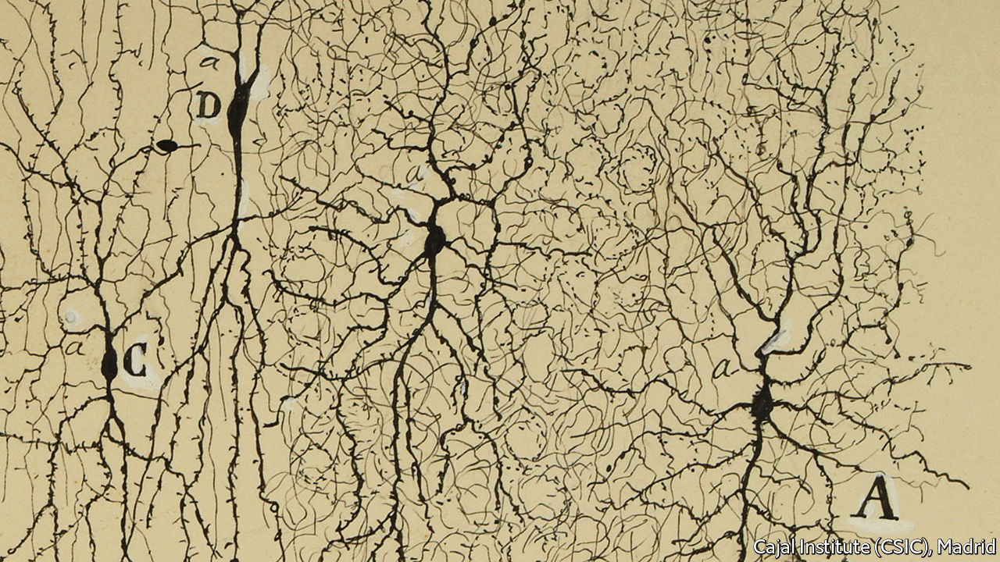

###### Neuroscience

# How neurons really work is being elucidated 

##### That will help both medicine and the search for better artificial intelligence 

 

> Jun 29th 2022 

A neuron is a thing of beauty. Ever since Santiago Ramón y Cajal stained them with silver nitrate to make them visible under the microscopes of the 1880s (see drawing above), their ramifications have fired the scientific imagination. Ramón y Cajal called them the butterflies of the soul.

 


Those ramifications—dendrites by the dozen to collect incoming signals, called action potentials, from other neurons, and a single axon to pass on the summed wisdom of those signals in the form of another action potential, turn neurons into parts of far bigger structures known as neural networks. Engineers now use simulacra of these to create what they are pleased to call artificial intelligence, though it is a pale shade of the real thing.

How neurons actually work their magic is only now being disentangled. One conclusion is that each is, in its own right, as powerful an information processor as a fair-sized artificial neural network. That has implications not only for learning how brains work—and how they go wrong—but also for designing artificial versions that more closely resemble the natural sort.

The first widely adopted neuron model, proposed in its existing form in 1957 by Frank Rosenblatt, an American psychologist (who drew, in turn, on Alan Turing, a British computing pioneer), was the perceptron. This is a mathematical function that receives sets of binary digits (zeros and ones) as inputs. It multiplies these by numerical “weights” and then adds the products together. If the result exceeds a preordained value, the perceptron spits out a “one”. If not, it spits out a “zero”. 

Layer cake

To make artificial neural networks, perceptrons are encoded as software. They are organised, logically speaking, into interconnected layers and the result is trained to solve problems via feedback and feedforward loops between the layers. These loops alter the values of the weights, and thus the behaviour of the network. The more layers, the “deeper” the network. Deep neural networks now underpin everything from Google Translate to Apple’s Siri.

All this imitates how action potentials arriving at the synaptic junctions between axons and dendrites, via which neurons communicate, were thought to trigger signals that then combined with each other to trigger (or not) new action potentials in the receiving cell’s axon. It is thus tempting to see neurons as physical perceptrons, with the difference from the computer versions that their signals are carried by sodium, potassium and calcium ions crossing cell membranes, rather than by a flow of electrons. And for decades that was just how many neuroscientists did see them.

In the early 2000s, though, Panayiota Poirazi of the Institute of Molecular Biology and Biotechnology in Heraklion, Greece, began looking at the matter differently. She imagined neurons themselves as perceptron networks. In 2003 she argued that a simple two-layer network might be enough to model them. Recent work has upped the ante. In 2021 David Beniaguev of the Hebrew University of Jerusalem concluded that, for human cortical neurons at least, five (and sometimes as many as eight) layers are needed, each with up to 256 perceptrons. 

This means lots of computing must be going on inside individual neurons. And it is. Dendrites are now known to generate their own, tiny action potentials, called dendritic spikes. These come in several varieties: calcium spikes (long and slow); sodium spikes (short and fast); and nmda spikes (triggered by a chemical called n-methyl-d-aspartate). Together, they let dendrites perform 15 of the 16 basic operations of Boolean algebra, a branch of mathematics that is the basis of digital computing. Those operations compare two input values and spit out a third as a result. Some, such as and, or, not and nor, are self-explanatory. Others, such as nand, xnor and xor, less so. 

xor, in particular, is notorious. It gives a non-zero output only when its inputs are dissimilar. In 1969 two eminent computer scientists, Marvin Minsky and Seymour Papert, proved that xor cannot be performed by a single perceptron—one of only two Boolean operation for which that is the case. This result stalled artificial-intelligence research for a decade, the first “ai Winter”, as it is retrospectively known. 

That was thought true of dendrites, too. But in 2020 work by Albert Gidon of Humboldt University, in Berlin, in which Dr Poirazi was also involved, found a new class of calcium-based spike which permits xor. That a single dendrite can thus outperform a perceptron suggests an entire layer of complex computation is going on out of sight of conventional models of neurons. That might help explain the remarkable performance of brains and the failure of artificial intelligence to reproduce it. 

Axons, too, have been reassessed. The action potentials they carry had once been seen by many as analogous to the all-or-nothingness of a binary digit. Look closely, though, and action potentials vary in both height and width. That matters.

In 2016 a group from the Max Planck Institute for Neuroscience, in Florida (one of the organisation’s few campuses outside its German homeland), showed that neurons in the central nervous system actively adjust the breadth of their action potentials. The following year a team from Dartmouth College in New Hampshire discovered that those in the cortex actively adjust their heights as well. 

Even the lengths of the intervals between action potentials matter. In May 2021 Salman Qasim of Columbia University reported that neurons in the hippocampus, a part of the brain involved in memory formation, modulate the timing of their firing to encode information about the body’s navigation through space. And in August of that year Leila Reddy and Matthew Self of the University of Toulouse, in France, reported that neurons also do this to encode the order of events in memories. 

All this has clinical implications. In particular, there is growing evidence that atypical dendrite development in childhood and early adulthood is linked to autism, schizophrenia and epilepsy. Deteriorating axonal function, meanwhile, is similarly associated with psychosis in multiple sclerosis, schizophrenia and bipolar disorder. These discoveries inform the development of new medicines. For example, ketamine, which triggers long-lasting structural change in dendrites, is receiving attention as a treatment for depression.

The art of forgetting

The sophistication of the neuron and its constituent parts has also caught the attention of computer scientists. In the early 2010s deep neural networks drove such dramatic improvements in the abilities of artificial intelligence that there was genuine concern people would soon have to wrestle with machines cleverer than they were. Then, suddenly, progress stalled.

Deep neural networks have hit three obstacles. First, computer scientists found that once a network has learnt a task, it struggles to transfer those skills to a new one, however similar, without extensive retraining. Second, when such a network is retrained, it tends to forget how to perform the original task—an effect called catastrophic forgetting. Third, to train a large network requires immense volumes of data, access to supercomputers, and the megawatts of electricity needed to run those supercomputers for days (or even weeks) at a time. 

The brain struggles with none of this. It effortlessly transfers knowledge between domains, has no trouble integrating old and new skills, and is remarkably efficient—running on watts, not megawatts. The sophistication of neurons may make the difference. In studies published last year and this, a team from Numenta, a Californian research company, designed artificial neurons, with dendrite-like subcomponents, that are immune to catastrophic forgetting. A network of these trained on 100 tasks in sequence retained the ability to perform all with reasonable accuracy. The same network also outperform networks of perceptrons at learning many tasks simultaneously.

Several studies show that sophisticated artificial neurons can approximate complicated functions—xor, for example—with greater accuracy and less energy than perceptrons do. Connected into networks, such devices learn faster and at a lower computing cost than perceptrons. The question of how brains apply knowledge from one domain to others remains a mystery, but it would not be a surprise if the complexity of neurons explains that, too. 

The lesson, then, is familiar: nature got there first. Necessity may be the mother of invention, but natural selection is the mother of inventors. In both neuroscience and artificial intelligence the next decade promises to be wild. Over a century after he described them, Ramón y Cajal’s butterflies are taking flight. ■


