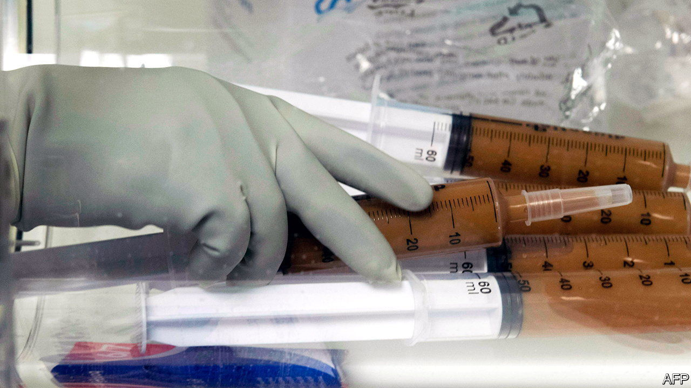

###### Faecal transplants

# People bank blood. Why not faeces? 

##### Storing your stools when you are young may help you later in life 

 

> Jun 29th 2022 

It never hurts to put something aside for a rainy day. And not just money can be put in a bank. Blood from donors is routinely banked, too. And some parents bank blood from their child’s umbilical cord, on the off-chance that stem-cells therein will prove useful for the future treatment of bone-marrow cancer. But three researchers at Harvard Medical School propose going further. They suggest people consider banking deposits, as it were, of their faeces.

Yang-Yu Liu, Shanlin Ke and Scott Weiss describe their proposal in . Modern life, they observe, is not kind to gut bacteria. Terrible eating habits; frequent use of antibiotics; jet-lag-inducing, diet-changing travel; sleep deprivation; even simply living longer; these all take a toll on the complex microbial ecosystems hosted by people’s intestines. That contributes to a range of illnesses, including  infections, irritable-bowel syndrome (ibs), inflammatory bowel disease, type 2 diabetes, asthma, cardiovascular problems and colorectal cancer. 

One approach to dealing with some of these ( and ibs, in particular) has been faecal transplantation. This takes healthy people’s stools and inserts them, with their payloads of well-adjusted bugs, into the guts of suffering individuals. It is 80-90% successful at treating  infections, though only between a quarter and a half of those with ibs gain benefits. At least as intriguing are animal studies that install the gut microbes of thin animals in obese conspecifics. This often causes the recipients to lose weight, though it has not yet been tried in people.

Faecal transplanting is still in its early days. But faeces banks analogous to blood banks now exist in America, Britain, China, France and the Netherlands. As with blood transplants, donations from these need to be matched to a given recipient, otherwise a bad reaction, such as a new infection, may result. But unlike tissue-matching by blood group, faecal matching is still an inexact science. 

Hence the three researchers’ suggestion that people might, when young and healthy, bank their own faeces for future use. They propose establishing facilities where stool samples will be held at the temperature of liquid nitrogen, as happens with existing faeces banks. Then, if a depositor needs a little gut rejuvenation in later life, he or she can withdraw part of the account, return it to room temperature, and make of it an enema.

There may be risks in this approach, too. Immune systems decline in potency as they age, so a bug kept under control at the time a deposit was made might go haywire later. Also, science may advance in the interim to a point where cocktails of microbes can be mixed reliably in a laboratory to perform whatever medical tasks are needed. The deposit will then be redundant, and any annual maintenance payments wasted. 

On the other hand, the list of conditions affected by gut microbes is so long that other microbe-related treatments may well be developed. Those with a sample of their microbial youth to hand might be best placed to benefit from these. If successful, the result could be a whole new movement.


