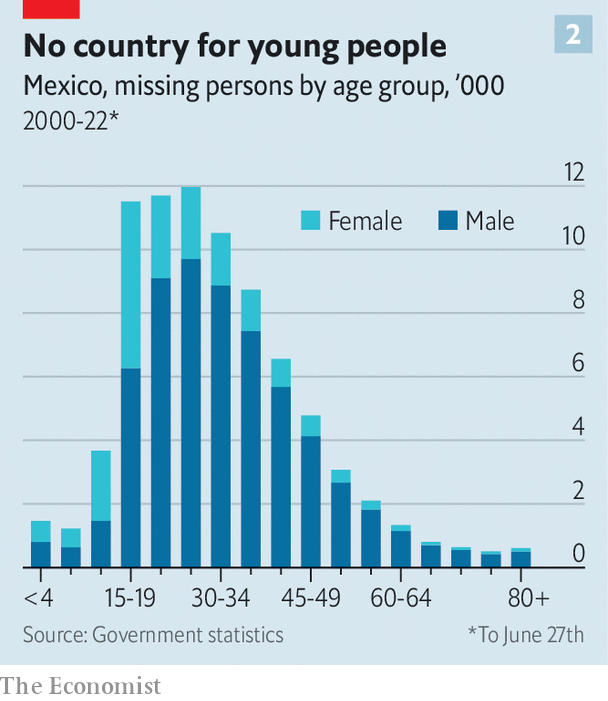

###### The drug war

# At least 100,000 people are missing in Mexico 

##### Many victims lie in unmarked graves in the desert 

 

> Jun 30th 2022 

Nadia rosales’s bedroom is that of a typical 17-year-old. Above her bed in a modest house in Puebla, a city 120km (75 miles) south-east of Mexico’s capital, hangs a poster of The Beatles and a Minnie Mouse balloon. Several Barbies, some make-up and a teddy bear litter a dressing table. But Nadia has not slept there since she went missing on the way to school in 2017. Her mother Vicky has searched for her ever since, on street corners and among corpses in the state mortuary. “We have not moved or changed phone numbers in case she returns,” she says.

At the other end of the country, in Saltillo, forensic specialists in the hushed labs of Mexico’s first human-identification centre work to identify bodies. In one lab, a skeleton dug up from a mass grave is laid out for analysis. In another, a forensic anthropologist delves into brown paper bags containing fragments. After examination, the scientists try to extract dna from the remains to see if they can find a match for someone who has been reported missing. 

 


Empty bedrooms and nameless bodies bear witness to a national disgrace. In May Mexico’s register of missing people, which dates back to 1964, passed 100,000. That cumulative total excludes those who have gone missing but subsequently been found; and the true number is undoubtedly far higher (see chart 1). 

Most of these missing people are probably dead. Between 2006 and 2016 over 2,000 clandestine graves were found in Mexico. The country’s forensic services hold 52,000 unidentified bodies, which may or may not belong to the people on the “missing” register. 

For a democracy during peacetime, these are staggering numbers. The official roll of the disappeared in Mexico is five times as long as the one Sri Lanka recorded during a quarter-century of civil war. It is 80 times the number of Chileans who disappeared during Augusto Pinochet’s dictatorship. It shows how violent Mexico has become in the past 15 years, and how drug gangs have carved out territories where they can kill with impunity.

Until the 1990s relatively few Mexicans disappeared. Those who did were often victims of the government itself, which was fighting an ugly campaign against left-wing student and guerrilla groups. The number shot up from 2006. Some 80% of disappearances have occurred since that year, when the government of Felipe Calderón launched a “war on drugs”. During Mr Calderón’s term, from 2006 to 2012, an average of eight people each day went missing. Today, under President Andrés Manuel López Obrador, who took office in 2018, the daily toll of disappearances is 25.

Some of this increase may be because of better counting, or people being more willing to report their relatives as missing. But experts think it mostly represents an increase in gang violence. The reported number of murders, relative to the population, has trebled since Mr Calderón’s war on drugs began. He sought to decapitate gangs by capturing or killing their leaders. This tactic backfired. Headless gangs split. New factions fought for control of smuggling routes. Crisis Group, a think-tank, reckons the number of criminal groups in Mexico more than doubled between 2010 and 2020, from 76 to 205. 

Searching for resolution

Some murder their rivals ostentatiously, hanging corpses from bridges as a warning. Others prefer to make the bodies vanish by burning them, dissolving them in acid or burying them in the desert. The aim is to forestall investigations before they have begun. (Cynics reckon the police also prefer it when there is no body to be found, as it makes the homicide figures look lower than they really are.) 

Most of the missing are young men, many of them gang members. Besides murdering rivals, the gangs eliminate witnesses. Some of the young men who disappear are not dead; they have been abducted and forced to join a gang. And some victims are killed by mistake. María Luisa Núñez, whose son went missing in Puebla with two friends when travelling by car, thinks they were taken because rival gangs had a rule that after 9pm no more than two men could travel together in their area.

 


A rising proportion of cases involve women and children. Female victims tend to be even younger than males: typically in their teens rather than their 20s (see chart 2). Many are thought to have been kidnapped and forced to do sex work—a lucrative sideline for some gangs. Some have been raped and murdered.

The scandal is not just that so many people disappear, says Karla Quintana, who heads the National Search Commission, a government agency that was set up in 2017. Two other scandals follow. The process of searching for bodies is slow and ineffective. And the families of the disappeared seldom find justice. A un committee reckons there is “almost absolute impunity” for disappearances. It estimates only 2-6% of cases it sees lead to prosecution. Disappearances are “not a national priority”, says Héctor de Mauleón, a journalist. “It has been normalised.” 

 


Mr López Obrador’s strategy of dealing with gangs, known as “hugs not bullets”, appears to have made things worse. The president thinks poverty causes crime, so it can be fought with welfare. Alas, welfare programmes are less lucrative than drug-smuggling. Mr López Obrador has pledged to stop the armed forces from fighting gangsters. They are still stationed in many areas where gangs run riot, but have been told not to confront them. Experts believe the president’s lack of a coherent security strategy has increased the sense of impunity not just for gangs but for other criminals, too. “We have never had such a huge problem with organised crime and such a weak state,” says Francisco Rivas of the National Citizen Observatory, an ngo. 

Officials sometimes collaborate with gangs, or are on their payroll. Mystery still shrouds a notorious incident in 2014, when 43 male trainee teachers went missing in Iguala, in the south-west. A government investigation concluded that local police pulled the teachers from a bus and handed them over to a drug gang, which murdered them. The motive is unclear. The teachers had commandeered a bus, as they did each year to travel to Mexico City to mark the anniversary of a historical massacre. One theory is that they inadvertently took a bus that contained a shipment of drugs, which the gang and their police accomplices thought they were trying to steal. A report by external experts this year found evidence that the military helped cover up the crime, too. 

Violence begets violence

Until recently the authorities did not even acknowledge that Mexico had a problem with disappearances. Some police would refuse to take reports of missing people, saying they had probably just run away, or would insist that families wait 36 hours. That changed under Mr Calderón and then under Mr López Obrador’s predecessor, Enrique Peña Nieto, after the case of the Iguala teachers provoked outrage. In 2012 and 2017 laws were passed to grapple with the problem. Police were required to accept reports of missing people immediately. The government set up a network of search commissions and a national register of the disappeared, which collated all the local registers going back to 1964. 

Mr López Obrador has made a few attempts to improve matters. In May his government updated the law of 2017 to set up a national human-identification centre, like the one in Saltillo. It also plans to set up a dna database to try to help match missing people with their relatives; currently only some states have local ones. He has given more money to the network of 32 search commissions. But this year the president increased its budget by just 0.3% in real terms, bringing it to $37m. That is unlikely to be enough, given that this year the money is meant to include setting up the national human-identification centre too. Setting up just the one centre in Saltillo cost $9m, not including staff salaries.

The president blows hot and cold on the issue. On taking power he established a commission to look into the case of the Iguala teachers. Yet he initially dismissed the recent report that implicated the military before admitting that some officers were under investigation.

And in many places, the authorities remain indifferent or in denial. In Jalisco, the state with the most missing people on the register, the attorney-general for missing people is Blanca Trujillo. Asked about disappearances, she first talks of people who leave home because of family problems, before acknowledging the role of organised crime. 

Too little, too late

Friction between different agencies, including the attorneys-general and the search commissions, also slows down investigations. Basic failings abound. Luz Araceli Díaz, whose daughter disappeared in Guadalajara in 2020 aged 23, says the authorities lost the file for three months. Ms Rosales says she asked the authorities to trace Nadia’s mobile phone and claims they did not. 

Some officials, no doubt, are untroubled by disappearances because those who vanish are typically poor and often criminals. Many voters share their views. Victims are dismissed as being on “” (the wrong path). Missing women are often assumed to be with a boyfriend. 

Sometimes, however, investigations are slow because investigators do not have skills or resources on anything like the scale needed to grapple with such a colossal tragedy. By some estimates, it would take the forensic services 35 years to deal with the backlog of unidentified bodies, if all capacity were directed at identifying the dead as opposed to dealing with new murders and other crimes. Slow investigations lead to a loss of evidence; witnesses die, get cold feet or move away. In 2020 Ms Núñez found her son, who went missing in 2017, in a grave with six other bodies. It took until February this year for the authorities to identify him formally and hand him back. 

Where the government fails, the mothers of the missing step in. Groups known as “”, consisting largely of female relatives of victims, have long operated as support networks, or dug in fields to look for hidden graves. They hold workshops, investigate their own cases and badger the authorities. They have helped draft laws on searching for missing people, too. “The mothers are doing what the authorities should be doing,” says Rosalía Castro Toss, who heads a  in Veracruz and is looking for her son. 

The response of the state governments may be slowly improving thanks to these groups. The government of Coahuila set up the human-identification centre in Saltillo in 2020. It has handed 16 bodies back to families. Protocols to look for missing people which involve their families are being drawn up. And officials at the National Search Commission are trying to get authorities to co-operate more. 

But for now the  continue to lead the way. Ms Núñez is still campaigning for her son’s killers to be found and prosecuted. On a recent Friday she and fellow mothers visited the forensic service in Puebla, where every week they go to look through bodies. After leaving, they took down a banner from the trees outside. It showed the faces of some of the missing locals. It would be difficult to make a poster big enough to feature all of them, said Ms Núñez. They folded it up, and discussed a recent case of a missing boy, whose parents shun the limelight. It takes courage to speak up. The simple truth, says Vicky Rosales at her home, is that “if we don’t search for Nadia, no one will.” ■

