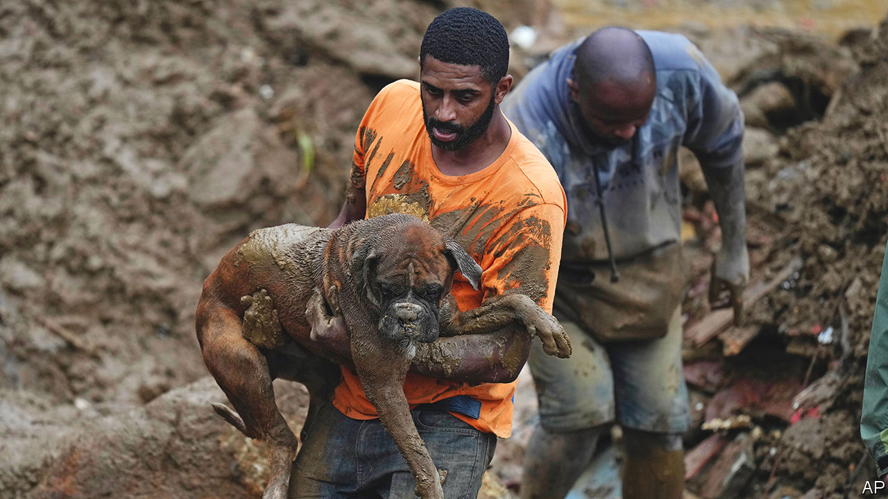
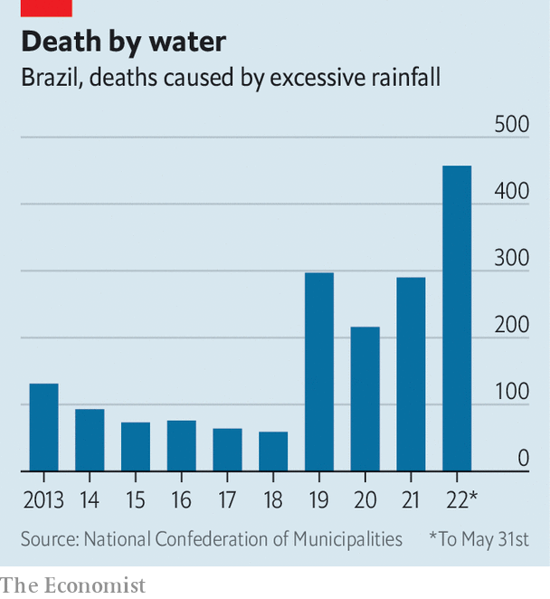

###### Rain strain

# More Brazilians are dying in floods and downpours 

##### It’s not just the water that is killing them 

 

> Jun 30th 2022 

Between late May and the start of June 130 people died as a result of heavy rains in the state of Pernambuco in north-eastern Brazil. In February and March at least 240 people perished in Petropolis near Rio de Janeiro following severe flooding in the city’s hinterland. In just the first five months of 2022, more people died in rain-related disasters than in the whole of 2021. 

The trigger is heavier rainfall, caused by some unusual weather patterns. This year the flow of moist air which normally arrives in the south-east instead moved to the north-east, says Moacyr Araújo, who co-ordinates the Brazilian Network of Climate Change Research, an academic group. Separately, the ocean currents that transport warmer water from Africa to South America were more intense than usual, releasing more moisture into the air. In Recife, the capital of Pernambuco, these two effects combined to drop 551mm (22 inches) of rain in five days, nearly a quarter of the annual average.

As the planet warms, such extremes of weather are becoming more frequent. But “you need more than rainfall to create a disaster,” says José Marengo of Cemaden, the federal agency responsible for disaster alerts. Badly sited or poorly built housing is part of the problem. 

 


Recife is low-lying and densely populated. The city’s poorest live on riverbanks and alongside canals. In Petropolis these residents cannot afford expensive housing, nor the 2.5% land tax still paid to the descendants of the last Brazilian emperor, who was ousted in 1889. So they build homes on steep hills, which get swept away in mudslides. Some of this year’s victims lived in houses condemned by civil-defence workers 11 years ago after a similar disaster. 

Cemaden is cash-strapped, too. It gets one seventh of the cash it received a decade ago, before Brazil fell into a recession in 2014. With no money to install them, weather-monitoring systems sit unused in boxes. Bureaucratic delays do not help. Mr Marengo says it is frustrating when he works “like hell” to issue alerts only to see officials sit on them until just before disaster hits (it is the civil-defence agency that passes on the warnings). Officials in Recife waited two days after receiving Cemaden’s alert before setting in motion a detailed contingency plan for heavy rains. Society calls such tragedies natural disasters, but they often look man-made.


