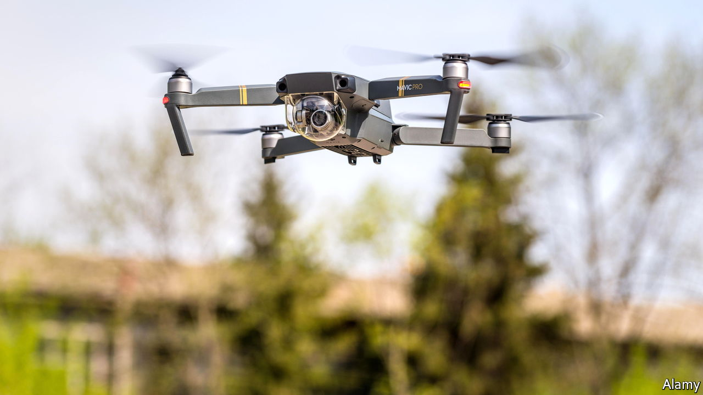

###### The Economist explains

# How consumer drones are changing warfare 

##### Both Russia and Ukraine are using cheap quadcopters to track the enemy 

 

> Jun 29th 2022 

IN MAY A pro-Kremlin journalist posted on Telegram, a messaging app, asking Russians to donate their drones to the armed forces. In  both sides have been buying cheap consumer drones. In peacetime, these were the playthings of technology enthusiasts and amateur film-makers. How are Russia and Ukraine using devices that have more in common with toys than military hardware? 

Consumer drones were first popularised by Parrot, a French company. In 2010 it released the AR.Drone, a 400g quadcopter. A camera gave the pilot a bird’s-eye view, and a sophisticated autopilot made manoeuvring and hovering simple. The AR.Drone was successful in part because it required little piloting skill, unlike previous radio-controlled toys. In 2013 the market changed radically with the arrival of the Phantom, made by DJI, a Chinese startup. A more sophisticated device with a range of one kilometre and a GoPro video camera, it brought affordable aerial photography to the masses. DJI has dominated the consumer drone market ever since. Its recent offerings boast a range of several kilometres, broadcast-quality cameras and automatic obstacle-avoidance.

These abilities make consumer drones useful in war. They have been used in previous conflicts, notably by Islamic State in Iraq and Syria for reconnaissance and to drop bombs, but only on a small scale. In Ukraine they are playing a larger role. When Russia invaded in February, Ukraine’s defence ministry appealed for drone-owners to turn their machines over to the armed forces. Several thousand are reportedly in use.

The drones act mainly as artillery spotters. It is  for an observer on the ground to precisely locate the enemy and direct fire. From a drone it is simple: the operator can spot vehicles hidden behind ridges or among buildings, and tracking artillery rounds is easy from above. One Ukrainian artilleryman claimed that a standard defensive position, which might normally take 60-90 rounds to destroy, could be knocked out with just nine rounds of drone-directed fire, and that every artillery battery now has a quadcopter. Ukrainian tank-hunting teams use drones to find and stalk Russian vehicles with minimal risk. Consumer quadcopters are not big enough to carry anti-tank bombs, but they can be jerry-rigged to drop anti-personnel grenades, sometimes directly into trenches.

Russian-backed militias in Ukraine’s eastern Donbas region have used consumer drones for years. After Russia’s defence ministry announced in 2019 that army units would be issued with quadcopters, most observers assumed that they would be developed inside the country, says Samuel Bendett, an expert on unmanned military systems. But a rash of consumer-drone sightings in Ukraine suggests that Russia is using off-the-shelf hardware in much the same way as Ukraine’s forces. Mr Bendett notes that even elite airborne units now have DJI drones.


Consumer drones have drawbacks, however. After issuing DJI drones to its infantry units in 2017, the Israeli army is now replacing them with locally made quadcopters because of security concerns. These arise partly because the drones’ communications are unencrypted, and partly because the maker is a Chinese company. DJI also makes a device called the Aeroscope, which can track its drones and their operators at a range of up to 50km, leaving them vulnerable. Ukraine’s vice-prime minister has claimed that the company has helped Russian forces by allowing them to use the Aeroscope (DJI denies this). 

DJI officially deplores any military use of its products, and in April it banned new sales in Ukraine and Russia. But other companies spy an opportunity. Parrot now makes drones for the military market. Hoping to break the Chinese near-monopoly on production, a Pentagon initiative encourages American manufacturers to build drones that follow an open standard of secure communication. Some of Parrot’s new drones, which also meet that standard, are being used by Ukrainian forces.

The ubiquitous, cheap drones buzzing overhead in Ukraine may be a vision of future conflicts. Knowing exactly where enemy forces are and what they are doing brings huge advantages. Now there is a simple way to find out.


