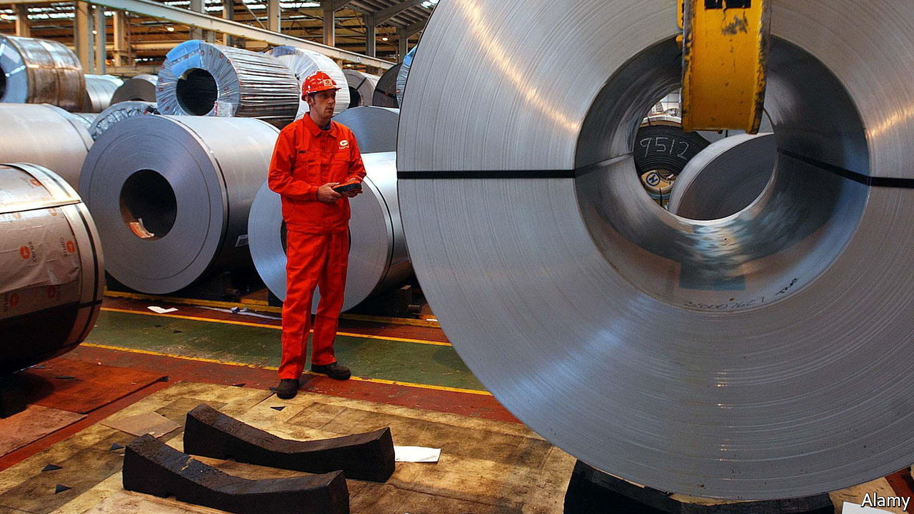

###### The Economist explains

# Why Britain is extending controversial tariffs on steel 

##### The government admits the measures break international trade rules 

 

> Jun 29th 2022 

ON JUNE 29TH Britain’s trade minister, Anne-Marie Trevelyan, announced that the government would be extending tariffs on five categories of steel—and breaking international trade rules. The move has support from the opposition Labour party, whose main criticism of Ms Trevelyan was that she had not announced the extension sooner. But it has generated controversy elsewhere. After he was asked to advise on the matter, on June 15th Christopher Geidt resigned from his position as the ethics adviser to the prime minister, Boris Johnson. Lord Geidt said that he had been put in an “impossible and odious position”. Why is the government extending the tariffs? 

Defensive tariffs are mostly boring, politics-free affairs. But very occasionally, something spicier comes up. In June 2018 President Donald Trump added EU countries to the list of those affected by a broad tariff on steel imported into America. In July 2018 the EU applied a broad tariff of its own on 19 steel products, justifying the move by pointing to a surge in imports from the rest of the world that would injure its domestic producers.  then had to decide what policy to adopt as its own, and tasked the independent Trade Remedies Authority (TRA) with forming a view.

In June 2021 the TRA recommended keeping tariffs on ten of the 19 products. One of the others failed on the grounds that tariffs would hurt consumers too much. For the remaining eight, it judged that imports into Britain had not surged—a necessary condition for a safeguard tariff according to the rules of the  (WTO). But squeals from the steel industry alerted the government to the fact that freer trade creates losers as well as winners. So Liz Truss, Britain’s trade secretary at the time, disregarded the TRA’s advice and passed emergency legislation to keep tariffs on an extra five products.

Safeguard tariffs are supposed to be temporary, and the extension applied in July 2021 to the five products only lasted for a year. The government learned its lesson. Instead of asking the TRA to make a recommendation for a second time, it requested some extra analysis. It asked whether the answer might change if the steel products were considered in groups. The answer was no. It also asked whether imports might surge if the tariffs were removed. Here, the TRA said yes.

Safeguard tariffs are a broad, blunt instrument, to be used only rarely. The rules of the WTO do not allow for governments to whack them on if they are worried that imports might surge only in future. Which is why on June 29th Ms Trevelyan told her colleagues that “the decision to extend the safeguards on the five product categories departs from our international legal obligations” at the WTO. More feathers than Lord Geidt’s have clearly been ruffled. Ms Trevelyan admitted that she had spent that morning attempting to soothe affected trading partners. In theory, they are allowed to apply compensatory measures, which could include tariffs, to make up for the lost market access. 

The debate will have little impact on the British economy. In 2019 the steel industry accounted for around 33,000 jobs, or around 0.1% of employees. Fears of recession and shrinking demand dwarf the impact of tariffs. The kerfuffle says more about the government’s relaxed approach to its international obligations, its respect for independent institutions and its capacity to stick to a particular policy stance. The framework underpinning the TRA is under review. The row over steel inspires little confidence over what will emerge.


