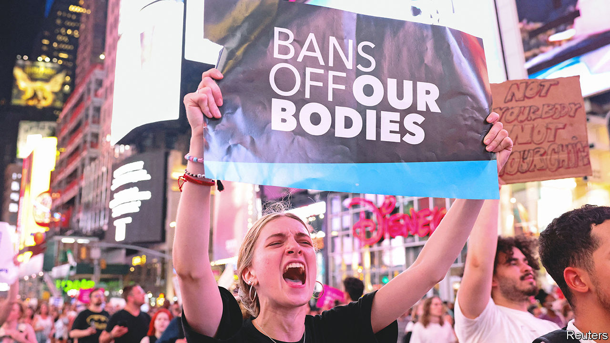

###### The world this week

# Business 

#####  

 

> Jun 30th 2022 

Several responded to a Supreme Court decision to overturn , the ruling that declared abortion a constitutional right in 1973. Amazon, Apple, Meta, JPMorgan Chase, Microsoft and Nike were among those that pledged to cover travel costs for employees seeking abortions and other medical care not available in their state.

in America fell to its lowest point in over a year in June amid , according to a survey by the Conference Board, a research organisation. The six-month outlook of consumers on the state of the economy and labour market was the bleakest in nearly a decade. In Britain, consumer confidence fell to its lowest level since records began in 1974, data published by gfk, a consumer-goods research company, showed.

, a German airline, became the latest carrier to cancel thousands of flights because of staff shortages at airports. The carrier will slash over 3,000 flights to and from Frankfurt and Munich this summer. This follows weeks of disruption at airports across America and Europe.

On the hook

defaulted on its foreign debt for the first time since 1918 after Western sanctions blocked it from paying its creditors. Despite having sufficient foreign currency to service its debt, Moscow failed to make interest payments of about $100m on two bonds, both of which were originally due on May 27th, but carried a 30-day grace period.

, an auditing firm, was fined $100m by the Securities and Exchange Commission (sec), America’s securities regulator, settling claims that dozens of its audit staff cheated on ethics exams. ey was also accused of misleading investigators. The penalty is the highest ever imposed by the sec on an auditor. It is double the amount paid in 2019 by kpmg, a rival firm, for altering old audit work using stolen data.

The board of voted to extend Bob Chapek’s contract as chief executive for three more years, putting an end to speculation about his future at the media conglomerate. Mr Chapek, who took over in 2020, had faced criticism over Disney’s response to a law in Florida dubbed “Don’t Say Gay” by its critics. The law is aimed at preventing discussion of gender identity and sexual orientation at primary schools. 

, Switzerland’s second-largest bank, was found guilty by the country’s top criminal court for its role in the laundering of drug money by Bulgarian clients between 2004 and 2008. The lender was fined SFr2m ($2.1m) and ordered to pay €18.6m ($19.5m) in compensation to the Swiss government. 

An appeals court granted ’ request for a temporary stay on a nationwide ban of its vaping products by regulators at America’s Food and Drug Administration. The decision allows the e-cigarette maker to keep selling its products while the case goes through further scrutiny. Juul leads America’s e-cigarette market, with a 35.7% share of sales.

Hanging up the boots

, a pharmacy giant, abandoned its sale of the Boots chain in Britain. The drugstore owner blamed market turmoil and weaker credit conditions for insufficient offers for the business, which includes the No7 beauty brand. Walgreens put the business up for sale in December in order to focus on health care in America.

, a hedge fund, and Citadel Securities, a trading firm, are moving their offices to Miami. They are the latest companies to leave Chicago, following long-held concerns by Ken Griffin, their billionaire founder, about the city’s crime rates. Boeing and Caterpillar recently announced that they would relocate from Chicago to suburban Washington, dc, and Dallas, respectively. 

Managers at , a British postal service, voted to go on strike in the latest case of industrial action across the country. Postal workers are voting over the next few weeks. It follows strikes on Britain’s train networks in June as higher fuel and energy costs eat into household budgets. Pay rows in other industries threaten further disruption over the summer.

, the world’s largest carmaker, recalled a fleet of 2,700 electric vehicles over faulty wheels less than two months after launching its first batch of battery-powered sport-utility vehicle. The company plans to spend $35bn to roll out 30 electric car models by 2030.

, a Swiss drugmaker, said a restructuring to save at least $1bn by 2024 could lead to the loss of 8,000 jobs, or around 7.4% of its workforce globally, including up to 1,400 in Switzerland. 

, a consumer-goods giant, sold the Israeli branch of its Ben &amp; Jerry’s ice cream business to its local licensee. The deal follows Ben &amp; Jerry’s’ decision in 2021 to halt sales in Israeli settlements, citing human-rights concerns.

