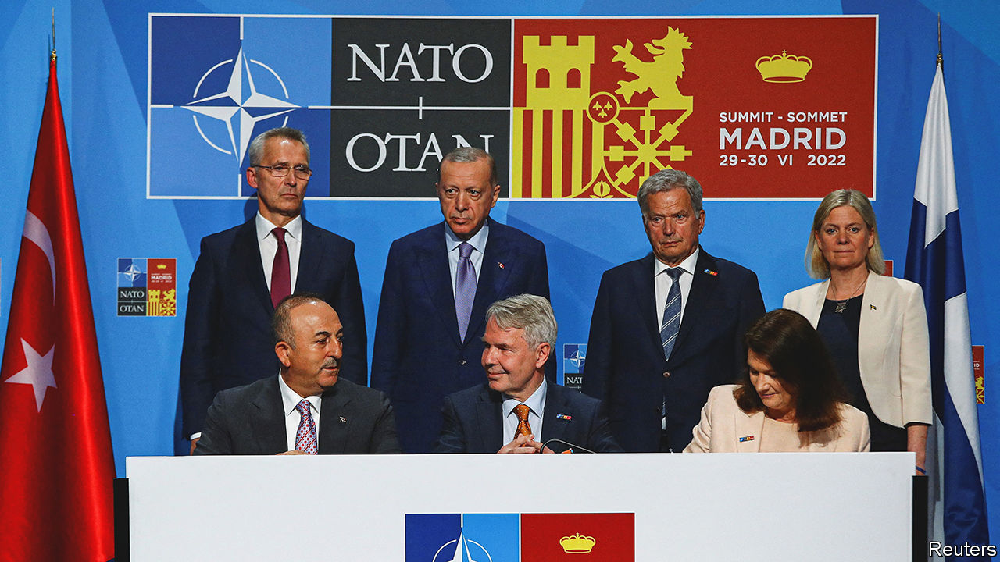
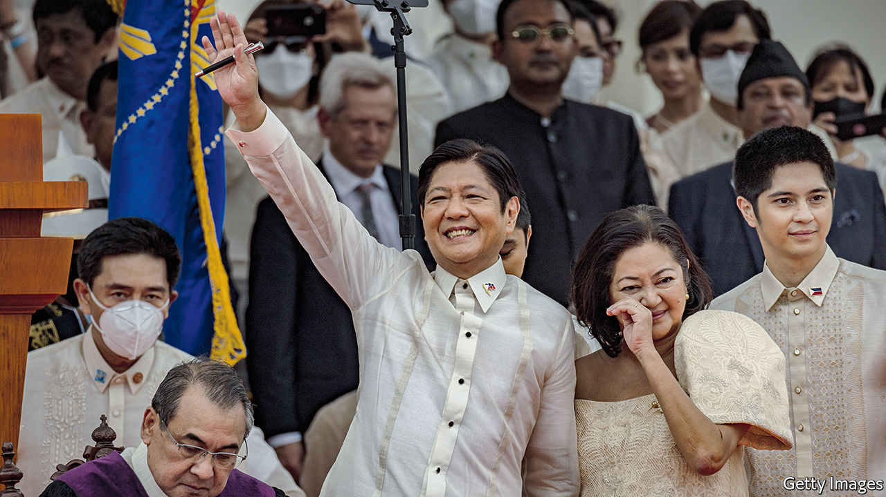

###### The world this week

# Politics 

#####  

 

> Jun 30th 2022 

Finland and Sweden were formally invited to join . Turkey, a member of the alliance, had been blocking their membership bids, claiming that they were too hospitable towards Kurdish separatists (whom Turkey considers terrorists). Turkey backed down after the two Nordic countries promised to be tougher on terrorism.

Jens Stoltenberg, nato’s secretary-general, called the alliance’s “most significant and direct threat”. will increase the number of its troops ready to deploy at short notice from 40,000 to 300,000. President Joe Biden announced new land, air and sea deployments across Europe, including a permanent army hq in Poland, America’s first on nato’s eastern flank.

Russian missiles hit a shopping centre in , a city in central Ukraine. At least 18 people have been confirmed killed. At a meeting in Germany the leaders of the g7, a club of rich countries, called the attack a “war crime”. 

Judges in Louisiana and Utah temporarily blocked enforcement of “” banning abortion. Both states were among 13 with laws activated on June 24th, when the Supreme Court overturned  which had established a national right to abortion. Abortion clinics in Louisiana and Utah may stay open, at least for now.

Other American states sought to guarantee . Lawmakers in California approved a ballot measure to enshrine a woman’s right to an abortion in the state’s constitution. Minnesota’s governor signed an order banning state agencies from co-operating with other states’ criminal investigations into women who travel to Minnesota to seek terminations. 

A former White House aide testified that  knew his supporters could turn violent when they gathered at the Capitol on January 6th 2021. Cassidy Hutchinson—who worked for Mr Trump’s chief of staff, Mark Meadows—told a congressional investigation that Mr Trump cursed secret-service agents who refused to take him to join the insurrectionary mob, and then tried to seize the wheel of his limousine.

More than  after being left in an abandoned lorry in San Antonio, , some 250km from America’s border with Mexico. The route is popular with people-smugglers. There was no air-conditioning. Guatemalans, Hondurans and Mexicans were among the victims. 

If at first you don’t secede

first minister, Nicola Sturgeon, named October 19th 2023 as the date for a  on independence. Ms Sturgeon accepted that her plan will be subject to legal scrutiny by Britain’s Supreme Court. Scots rejected independence in 2014 by 55% to 45%. Recent polls suggest they would do so again by a narrower margin. 

London’s  was placed under special measures by the policing inspectorate. The force has been plagued by scandal, including the rape and murder of a woman by an officer in 2021. In April Dame Cressida Dick, the Met’s commissioner, was forced to step down.

 said it would close schools in urban areas until July 10th and stop supplying private vehicles with fuel to address an acute shortage. The country ran out of foreign currency and defaulted on its external debt in May. It has struggled to import basic necessities, including food and medicine. It is negotiating with the imf for a bail-out.

 


Ferdinand “Bongbong” Marcos replaced Rodrigo Duterte as the president of the . Mr Marcos was elected in May, along with Sara Duterte, Mr Duterte’s daughter, who is now vice-president. He has offered few details as to how he will govern. Between 1965 and 1986 his father, also called Ferdinand Marcos, led a regime that looted the country and tortured and murdered its opponents. A popular uprising restored democracy. 

asked 37m people in and around Tokyo to switch off unnecessary lights to avoid blackouts. Tokyo is suffering its worst June heatwave since 1875, which has sent demand for electricity surging. Supply has been tight since a strong earthquake prompted the shutdown of several power plants in March.

Guillermo Lasso, the president of , survived an impeachment attempt. It came after two weeks of protests. The protesters, most of whom are indigenous people, have been marching to complain about rising food and fuel prices. Several people have died, including a soldier who was killed after an attack on a fuel convoy.

A fire during a prison riot in south-west killed 49 prisoners. Around 30 others were injured, including guards. The country’s prisons are overcrowded, as are those in much of Latin America. 

shelled Ethiopian military positions in al-Fashaga, a disputed territory on the border, days after Ethiopian forces or one of their allied militias captured and murdered seven Sudanese soldiers. Meanwhile pro-democracy activists called for large protests on June 30th against Sudan’s military government, which seized power over the course of two coups.

 army gave civilians two weeks to evacuate a vast stretch of the country for an indefinite period ahead of a planned military operation, suggesting that anyone who remains will be considered an enemy. The army has been losing ground to jihadist insurgents, who now have the upper hand in some 40% of the country.

At least 23 people were killed in a stampede during an attempt by around 2,000 migrants to cross a fence from into Melilla, a Spanish enclave on the African coast. The un denounced the excessive use of force by authorities on the border.

Naftali Bennett, departing prime minister, said he will not stand in the general election on November 1st, which will be Israel’s fifth in four years. His year-old governing coalition imploded after the defection of one of its members and its failure to renew a law governing Jewish settlements in the occupied West Bank.

On the road again

President Xi Jinping of travelled to Hong Kong for the anniversary of its handover from British rule in 1997. It was his first trip outside the mainland since the start of the pandemic. Beijing and Shanghai reported no new locally transmitted cases of covid-19 on June 27th, the first time that has happened in months. China cut the quarantine period for international travellers from at least two weeks to one.

