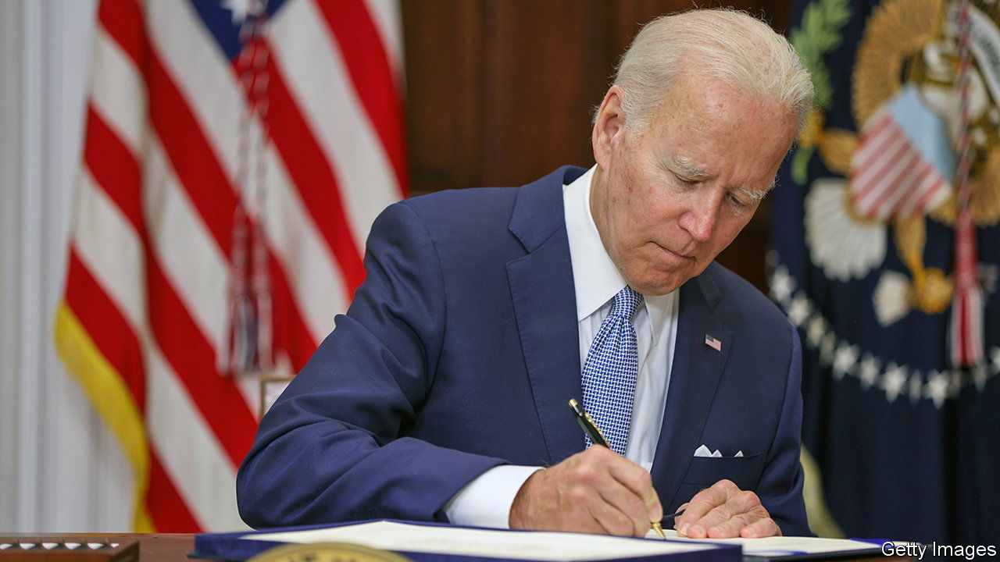

###### Win one, lose one

# America moves in conflicting directions on gun laws 

##### One branch of government passes gun reform, another rejects a gun law 

 

> Jun 30th 2022 

“T here were audible gasps,” said Christian Heyne of Brady, a gun-control group, when Mitch McConnell voted yes on the Senate gun bill on June 23rd. Mr McConnell, the Senate minority leader, has been a consistent opponent of gun reform. He led a filibuster to stop an expansion of federal background checks after 20 children were murdered at a primary school in Sandy Hook, Connecticut, in 2012. He has an a+ rating from the National Rifle Association (nra), the powerful gun lobby, which once gave him its “Defender of Freedom” award. Yet he joined 14 other Republican senators in voting for the most significant gun reform in three decades.

The Bipartisan Safer Communities Act reassured gun-control advocates while also appealing to those on the right concerned about preserving the constitutional right to bear arms. It passed in the Senate by 65 votes to 33. The House passed it the following day, with 14 Republicans joining the Democrats, and President Joe Biden swiftly signed it into law. Mr Heyne was sitting in the Senate gallery with his sister for the vote, along with other shooting survivors. Their parents were shot, their mother fatally, by a gunman in 2005. “It’s not going to solve gun violence on its own,” he says, but it provides a path for “creating real change around guns”.

The package provides billions of dollars for mental-health services and school safety, as well as grants to help states pass and implement red-flag laws, which take guns away from those deemed a danger to themselves or others. The law enhances background checks for gun buyers under 21. It closes the “boyfriend loophole” to prevent domestic abusers from buying a gun for five years. It also clarifies and expands what a “federally licensed firearms dealer” is, to ensure more buyers get background checks. And it creates new federal offences for interstate gun trafficking and “straw purchases” (buying a gun on behalf of someone prohibited from possessing one).

Lawmakers began to realise that “safety is not just good policy, but it’s good politics,” says John Feinblatt of Everytown for Gun Safety, a gun-reform group. Americans wanted action. They were angry and frightened after recent mass shootings in Uvalde, Texas, and Buffalo, New York. The sense of urgency mattered. Past efforts took months and lost momentum.

The states had become laboratories for reform. Forty-eight states and Washington, dc, have collectively passed 466 new gun laws. Often these state laws were passed with bipartisan support without political consequences. “We did not have this infrastructure ten years ago,“ says Robin Lloyd of Giffords, a gun-control organisation founded after Gabby Giffords, a former congresswoman, was shot in the head in 2011. Mr Feinblatt says the nra’s influence has waned. Everytown is now twice the size of the nra.

But the morning the Senate bill passed, the Supreme Court struck down a New York state law that requires residents to obtain a licence if they want to carry a handgun outside the home. The decision will affect similar laws in five other states. Mr Heyne thinks the court is out of step with the rest of the country and the other government branches. “The first bipartisan push, real bipartisan push we’ve seen in Congress in decades,” he says. “It is almost one step forward, two steps back.” ■


