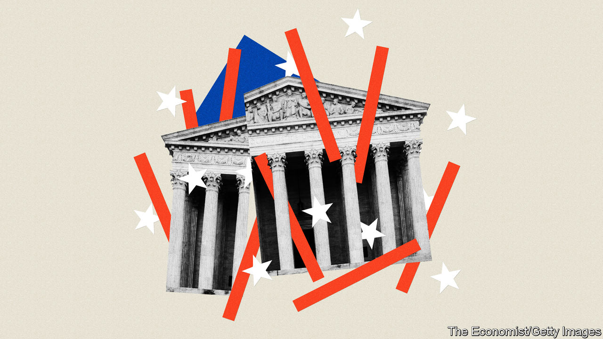

###### Supreme Court wrap

# SCOTUS, an end-of-term report 

##### The scope of change flowing from the court’s rulings has been staggering 

 

> Jun 30th 2022 

Breathtaking change marked the Supreme Court term that began last October and wrapped up this week. For St Thomas Aquinas, a 13th-century theologian and philosopher, the majority’s bold moves would be alarming. Each time the law’s foundation is shaken, he wrote, its “binding power…is diminished”. Though it is sometimes necessary to rejig the law, Aquinas cautioned, there is good reason to be wary of changing too much, too quickly. 

The six-justice conservative majority is failing to heed his admonition. Donald Trump’s three appointees (Amy Coney Barrett, Neil Gorsuch and Brett Kavanaugh), along with Samuel Alito, Clarence Thomas and the chief justice, John Roberts, are “conservative” only in the ideological sense: their core project is to refashion, not conserve, America’s legal structures.

On June 24th, in  the justices eliminated the constitutional right to abortion. That decision reversing from 1973, leaves American women with “fewer rights than their mothers and grandmothers had”, as the dissenters (Justices Stephen Breyer, Elena Kagan and Sonia Sotomayor) lamented. In a solo opinion, Justice Thomas called on his colleagues to revisit several additional personal and familial rights—such as the right to contraception and the right of gays and lesbians to engage in intimate sexual conduct and to marry. 

The results of the court’s other seismic actions over the past nine months include a hole-riddled wall between church and state, a diminished capacity to vindicate several constitutional rights and a radical and expansive new interpretation of gun rights. Another ruling with potentially far-reaching implications is  a decision arriving on June 30th after was published.

 involved the scope of the epa’s authority to regulate coal-burning power plants. If the majority decides the case the way it seemed to be leaning at the February hearing, West Virginia and other Republican states will succeed in throttling the agency’s power to shift energy production from coal to cleaner sources like solar and wind power. The conservative justices seem likely to interpret the Clean Air Act, the landmark pollution-fighting law enacted in 1963, to allow only narrow regulations at individual plants rather than system-wide rules to reshape the power network and reduce greenhouse gases. This likely outcome reflects the majority’s increasing tendency to be sceptical of—and rein in—what it sees as an administrative state that has grown too powerful.

An arrogation of judicial power also characterised Justice Thomas’s methodology in his majority opinion in  the landmark Second Amendment case decided on June 23rd. expands the “right to keep and bear arms” by removing authority from states to use discretion when issuing concealed-carry licences. Its immediate impact will be limited to a handful of states that have required a special justification to carry a concealed weapon, but the ramifications are much broader. 

Justice Thomas’s approach in  matches Justice Alito’s in a selective examination of history to justify what seems to be a preordained outcome.  wiped away a consideration every federal court of appeals included in its analysis: how compelling might the justification for a gun regulation be? That’s no way to respect the right to bear arms, Justice Thomas decided. The only question a judge may ask is whether an analogue to the rule can be found in the history of American firearms regulation. 

More abandonment of decades-old approaches came in religion cases. In requiring the state of Maine to give parents money for religious schools since it was also giving some parents tuition payments for secular private schools, the six-justice majority in effect dispensed with precedents allowing, but not obliging, states to foot the bill for religious studies. And, siding with a public-school football coach who lost his job for praying with students at the 50-yard-line after games, the same majority silently overruled several precedents that had previously retained some semblance of a wall between church and state. 

A trio of cases, all decided by the familiar 6-3 margin, found that Americans sometimes have no recourse when their bedrock constitutional rights have been violated. In the court told an innkeeper he could not sue a border-patrol officer who had, in violation of the Fourth Amendment, entered his property without a warrant and assaulted him. found that defendants may not sue police officers who neglect to read them their  warnings in violation of the Fifth Amendment. And concluded that a defendant who had received terrible representation could not vindicate his Sixth Amendment right to counsel because a second lousy lawyer had failed to press that claim at the appropriate time. 

When the court resumes its work in October—with Ketanji Brown Jackson replacing Justice Breyer, who retired on June 30th—the docket does not lighten. Affirmative action, voting rights and more environmental cases are in the queue. Kate Shaw, a professor at Cardozo law school, says the court no longer values “incrementalism, compromise or half-measures”. She expects it will keep moving “as aggressively and as quickly as possible”. ■


