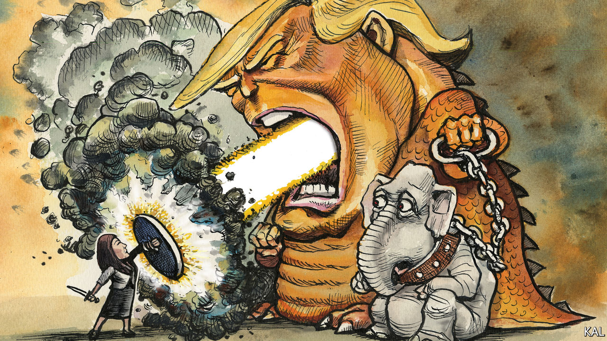

###### Lexington

# The courage of Cassidy Hutchinson 

##### Even without Donald Trump, says our departing columnist, the Republican Party may be unreformable 

 

> Jun 30th 2022 

Americans learned something shocking from  to the January 6th committee this week, but it was not about Donald Trump. The fact that the 45th president is vile and corrupt was clear long before he won the Republican nomination in 2016. What was more remarkable about the 26-year-old former White House aide’s account of events before and during the Capitol Hill riot was that someone so embedded in Trumpworld had the moral compass to provide it.

Matter-of-factly, Ms Hutchinson described overhearing Mr Trump being informed that the maga crowd had guns and in response suggesting it be allowed to keep them. That was before he instructed its members to go to the Capitol and “fight like hell”. She told the committee that she heard Mr Trump had to be restrained by his security detail after he tried to lead the mob there. No one with her proximity to the president had broken ranks so devastatingly. Even though, as she made clear, senior Trump courtiers had known perfectly well what Mr Trump was up to. She recalled Mark Meadows, the chief of staff, warning that “things might get real, real bad on January 6th.” She described Pat Cipollone, the White House counsel, advising against Mr Trump’s plan to march to the Capitol because “we’re going to get charged with every crime imaginable if we make that movement.” So far both men have refused to testify to the committee.

Neither will Mike Pence, whom Mr Trump slammed on Twitter even as the maga mob were baying for him to be hanged. Mr Trump thought he perhaps deserved to be, Ms Hutchinson told the committee, on which just two of the 210 Republican House members are serving. Few of the party’s leaders have to this day denounced Mr Trump. And some of them, including Mitch McConnell and Bill Barr, say they will still vote for him if he is the Republican candidate in 2024. Most Republican voters want him to be.

This embrace of the unconscionable by millions of otherwise reasonable Americans is by far the biggest novelty of the Trump era. By comparison, the paranoia and bigotry of the Capitol Hill rioters was old hat. Around a quarter of Americans have always expressed such sentiments. They represent the “paranoid style” in American politics described by the sociologist Richard Hofstadter, in a famous essay on the populist eruptions inspired by Barry Goldwater, George Wallace and through American history. The current eruption, Mr Trump’s maga base, represents around half the Republican coalition. Yet the real puzzle is why the other half, including amiable conservatives up and down the country, have gone along with it. They are why Mr Trump succeeded where Goldwater failed, why he remains such a threat; and no political question has exercised your columnist more.

Economic privation was an early explanation—which never squared with the gleaming trucks parked outside Mr Trump’s rallies. Disinformation and racism were more convincing suggestions, but insufficient. Many Republicans knew all along what Mr Trump was; many are not racist. The main reason for Republicans’ capitulation to Mr Trump is simpler. They hate their political opponents, who are his main enemy, which made him their friend. Political scientists have a term for such hyper-partisanship, “affective polarisation”, and it is far more pronounced on the right than on the left. Swathes of white America are resentful and fearful of diversity, rampant liberalism and other big ways in which America is changing, which they blame on the left. This cultural outlook has become the main difference between the two parties. Whereas Democrats are positive about America’s multiracial future, most Republicans say the country is “in danger of losing its culture and identity”. Mr Trump agreed, swore to fight back and they loved him for it.

Not all societies undergoing disruptive change succumb to demagogues. And America has unusual defensive strengths, including the vigour of its economy, institutions and civil society. Provided Mr Trump can be stopped, which seems likelier than not, it is in theory easy to think that the right will return to sanity. Yet the reality looks darker, partly because of the structural advantages that are sparing Republicans the electoral reckoning their dalliance with Mr Trump merits. Republicans are getting more power than the Democrats through the electoral college and Senate with fewer votes. And they were successfully compounding that undemocratic edge through all manner of ways to defy the majority, from judicial activism to gerrymandering, even before Mr Trump took it a stage further by trying to steal an election.

Thus  that the half century of abortion rights women had enjoyed, with popular support, was inconsistent with a conservative understanding of American “history and tradition”. Four of the five judges who made that decision were confirmed to the bench by a Republican Senate majority that represented a minority of voters. You might think such distortions would ease the right’s anxieties. Instead, they are raising its incentive to press cultural issues, and the left’s outraged response, including incendiary but toothless calls for system change. And so the cycle of outrage, reaction and counter-reaction continues.

Culture vultures

Among scholars of democracy it has become a truism to predict that America’s will get worse before it gets better. It is hard to disagree. Even without Mr Trump, culture warring will dominate conservatism until Republicans can no longer win power by it. That is why  of Florida, Mr Trump’s closest rival, is spending so much time banning critical race theory and references to single-sex marriage in schools. Yet it is important, in what looks bound to be a protracted battle, to at least celebrate tactical successes—like Ms Hutchinson’s brave performance on the Hill this week. America needs an awful lot more conservative heroes like her. Lexington fervently hopes they exist. ■


