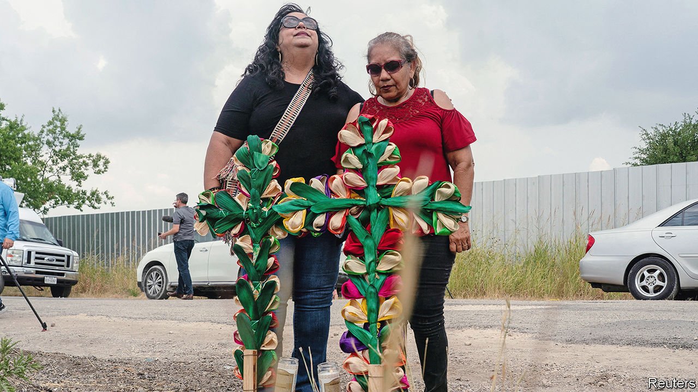
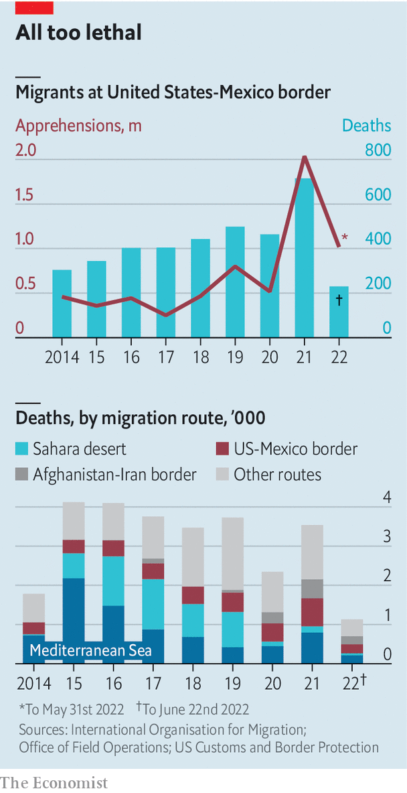

###### A dangerous path

# The deaths of 53 people in Texas highlight the perils of migration 

##### Nearly 4,000 people have died trying to cross America’s border with Mexico since 2014 

 

> Jun 30th 2022 

It was a gruesome discovery: the bodies of at least 46 people, found abandoned in a lorry in the baking 37°C heat of San Antonio, Texas, on June 27th. Seven more have died since. There was no air conditioning inside; corpses were reportedly dusted in steak seasoning to mask the smell. Over a dozen survivors, suffering from heat exhaustion, were rushed to hospital. The tragedy was one of the deadliest incidents in recent decades related to people-smuggling along America’s border with Mexico—among the most lethal land borders in the world.

As illegal crossings at the border have surged, so has the number of deaths. In the past fiscal year, ending on September 30th 2021, border-patrol officers reported 1.7m encounters with migrants at the border, the highest annual total. At least 651 people died while attempting the journey last year, the largest toll since the International Organisation for Migration started keeping track in 2014. Many drown in the Rio Grande; hyperthermia is another big killer.

More people attempting the journey is one reason why deaths have risen. Another is that crossing has become more perilous. Researchers at the University of Arizona have analysed records from the medical examiner’s office in Pima County, in southern Arizona, to chart the rising fatality rate among migrants over the past three decades. Between 2000 and 2005, the office logged the remains of 32 migrants on average per 100,000 apprehensions by border patrols (a proxy for unauthorised migration). That rose to 95 per 100,000 in 2006-13, and to 244 in 2014-20.

 


The rising fatality rate is a perverse consequence of America’s border policies, which have made illegal crossing harder. In 1994 the us Border Patrol launched a strategy known as “prevention through deterrence”. Authorities clamped down on popular urban passageways, such as those between San Diego and Tijuana, and El Paso and Ciudad Juárez. To avoid detection, migrants increasingly take longer, more arduous routes. Trips through the Sonoran Desert, for example, take on average 2.4 days on foot, raising the risk of fatal heat exhaustion. “We did believe that geography would be an ally for us,” remarked the head of the agency overseeing the border during the 1990s. “It was our sense that the number of people crossing through the Arizona desert would go down to a trickle once people realised what [it’s] like.’’

Policies limiting entry by legal channels have probably encouraged illegal crossings, too. During the pandemic America has been expelling migrants without offering them the chance to apply for asylum, on public-health grounds. The Biden administration has unsuccessfully tried to end the policy, known as Title 42. But 21 Republican states sued to block it, and courts have kept it in place pending litigation. ■


