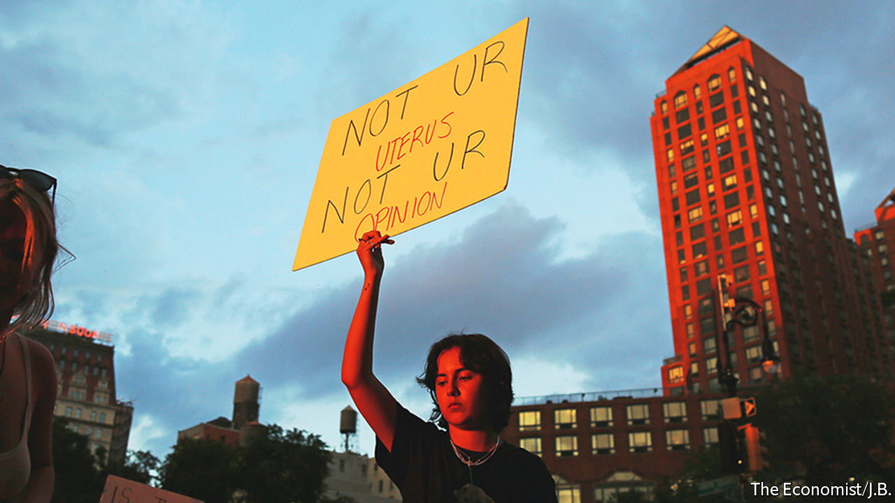
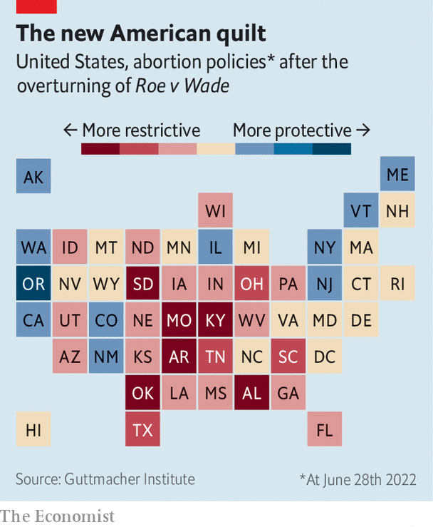
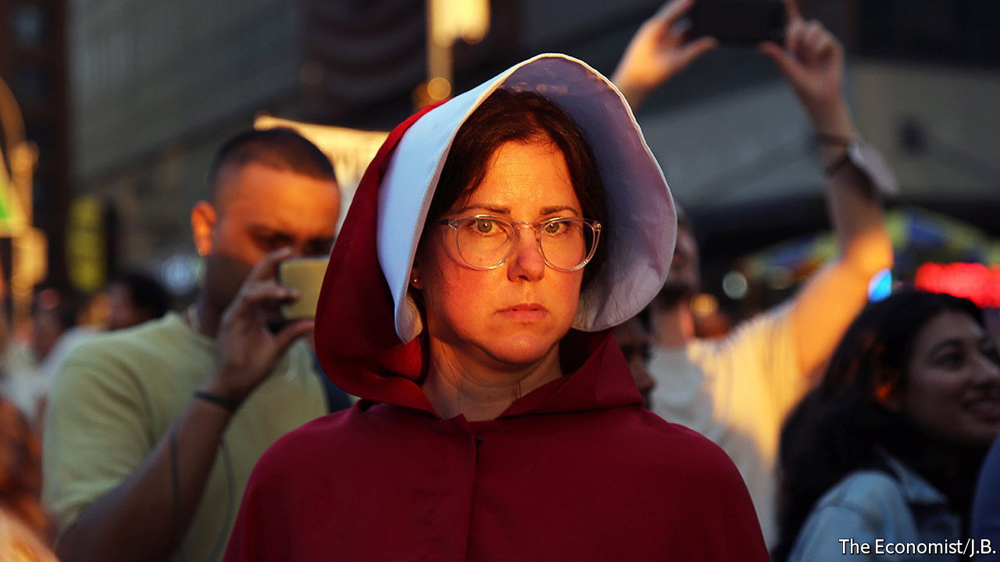

###### After Roe v Wade

# The fallout from overturning Roe 

##### In an even more divided America, the battle over abortion goes on 

 

> Jun 26th 2022 

A lot can change in a day. On the morning of June 24th, women waking up in the conservative states of Kentucky and Arkansas had a formal constitutional right to an abortion—even if the reality of getting one had become increasingly fraught and laborious. A few hours later, a Supreme Court refashioned by Donald Trump’s appointees finalised a sweeping opinion that had been leaked in May. It declared that , that the landmark  decision from 1973 had been “egregiously wrong from the start”, and that states could start to regulate abortions as they saw fit. 

Some 13 states had “trigger laws” designed to ban abortion soon after this moment came; some went into immediate effect. By nightfall, Kentuckians and Arkansans had no right to an abortion at any stage of pregnancy—with no exceptions for incest or rape. Anyone who performed one would be charged with a felony.

After the Supreme Court’s decision, . In the most doctrinaire pro-life states, the abortion regime will be more austere than that of Pakistan or Saudi Arabia, which permit the procedure to preserve the health, not just the life, of the mother. Democrat-dominated states have codified ’s right to abortion up to the point of fetal viability, a more permissive standard than that of Norway and Sweden, which have gestational limits for terminating pregnancies at 12 and 18 weeks, respectively. In four states and the District of Columbia, late-term abortion is legally permissible even if the mother’s health is not at risk. And the war over reproductive rights will heat up rather than cool down. 

Mike Pence, the former vice-president who seems to be mulling a presidential run, has called for a nationwide ban. In Missouri, hardline legislators are pitching laws to prevent women from travelling out of state for the procedure. Mississippi has passed a law to restrict access to mifepristone—one of the two drugs needed for medically induced abortions, . Other creative means to dissuade women from seeking abortions are sure to be devised. The Department of Justice is vowing to fight Republican-led states on these restrictions, auguring yet more legal warring.

This has already proved chaotic. In Louisiana, Texas and Utah, judges temporarily blocked abortion bans that were slated to take effect after fell. In Idaho and Mississippi, civil-rights groups have sued to enjoin states from implementing harsh restrictions, arguing that state constitutions include a fundamental right to bodily autonomy even if the federal constitution does not. Many large firms with headquarters and employees in Republican states are getting caught in the imbroglio. Banks, tech firms and retailers like Starbucks and Target have announced they would cover the costs for employees to travel out of state to obtain an abortion. Irate lawmakers in Texas have already dispatched letters to companies including Citigroup and Lyft threatening the viability of their business if such policies come into effect.

 


There is little that President Joe Biden can personally do for distraught Democrats. Mr Trump’s three recent lifetime appointments to the Supreme Court are there to stay. And Mr Biden has reiterated his opposition to packing the court with more pliant justices, as some in his party want. 

Neither is there any real chance of the Senate overturning the filibuster, the parliamentary procedure that in essence imposes a requirement of a 60-vote supermajority for most legislation to pass. Without it, Congress could pass a law establishing a nationwide floor for the right to an abortion—arguably a superior form of legislating than the present cycle of divining and undivining fundamental rights implied by the constitution. But there simply aren’t the votes for it. In the immediate aftermath of the news, Democrats in the House of Representatives gathered on the steps of the Capitol to sing “God Bless America”. It was an unwittingly fitting metaphor: an out-of-tune gesture that was short-lived and soon lost forever to the wind.

 


Whether Democrats can do anything more substantive depends on their stock of political power, which will probably dwindle rather than increase. Americans disapprove of both the president and the economy, which is the usual precursor to severe electoral punishment. Democrats may have some hope in a backlash against the Supreme Court’s decision, as the real-world consequences for laws drafted for a counterfactual America without  actually come into effect. Horror stories of teenagers being made to carry their rapist’s baby to term, for example, are inevitable. 

Democrats will also emphasise the potential erosion of other current constitutional rights. The concept of “substantive due process” which had undergirded the right to abortion is also the intellectual underpinning for the Supreme Court’s findings of rights to privacy, contraception and same-sex intimacy and marriage. Though Justice Samuel Alito, the author of the abortion opinion, took pains to circumscribe his attack on substantive due process, Democrats pointed with foreboding to a concurring opinion of Justice Clarence Thomas that eagerly anticipates attacks on exactly those precedents.

There are reasons to believe, however, that this counter-mobilisation . Most Americans are moderates on the matter. Those most exercised by the issue of abortion have already sorted into their respective parties. Recent polling by YouGov finds that only 3% of Biden voters support a complete ban on abortion; only 7% of Trump voters believe in unrestricted abortion. There is a chance that the issue boosts turnout among Democrats who might have otherwise been disaffected. That could matter in states where elections are decided by close margins. In Pennsylvania, for instance, the election of the Republican candidate for governor, Doug Mastriano, would almost certainly result in enactment of a new law severely curtailing access to abortion in the state. Mr Mastriano, an ardent election conspiracist who was protesting at the Capitol on January 6th, certainly has other liabilities. In elections like these, including closely watched contests in Georgia and Wisconsin, Democrats may be able to eke out narrow victories, even if the national environment remains grim.

There is less doubt about  in states that have the most severe restrictions. Some women will revert to abortion in secret, at least safer now with the advent of abortion medicines, which are easily obtained by post. Others will carry unwanted pregnancies to term in states that have the weakest social safety-net programmes for new mothers. Women in states that permit abortion are setting up schemes to help, advertising their homes to women from states that prohibit it. Justice Alito, in his opinion, argued that “ certainly did not succeed in ending division on the issue of abortion. On the contrary,  ‘inflamed’ a national issue that has remained bitterly divisive for the past half-century.” Maybe so. But the unmaking of  seems unlikely to be anything less bitter.■


