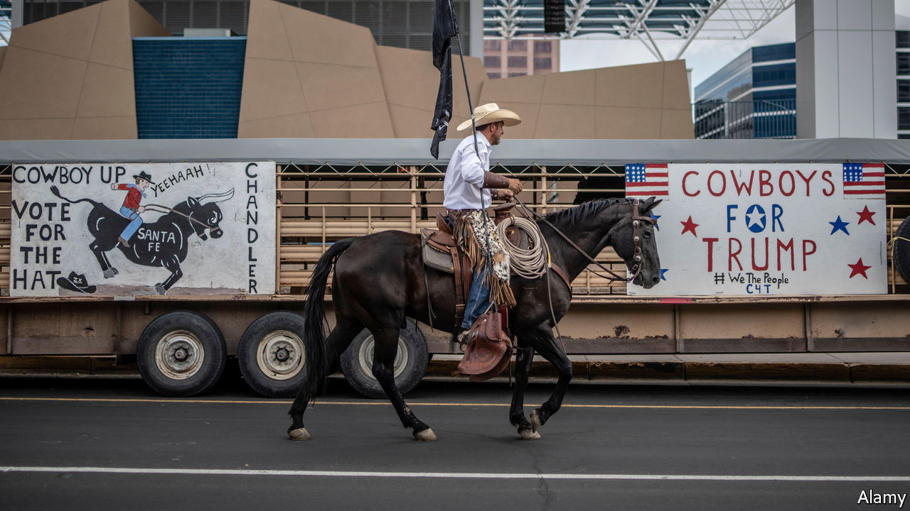
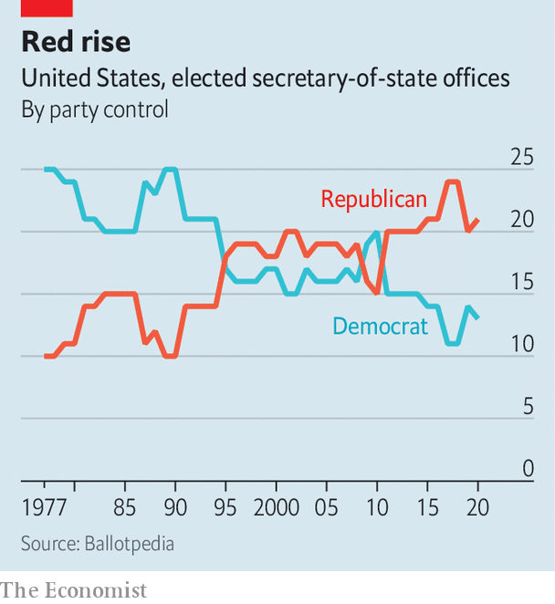

###### Trust in the vote

# Trump truthers are vying to run America’s local elections 

##### A mostly bureaucratic endeavour is becoming a partisan battleground 

 

> Jun 28th 2022 

Otero county, in New Mexico, is home to fewer than 70,000 people. Yet the rural municipality found unfortunate fame recently when local officials refused to certify the results of their primary elections, held on June 7th. New Mexico’s secretary of state, Maggie Toulouse Oliver, swiftly asked the state Supreme Court to compel the county commissioners to certify the results. They eventually voted 2-1 to do so. Couy Griffin was the lone dissenter. The founder of Cowboys For Trump, Mr Griffin had to dial in to the vote from Washington, dc. On the same day that he voted to disenfranchise his constituents, he was sentenced to two weeks in jail for taking part in the Capitol riot on  last year.

This was not a contentious election. The county clerk insisted there was no evidence of fraud, and no candidate questioned the results. Mr Griffin himself admitted his intransigence was not based on any facts. Echoing a favourite conspiracy theory of Donald Trump, the commissioner said he just had a “gut feeling” that something was amiss with the Dominion voting machines. Ms Toulouse Oliver told  that the state’s attorney-general was mulling civil and criminal charges against the trio, whose limited role in elections is supposed to be “a rubber stamp” of results already verified by the clerk. 

 


That local officials are turning routine administrative tasks into partisan judgments may portend wider problems. Election administration in America was not free of partisanship before Mr Trump peddled the  that he beat Joe Biden in 2020. In eras past, political machines “put their thumbs on the scale to help their party”, says Kevin Johnson, executive director of the Election Reformers Network (ern), a non-profit group. In many other countries, non-partisan commissions run elections. America’s election administrators belong to political parties and are voted into office (see chart). Republican and Democratic secretaries of state, the top election officials in more than 30 states, routinely raise money for other candidates. They also oversee elections in which they themselves are on the ballot. 

Two related developments have transformed election administration from a mostly bureaucratic endeavour into a partisan battleground. The first was the pressure that Mr Trump exerted on election officials to declare his victory in 2020. The hearings run by the House of Representatives committee  insurrection demonstrated how Mr Trump and his toadies tried to coerce , Georgia’s secretary of state, to “find” enough votes to win. To some, this revealed the importance of electing principled officials to such posts. 

To others, however, it revealed the importance of packing those posts with loyalists who might take a different decision should there be a next time. This is the second change. At least 23 Republican candidates for secretary of state in this year’s mid-terms have questioned the results of the 2020 election, according to States United Action, a watchdog. The latest test of Republicans’ embrace of these candidates was Colorado’s primary on . Tina Peters—a clerk who was recently indicted for breaching her county’s election system in an effort to prove that the voting machines were rigged against Mr Trump—lost out to a moderate with no such delusions. That shows voters can push back.

The partisanship of election administrators matters beyond questions of certification. Polling shows that Americans have more confidence that their local elections are run fairly than they do in state or national elections. But that confidence may be eroded if local officials continue to cry fraud. A survey of New Mexican voters in 2020 found that, of several possible fraudulent activities, people were most worried that their secretary of state would make rules that favour his or her own party.

Unfounded accusations of fraud also take a toll on the hundreds of thousands of Americans who work on the polls, many of whom are volunteers. Ruby Freeman, a former election worker in Atlanta, told the January 6th committee that there was nowhere she felt safe after enduring threats and abuse from supporters of Mr Trump. Robyn Holmes, the Otero County clerk who oversaw the vote, said one of her workers wants to quit. “We’ve never had a commission that doubted anything,” she laments. “It’s just so strange, you know?” ■

