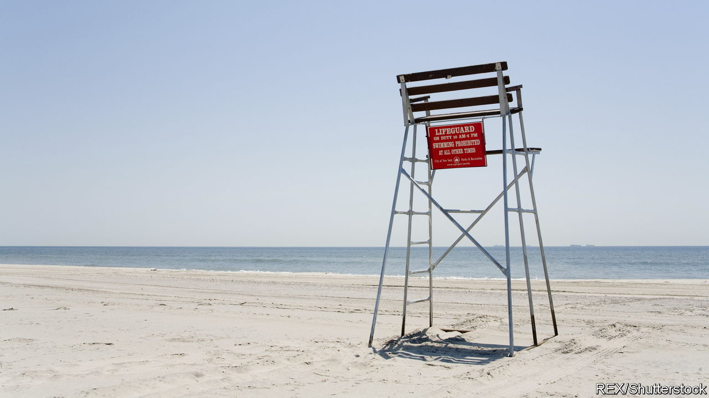

###### Sink or swim

# Where have all the lifeguards gone? 

##### A national shortage means many of America’s pools and beaches may be closed or unmanned 

 

> Jun 30th 2022 

Becoming a lifeguard is not easy. In Philadelphia a candidate must swim 300 yards (274 metres) without stopping, complete 12 laps in a 25-yard pool and tread water for two minutes without using arms. They must also retrieve a ten-pound (4.5kg) brick from a well 12 feet deep, then return to the surface and, using legs only, swim 20 yards back to the starting point with the brick, holding it out of the water with both hands—all within one minute and 40 seconds. 

After that comes a 25-hour training course, including first aid. Ocean lifeguarding requires additional hours of training. Wildwood Crest, on the Jersey Shore, requires a ten-day camp.

It may look an easy job, sitting on a chair by the water, but it is highly skilled. This is part of the reason that pools and resorts are struggling to find lifeguards. The main cause is the pandemic. When pools closed, the pool of lifeguards dried up. A poll in May by the National Recreation and Park Association found that only 12% of park and recreation leaders were fully staffed for the summer. The national shortage means many pools are closed or operate for reduced hours. Some beaches may be unmanned.

Austin, Texas, has 462 lifeguards, 62% of the 750 needed to operate its summer pools. It has opened only 15 of its 32 pools. In New Orleans some pools will open for two days a week, instead of the usual five or six. New York City has had to cancel its aquatic programmes, including free swimming lessons. Philadelphia, a city of 1.6m people, has 1m pool visits every summer. It is opening 50 of its 63 pools on a rolling basis. 

Philadelphia is using TikTok to recruit lifeguards, as well as looking to pensioners: one, a 70-year-old grandmother, last served as a lifeguard when she was 16. Austin is offering signing bonuses of up to $750; New Orleans has raised its summer hourly wage from $12.57 to $18.02. Private resorts are struggling, too. George Amitrano, general manager of Catalina, a beach club on Long Island, is worried he will lose lifeguards to the club next door, which is offering $3 more an hour. 

“The candidates are just not out there,” says Bud Johnson, chief of patrol in Wildwood Crest. Usually he has his pick. “This year basically anybody that showed up to take the test, we worked with them until we could get them up to standard.” Tom Gill of the United States Lifesaving Association is worried about next year. “We’ve already screwed up the pipeline in the last two years,” he says. “And it’s not going to get better.”

Water programmes may seem like a luxury, but they are a matter of life and death. Pools and beaches keep people cool, teach children to swim and keep them out of trouble in the summer, when violence often increases in cities. Three people, sadly, drowned at Wildwood’s beaches in June. No one has perished when a lifeguard has been on duty. 

