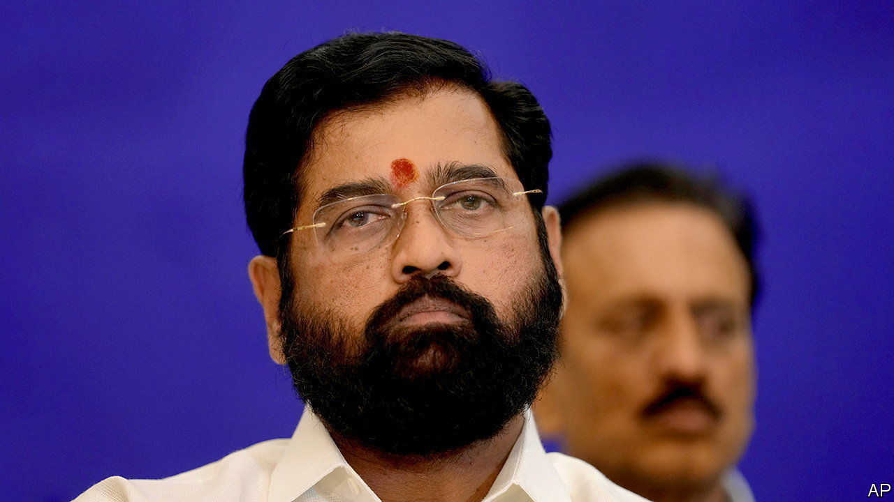
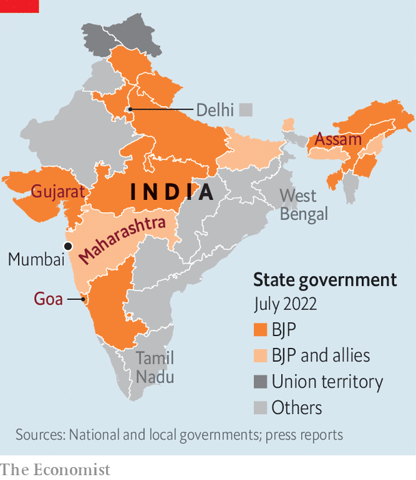

###### Shinde shindig

# India’s ruling party wins control of its richest state 

##### By wooing defectors, the Bharatiya Janata Party has taken Maharashtra 

 

> Jul 7th 2022 

A heavy downpour washed over Thane, a distant suburb of Mumbai, on the night of June 30th as the monsoon at last put in an appearance. No matter—the streets were alight with celebration. Firecrackers and rockets went off. People played music and danced in the road. “I banged the drum so hard that it tore,” enthused Sanjay Dalvi, an autorickshaw driver. At 7.30pm that evening Eknath Shinde, who represents a part of Thane in the state assembly and had himself once driven an autorickshaw for a living, had been sworn in as chief minister of Maharashtra, of which Mumbai is the capital.

Mr Shinde’s ascent capped ten days of political turmoil in India’s richest and second-most populous state. A longtime member of the Shiv Sena, for decades Maharashtra’s dominant political force, Mr Shinde broke away along with some 40-odd legislators and tied up with the Bharatiya Janata Party (bjp), which runs the national government. “It is a blockbuster surprise,” says Sanjay Jha, a former spokesman for the Congress party, which until last week helped run the state in a grand coalition with the Shiv Sena and a third party. Nobody expected the Sena, as it is often known, to crack up. 

Long before the bjp veered down the path of muscular , or Hindu nationalism, the Shiv Sena had established itself as a fierce defender of Hindus in general and native Maharashtrians in particular. Under its firebrand founder, Balasaheb Thackeray, it developed a reputation for assaulting migrant workers in Mumbai. Its members were also involved in bloody anti-Muslim riots in Mumbai the early 1990s. 

Yet in recent years the Sena had mellowed. Uddhav Thackeray, Balasaheb’s son and Maharashtra’s now-former chief minister, had built a reputation for competence and . The state had remained mostly free of the religious clashes common in bjp-ruled states. Though covid-19 hit Mumbai as hard as any other Indian city, the health system  the wrenching scenes of people dying outside hospitals seen in Delhi, the capital, and the north. That earned Uddhav new admirers, even among liberal types who once loathed his party. 

It also earned him the hatred of the bjp. The parties were natural allies, and indeed had fought elections together since 1989. But  after the last poll, in 2019, over who should get the chief minister’s post. The bjp has been trying to bring down the state government ever since. It repeatedly accused the Sena of forgetting its  antecedents. Uddhav, for his part, emphasised governance over hatemongering: “Our  is not to burn houses, but to light stoves in houses,” he said at a rally in May. 

 


The trouble started on June 21st, when Mr Shinde took 11 lawmakers to a hotel in Surat, a business hub in the bjp-ruled state of Gujarat. By noon the number of rebels had grown to 25. Two days later he put them on a plane and locked them up in a hotel in Guwahati in Assam, another bjp-ruled state (see map). By now they were 40.

There, he told them he had the support of “a national party that shook Pakistan”, a reference to the bjp. Next, they shifted base to yet another five-star hotel in bjp-ruled Goa. Having lost the support of the majority of his lawmakers, Uddhav resigned on June 29th. Mr Shinde later credited Devendra Fadnavis, a former bjp chief minister of Maharashtra (who is now Mr Shinde’s deputy), with orchestrating the whole thing. Such shenanigans are common enough to have a name: “resort politics”.

Opposition parties across the country will be worried by the bjp‘s ability to split the Sena, a usually disciplined group. The bjp, for its part, gloated over its victory by vowing to pick up other states that seem out of its reach, such as Tamil Nadu in the south and West Bengal in the east. One test of its popularity in Maharashtra will come later this year, when Mumbai holds municipal elections. The Sena dominates the city, but the split may cost it dearly.

For the citizens of Maharashtra, the immediate worry is that the bjp’s divisive politics, and the violence and disharmony that come with it, will disrupt life in the state. Mumbaikars in particular tend to prize business over politics and ideology. Yet they too may soon find themselves subject to the same forces that govern much of the rest of the country. ■

