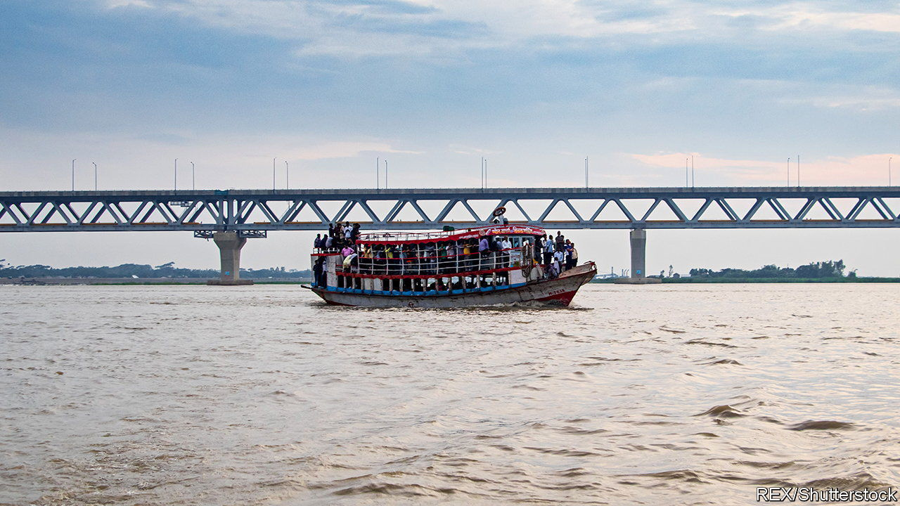

###### Bridges to liberty

# New transport infrastructure helps South Asian women into work 

##### Female employment rises when journey times fall 

 

> Jul 7th 2022 

Mamtaj begum has lost count of the hours she has spent waiting for a ferry on the banks of Bangladesh’s Padma River. Travelling from her hometown of Faridpur to Dhaka, the capital, and back can take days. It is also hazardous. Last year, as one of the heaving boats lurched across the water, she watched a man drop dead from heat stroke. Her cousin drowned when his overloaded ferry overturned. The 33-year-old garment worker also faces “horrific harassment” during the bus and boat rides, she says. Back home, her neighbours call her “prostitute of garments” for undertaking such a long journey alone. 

Since Bangladesh’s economy took off a few decades ago, millions have headed to the capital to make their fortunes. Many of them are women, who make up 80% of the 4m workers in the garment industry, which has propelled . For the women of Faridpur, a town 60km south-west of Dhaka, these jobs have been tantalisingly close, yet hard to reach. Now, a new bridge spanning the Padma, which opened on June 25th, has cut the journey time to the capital to just a couple of hours. 

Some 23 years in the works and costing more than $3.5bn, the Padma bridge promises to connect around 30m people in Bangladesh’s south-west to jobs and trade in the east. Such projects benefit everybody, but especially women, whose ability to travel is often restricted in conservative South Asian societies, says Mushfiq Mobarak, an economist at Yale University. The greater the distance or perceived distance, the greater the stigma. 

New research on an earlier project reveals what women stand to gain from the Padma bridge. In 1998, when the Jamuna bridge connected Bangladesh’s north-west to Dhaka, journey times plummeted. For residents of one city, for instance, a trip that took anywhere from 12 to 36 hours was cut to four hours. The number of women migrating and finding work in garment factories soared compared with those in similarly remote regions, researchers at the University of Kent in Britain and Monash University Malaysia found.

Yet that bridge, and the greater ease of getting to work it allowed, did not wholly offset the effect of conservative social norms, says Zaki Wahhaj, one of the study’s authors. These often prohibit women from travelling alone. The number of unmarried or unaccompanied women migrating did not go up. What changed was that families were happier to marry their daughters to men heading for Dhaka. They felt that a faraway place had come closer. Many of those women then took up work in the garment industry. 

Women were not passively carted off to the city by industrious husbands, though, says Niaz Asadullah, another author of the study. After the bridge was built, migrating grooms were more likely to receive a dowry. Women—or their families—appeared to be looking specifically for men migrating to the capital. They were prepared to pay a premium for such a catch. 

Opportunities for and ease of access to work can also shift cultural norms. After the Jamuna bridge was built girls in Bangladesh’s north-west spent on average an extra year in primary school, and those from wealthier families were more likely to enroll in secondary school, perhaps in part because their parents hoped a better education would help them snag a migrating husband. In villages where women could travel to a garment factory and back within a day, parents were more likely to send their daughters to school than in villages that were slightly farther away, another study co-authored by Yale’s Dr Mobarak found. In this case, their efforts seemed aimed at securing jobs, not husbands, for their daughters. 

Only some 20% of Indian and Pakistani workers , compared with 36% in Bangladesh. Changing that is critical. “If you cannot make half the population productive, that’s always going to be an impediment to growth,” says Dr Mobarak. Governments everywhere love things like bridges. In South Asia, such efforts have the added bonus of benefiting women. ■

