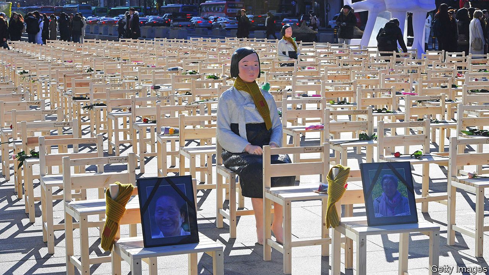

###### Cold comfort

# South Korea and Japan have a rare chance to make friends 

##### They should be close allies. But history divides them 

 

> Jul 7th 2022 

The flight time between Seoul and Tokyo is just under two hours. Yet the last time a leader of South Korea or Japan paid a state visit to the other was in 2011, when Lee Myung-bak, then South Korea’s president, went to see Noda Yoshihiko, Japan’s prime minister at the time. Mr Lee praised Mr Noda’s recent goodwill gesture of returning some 1,205 royal books, which Japan had filched from South Korea during colonial times. Mr Noda held an intimate dinner party in Kyoto in honour of Mr Lee’s 70th birthday and 41st wedding anniversary. The two leaders expressed their desire to build a “future-oriented relationship” between their countries. 

Along with China, Japan and South Korea are East Asia’s economic powerhouses. Unlike their giant neighbour, they are established democracies and staunch allies of America. They are also wary of China’s growing clout in the region, to say nothing of the threat from a bellicose North Korea. But despite their shared contemporary interests, the past divides them. During the same summit, Mr Lee and Mr Noda clashed over the issue of “comfort women”, as Koreans and others forced into brothels for the benefit of Japanese soldiers during the second world war were euphemistically called (a memorial to the women is pictured). The goodwill quickly turned to renewed bad faith. A mix of historical grievances and fresh disputes has continued to curdle relations for a decade.

The problems stem from  about Japan’s colonisation of Korea between 1910 and 1945 and the suffering it inflicted on Koreans. It looked for a brief moment in 2015 as if the two might begin to put the past behind them. That year, Japan’s Abe Shinzo and South Korea’s Park Geun-hye, the countries’ leaders at the time, agreed a “final and irreversible” deal on the matter of comfort women. Mr Abe issued an official apology. His government gave ¥1bn ($7.4m) to a foundation to compensate victims. 

Ms Park’s successor, Moon Jae-in, was critical of the deal from its inception. In 2018, a year after he was elected, he ordered the foundation to dissolve. That year the country’s Supreme Court twice upheld rulings ordering Japanese firms to compensate South Koreans forced to work in their factories to aid the Japanese war effort. Japan, which considers  through a treaty signed in 1965, was aghast. The ruling created a formal legal barrier to rapprochement. But attitudes on both sides hardened too. 

A window of opportunity to improve relations may now be opening, if only briefly. Mr Moon finished his term in May. His successor, Yoon Suk-yeol, has renewed the call for “future-oriented” ties with Japan. Kishida Fumio, Japan’s prime minister, faces upper-house elections on July 10th, which his Liberal Democratic Party (ldp) is on course to win. He will then have up to three years before the next national vote. Both leaders have stressed the importance of working together amid an ever more challenging regional environment. 

Since Mr Yoon took office, links between the countries have begun to revive. He signalled his intent to patch things up by sending a delegation to Tokyo in April. On June 29th American, Japanese and South Korean leaders met to discuss security on the sidelines of a nato summit for the first time in nearly five years. On July 4th the two countries’ big business associations held their first meeting in three years. They urged their political leaders to make haste in repairing relations. 

That depends on first resolving the forced-labour dispute. South Korean courts have approved the seizure of assets belonging to Mitsubishi Heavy Industries and Nippon Steel, Japanese industrial giants that used forced labour during the second world war. Appeals have delayed the process, but the assets, which include South Korean patents and revenues, may be liquidated and the proceeds given to victims (or, in most cases, their surviving relatives). On July 4th Mr Yoon’s government launched a council tasked with devising a plan to avert that irreversible step.

Much will depend on Mr Yoon’s ability to keep the public and the opposition on side. Any perception that he is doing all the give and Mr Kishida all the take will enrage voters. “We cannot dance a tango alone,” says Shin Kak-soo, a former South Korean ambassador to Japan.

Many Japanese politicians reckon the sides are playing tennis, not dancing together. “It’s very clear the ball is in Korea’s court—they have to fix it,” says one ldp lawmaker. Mr Kishida, who as foreign minister in 2015 led negotiations on the ill-fated comfort-women agreement, is himself hesitant. He must also handle his party’s nationalist wing, which can be tin-eared on historical issues. Yet he may still be persuaded to two-step. Japanese diplomats recognise the strategic folly of continuing to quarrel with South Korea. 

Averting the liquidation will require careful choreography and mutual trust, which is in short supply. If efforts fail, relations will surely deteriorate further. Military co-operation between America, Japan and South Korea could stall. Trade restrictions could multiply. China and North Korea would surely rejoice. 

Shared strategic interests should, in theory, create a “lower limit” to how bad relations can get, says Sohn Yul of the East Asia Institute, a think-tank in Seoul. North Korea’s  of missile launches, and the spectre of a nuclear test, are a strong incentive for Japan and South Korea to work together. America has so far only sought to bring its two allies to the table, but it may try more active arm-twisting as the spat threatens to upset its efforts to rally allies in the region against China. 

The rewards for improved relations are big. A successful resolution to the court case might beget closer co-operation not only on security, but on a broader range of issues, such as supply-chain resilience. More co-ordinated economic outreach to South-East Asia would help to counter China’s clout in the region. Yet the countries’ troubled history also imposes “an upper limit” on how good relations can get, Mr Sohn says. Without confronting the past, Japan and South Korea will struggle to face the future together. ■

