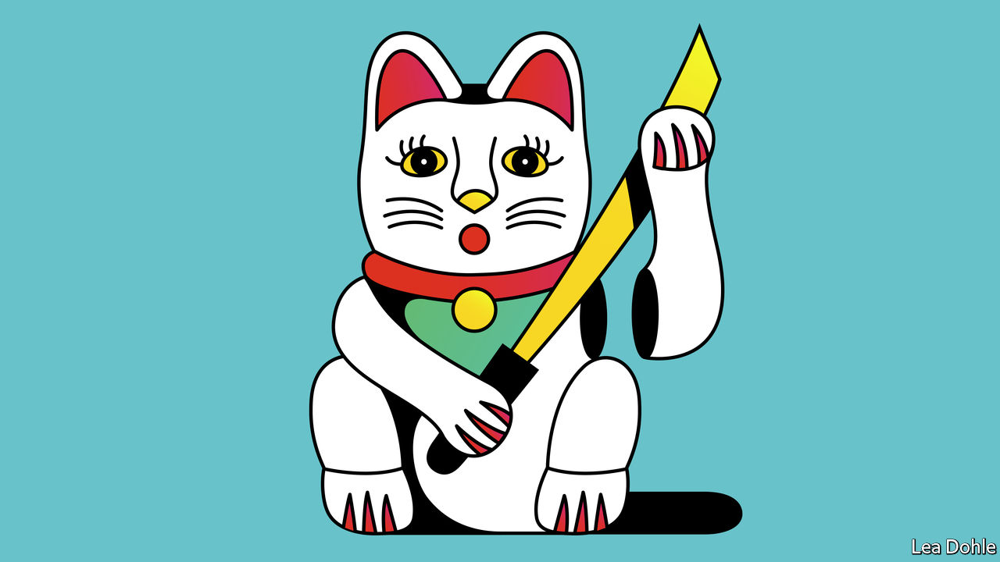

###### Banyan

# What pandemic border closures say about Japan’s view of outsiders 

##### Double standards in travel rules reveal a distrust of foreigners 

 

> Jul 7th 2022 

Facing the menace of Christianity in the early 17th century, the Tokugawa shoguns closed Japan’s borders. Foreigners were allowed to visit just a handful of ports. Japanese who tried to travel abroad, or who did so and returned home, were put to death. If they brought back a letter, their families were executed, too. Thus began the period later dubbed , or “closed country”; it lasted until Western warships “opened” Japan in the mid-19th century. 

Cut to the 21st century. Throughout the pandemic, Japan has maintained some of the tightest border controls of any democratic country. To this day, tourists are barred unless part of a group tour. Some observers are calling the government’s approach “neo-”. 

In some ways, Japan’s pandemic policies are normal for Asia, where many places took a draconian approach to keeping out the virus. Yet whereas other countries pursuing zero-covid strategies, such as China and Australia, barred even their own citizens from leaving, Japan created a dual system. Japanese nationals were largely free to come and go. Foreigners, even those with permanent residence, faced restrictions. , a daily, reported in October that roughly 370,000 foreign students, guest workers and their relatives were stuck outside the country despite holding residence visas. “Does the virus read your passport?” quipped a global health official. 

Such isolationism is a reversal of the pre-pandemic direction of travel, so to speak. Spurred by its ageing, shrinking population, Japan had been opening up. The number of tourists had grown from fewer than 7m in 2009 to more than 30m in 2019. The number of foreign students nearly doubled over the same period. The tally of foreign workers , albeit from a low base. In 2019 the Japanese government loosened laws to allow some foreigners to stay for longer. 

The pandemic revived an enduring scepticism about foreigners. “Japanese conceptualised covid as something that comes from the outside,” says Oussouby Sacko, a former dean of Kyoto Seika University, who was born in Mali. The unspoken logic is that foreigners cannot be trusted to stick to the practices, from mask-wearing to silent eating, that many believe helped the country maintain the  in the oecd, a club of 38 mostly rich countries, despite having the highest share of old people. Border closures have been popular: nearly 90% of Japanese approved when Kishida Fumio, Japan’s prime minister, tightened travel restrictions in response to the outbreak of the Omicron variant late last year.

The short-term political gain comes at a cost, however. Japan has already lost a cohort of foreign students, the very people who often go on to become bridge-builders between countries. Only around 11,600 managed to enter Japan in 2021, compared with some 120,000 in 2019. Foreign students stuck in limbo have protested. Some have switched to studying in countries with more open borders, such as South Korea. Foreign businesspeople complain that the policies have made it harder to oversee operations, negotiate deals and make investments. 

The present-day isolationism serves as a reminder of why Japan needs outsiders in the first place. The country needs to quadruple the number of foreign workers by 2040 to sustain the government’s modest average growth target of 1.2%, according to a recent study by a group of Japanese think-tanks. (Without sustained investment in automation, the number would have to rise more than ten-fold.) Japanese business leaders have been among the loudest voices calling for reopening. “Business is not conducted solely on a domestic basis,” the head of Keidanren, Japan’s biggest business lobby, said when calling for an end to the “situation” earlier this year. As demographic change accelerates, labour shortages will become more acute. 

Mercifully, neo- looks likely to ease a lot sooner than the original version. Japan began letting business travellers and students into the country in March and allowed group tours in June. Officials whisper that a full reopening will come sometime after upper-house elections on July 10th, barring a resurgence of the virus. If anything, demand for travel is likely to have grown rather than faded: in an annual survey, readers of , an American magazine, put three Japanese cities at the top of their list of favourite foreign cities in 2021, despite being unable to visit. Like it or not, the world wants Japan, and Japan needs the world. 


 


