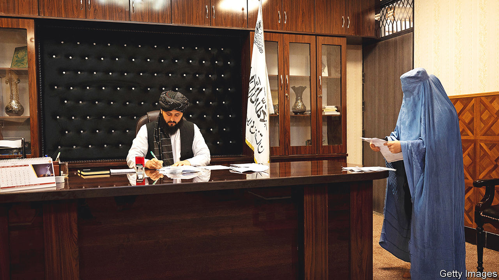

###### Bureaucratic nightmare

# “I’m from the Taliban and I’m here to help” 

##### Former fighters and religious clerics are filling Afghanistan’s civil service 

 

> Jul 7th 2022 

Under ashraf ghani, Afghanistan’s president until the  last August, the country’s interior ministry oversaw much of the security apparatus involved in fighting the insurgents. It is now presided over by one of its deadliest foes, Sirajuddin Haqqani, who led a faction of fighters known for its high-profile bombings in Kabul, the capital. Corridors where American and European advisers once roamed are crowded instead with Mr Haqqani’s long-haired fighters. Civil servants who worked for Mr Ghani’s government sit alongside men who would cheerfully have murdered them a year ago.

Such shared offices are now found throughout . The country’s civil service, like those across South Asia, is a bloated, inefficient thing that puts much stock in the power of rubber stamps and official signatures. The Taliban has adopted this bureaucratic machinery wholesale, filling it with its own people. After all, citizens still need permits, licences and official forms.

Civil servants from the previous regime have little option but to make the best of it. They and their new colleagues rub along as well as they can. Pragmatic technocrats are growing out their beards and swapping suits for the traditional clothing favoured by their new masters. It is sometimes hard to tell the difference between old and new officials.

At other times the divide is clear. “Don’t worry. I am not one of them. I will help you,” whispers one manager once he is sure none of his Taliban colleagues can overhear. “These people are ignorant,” complains another. At one department, a functionary being interviewed by a journalist worries he has offended his bullying new Taliban director. “Please write that he is a great man,” he pleads.

The Taliban’s appointments fill holes left when thousands of Afghan civil servants fled the country last year. The calibre of the replacements is often questionable. The new Taliban counterpart of the medical director at one Kabul hospital at least has a degree in medicine. But at other hospitals, staff said the new Taliban appointees were fighters or village clerics with more interest in how women dressed than in public health. 

Nor are things much better at the highest levels of government. The cabinet is packed with ethnic-Pushtun Taliban stalwarts. Other groups are sidelined. Appointments “have favoured loyalty and seniority over competence”, notes a un report. Decision-making is unpredictable, say foreign officials who deal with the new government. 

Any hope that the demands of running a battered country might mellow the militants’ ideology was dashed last week, after the regime held a , or grand council, of religious scholars. More than 3,000 clerics and notables—all men—were invited to Kabul for three days of confabulation. It was the biggest gabfest since the Taliban took power. Speculation was rife that the  would revisit the unpopular decision . Marginalised ethnic groups as well as some inside the Taliban sought signs of compromise from a leadership they see as increasingly remote and autocratic.

The Taliban’s supreme leader, Haibatullah Akhunzada, offered no such thing. Instead, he delivered an emphatic speech in which he called for total obedience and unity. He outlined a theocracy where clerics would guide everything. Mr Akhunzada made it clear that anyone associated with the former government would not be allowed to share power. The Talibanised ministries and courts, he boasted, had banished bribery and corruption, and brought justice and harmony. There was no mention of girls’ education. For the officials in charge of implementing these policies, more awkward conversations lie ahead.

