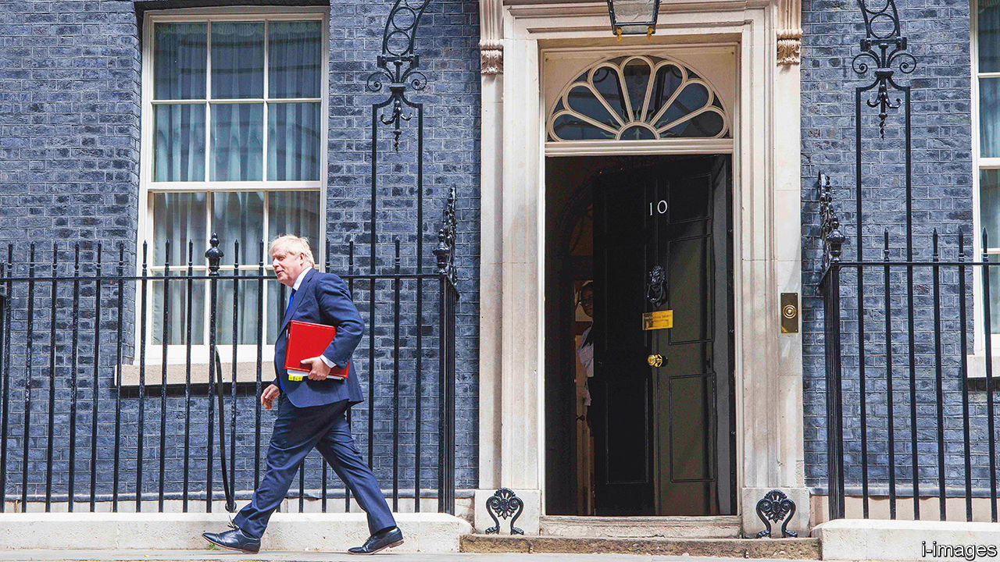
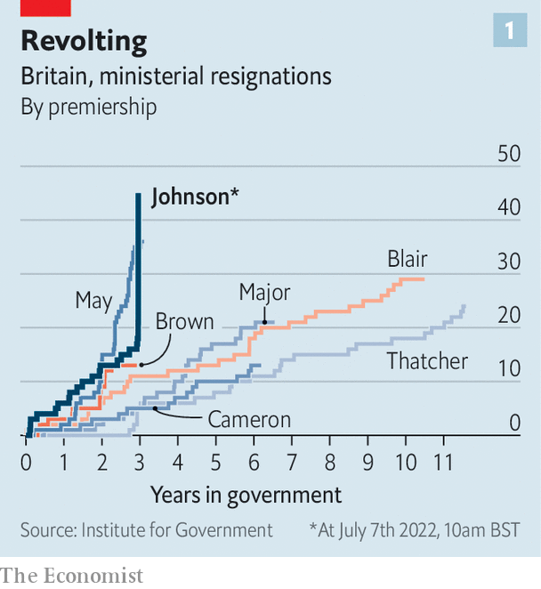
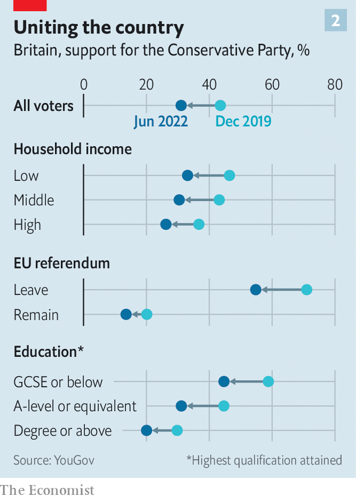

###### The wreckage he will leave behind

# A monstrous in-tray awaits Boris Johnson’s eventual successor 

##### Dealing with it may be beyond an exhausted Conservative Party 

 

> Jul 7th 2022 

Boris johnson’s premiership started collapsing to the sound of “Zadok the Priest”On July 5th, beneath the windows of Downing Street, the bands of the Household Division were conducting the Beating Retreat, an annual parade marking the closure of camp gates at nightfall. One hour before, Rishi Sunak, the chancellor of the exchequer, and Sajid Javid, the health secretary, had resigned. In the offices of Whitehall, all hell was breaking loose. On the square below, immaculate precision. 

Over the next 36 hours, some 50 members of the government would resign; countless more mps would urge Mr Johnson to go. On the evening of July 6th, a delegation of cabinet ministers—among them Mr Sunak’s replacement, Nadhim Zahawi—told him the game was up. His response was a fit of Shakespearean defiance. He sacked Michael Gove, the closest thing the cabinet had to a greybeard, and insisted upon his personal electoral mandate of 14m voters (a bastardisation of the constitution: Britons elect parliaments, not presidents). He hinted at asking the queen for an election to save himself from his colleagues; that would have tested constitutional conventions to the limit. Boris Johnson did what he always does: he looked out for Boris Johnson. 

 


By the next morning, he did not even have a Potemkin government left to run. He told his colleagues he would go, but asked to be allowed to stay on to oversee a transition. Fat chance, thought many; the most careless of prime ministers could not be a caretaker. “Evict TODAY or he’ll cause CARNAGE,” tweeted Dominic Cummings, a vengeful former aide. Mr Johnson had promised to end the instability that blighted Theresa May’s short premiership. He has more than matched it (see chart 1). 

At the front of the queue to succeed Mr Johnson is Mr Zahawi. A child refugee from Iraq, who supported Brexit and oversaw a successful vaccine programme, he is a popular figure in the party. But the field will be large. Liz Truss, the foreign secretary, is keen; so is Tom Tugendhat, the chair of the foreign-affairs committee, and Suella Braverman, the attorney-general. Mr Sunak and Mr Javid are expected to have a tilt.

Whoever succeeds Mr Johnson will inherit a monstrous in-tray. The Bank of England forecasts inflation to reach 11% in the autumn; the pound is fragile. The nhs is grappling with an immense backlog of 4.3m patients waiting for elective procedures. The long-term growth outlook is poor. He or she will also confront a deeper question: is the Conservative Party still capable of governing? 

 


Support for the Tories has fallen across all types of voters who backed them in 2019, according to our analysis of polling conducted by YouGov in June (see chart 2). The next election will see them fight on all fronts, as new northern seats and southern heartlands face a pincer movement from Labour and the Liberal Democrats. After 12 years in power, four general elections and the imminent loss of a third prime minister, the exhaustion may be too great and the rifts too deep for the party to recover.

Mr Johnson’s policy of vigorous support for Ukraine is not in any great jeopardy. Beyond that, difficult choices lie. Lee Anderson, the blunt Tory mp for Ashfield, an old mining district, declared he had no confidence in Mr Johnson and called for a “government of low taxation [that] will be tough on illegal immigration.” Such simple demands, so hard to meet.

On the economy, Mr Sunak’s departure underlined deep Tory divisions. In his resignation letter to Mr Johnson, Mr Sunak, who espouses fiscal discipline, declared that their approaches were “fundamentally too different”. A leadership contest will be rich in Thatcherite homilies but unlikely to resolve the party’s simultaneous desires for low taxes, balanced budgets and expansive public services. 

On immigration, one right-winger lamented that Mr Johnson might have been safe had he only cracked on with sending asylum-seekers to Rwanda in defiance of a ruling of the European Court of Human Rights. Similarly, the Eurosceptic right will seek promises to overturn the part of the Brexit treaty that deals with Northern Ireland as the price of its support for any leadership candidate. 

Yet such violations of international law gravely alarm the liberal wing of the party, which sees them as ruinous to the reputation of Britain abroad. There is no consensus on whether Britain should pursue a rapprochement with the eu or fight it. Mr Johnson has hooked his party on quick fixes to intractable problems. It will take years to get clean. 

On culture, too, it is riven. Mike Freer, who resigned as the equalities minister, accused the government of “creating an atmosphere of hostility for lgbt+ people”; many other mps want the government to be more sceptical of transgender rights. The question of whether Mr Johnson’s skirmishes with the bbc, universities and other agents of “wokery” were a net gain or a net drag on Tory performance is unresolved. The party never fully digested how it won so handsomely in 2019; many Tories have confused their personal hobbyhorses for the priorities of the electorate. 

The Conservative Party will unite on one thing, however, and it is the silver lining to a very dark cloud. Above all, the coming leadership contest will be dominated by the question of who can restore the Conservative Party’s values of government, says Will Tanner, of Onward, a think-tank close to the party. Candidates will outbid each other with pledges to restore integrity to public office, uphold conventions and put the national interest over ideological purity. Shirts will be tucked in; shoes buffed. They will agree that chaos in Downing Street has paralysed policymaking. 

After Donald Trump’s downfall, America’s Republicans doubled down on populist excess. For three years, the Conservative Party has leant over the precipice. Mr Johnson was happy to plough straight on. But Tory mps have chosen to turn back. ■

