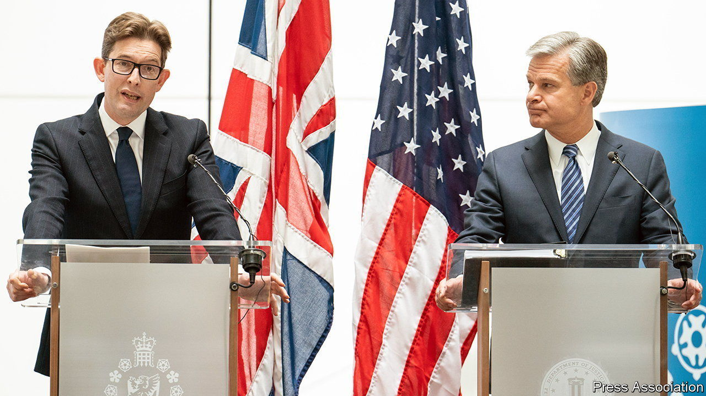

###### Chinese espionage

# Britain and America sound a joint alarm over China 

##### In Britain, that is a novelty 

 

> Jul 7th 2022 

As boris johnson’s authority dissolved a few hundred metres away in the House of Commons, business and academic leaders gathered in Thames House, the headquarters of mi5, Britain’s security service, on July 6th. The occasion was the first ever joint speech by that service’s director-general, Ken McCallum, and the director of the fbi, Christopher Wray. With all eyes on Russia, they issued a stark warning: Chinese spies are running rampant. 

“The most game-changing challenge we face comes from the Chinese Communist Party,” declared Mr McCallum, who spent most of his career working on mi5’s bread-and-butter task of counter-terrorism. Chinese espionage against intellectual property is a “co-ordinated campaign on a grand scale”; the “strategic contest” would last decades. mi5 has doubled the resources devoted to China in the past three or so years and will double them again, he added. The volume of China-related investigations has grown sevenfold since 2018. 

Mr Wray, who revealed in January that the fbi was opening a new China-related case every 12 hours, warned that the mss, China’s main spy agency, and the pla, its armed forces, were out to “ransack” Western companies of their know-how. Many Chinese firms were fronts for the Communist Party, he warned, adding that the country’s hacking exceeded in scale that of all other major powers combined. Chinese espionage was “subtle” and “patient”, said Mr McCallum, often cultivating politicians and others at the outset of their careers.

Such candour about China is  for American spooks but relatively novel for British ones. Under David Cameron, the prime minister from 2010 to 2016, Britain sought to be “China’s best partner in the West”. Mr Cameron even shared a pint with Xi Jinping in a rural pub. The mood hardened under Theresa May, Mr Cameron’s successor, and a decisive break occurred when Mr Johnson’s government banned Huawei, a Chinese telecoms giant, from Britain’s 5g mobile network in 2020.

A few years ago Europe was deeply split over China. But at a nato summit in June all 30 allies agreed that China was now in “strategic partnership” with Russia, and that the duo were “at the forefront of an authoritarian pushback”. Whoever succeeds Mr Johnson is unlikely to sup with Mr Xi any time soon. ■

