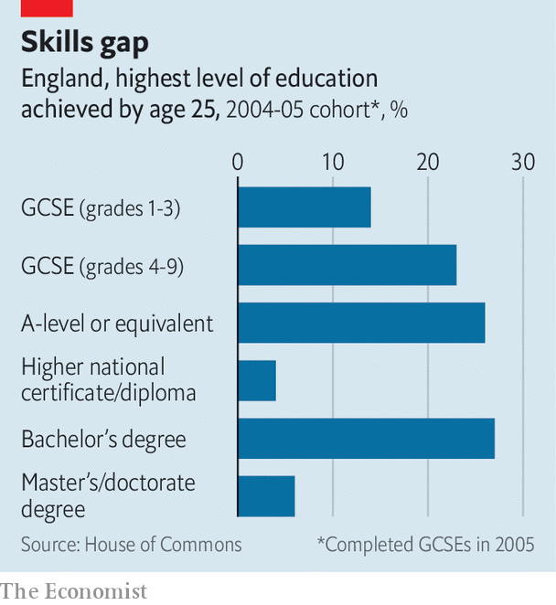

###### Britain’s growth crisis

# Britain wants to shake up adult education 

##### Plans to shake up lifelong learning are intriguing 

 

> Jul 7th 2022 

Britain is good at turning out graduates. The number of people starting a full-time degree in England has risen by nearly a quarter since 2010. But a university degree is only one kind of adult education, and unfortunately the others are ailing. The total number of adults enrolled in classes of any sort fell by almost one-third between 2010 and 2020. That is denting their economic prospects, and Britain’s. 

Few people are studying for “sub-degree” qualifications—technical certificates and diplomas that school-leavers can obtain in one or two years. Only 10% of adults in England hold one of those as their highest qualification, compared with around 20% in Germany and more than 30% in Canada. Part of the reason is that part-time study has become less popular: part-timers account for about half of the people taking sub-degree courses. 

When it is not imploding, the government is thinking about how to make such courses more popular. It wants a “Lifelong Loan Entitlement”, which would be a sum equivalent to the cost of four years’ full-time undergraduate study. People could draw on this entitlement at will. It says it wants to have this running by 2025. 

 


In theory, this would not only encourage school-leavers back into classrooms but would steer some young people away from conventional degrees. An independent review of student financing released in 2019 argued that it would encourage learners to shop around for cheaper degree courses (because any individual “entitlement” that they do not borrow upfront could be squirrelled away for re-skilling in later life). Young people might also ask themselves whether one or two years of post-secondary study could be enough to launch their careers. The report’s authors noted that Australia and New Zealand already have loan systems that work in a similar way.

The government is also thinking of relaxing various restrictions. Officials may loosen rules that require borrowers to study at a certain pace, which makes some night classes unfundable. The government also seems inclined to relax rules that deter people from borrowing to take a qualification at the same or lower level as one they have already achieved. That would make it easier to learn new skills. 

And there are plans to allow learners to apply for tiny loans (at present they must borrow enough to pay for a whole qualification or for a year’s worth of lessons). The hope is that people might gain useful skills by snacking on learning. In September some universities will begin to offer “short courses” in areas such as health care and teaching. They can be completed in as little as six weeks. Many will be online. 

These reforms will probably do more to promote vocational education among youngsters than to help oldies re-skill. Mature students tend to be warier of debt than young ones, so tinkering with loan terms might not entice them. Providing more grants would work better—though that does not seem to be on the cards. The plans also offer little new to graduates who wish to refresh their skills mid-career. Still, the attempt to give people more control over loans and push short courses is intriguing. This government has produced few big ideas. Lifelong learning is an exception. ■

