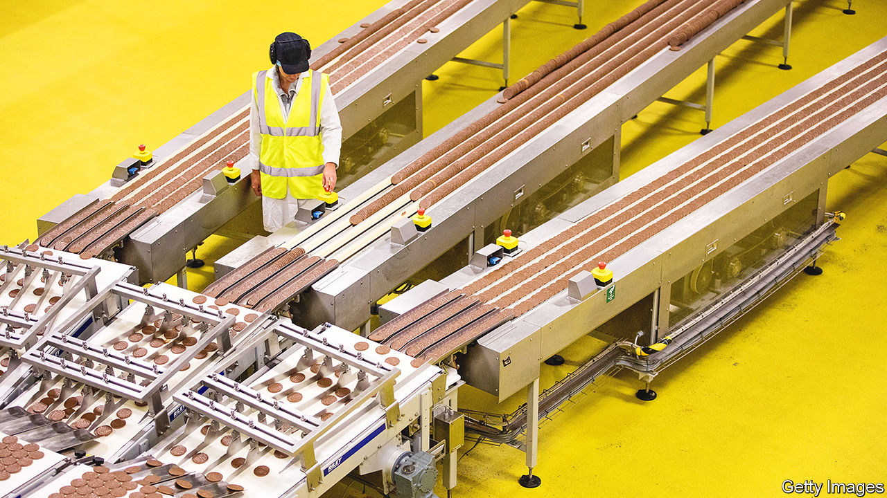
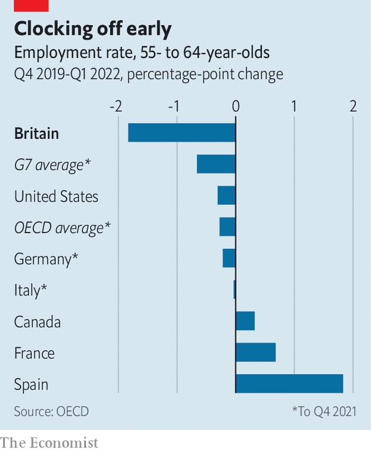
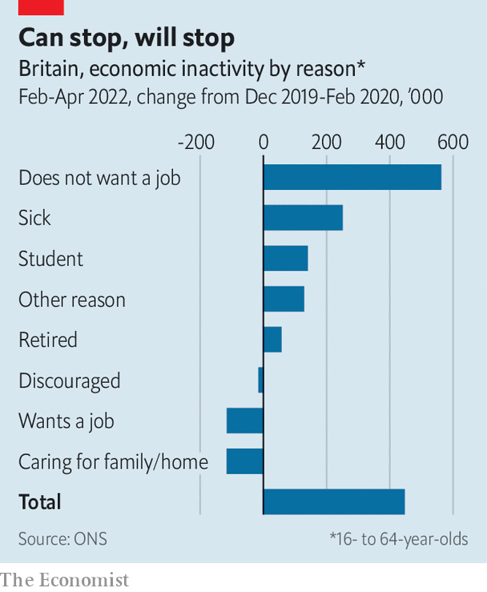

###### A nation of backlogs

# Britain’s labour market is straining to recover from the pandemic 

##### The disappearance of older workers explains a lot 

 

> Jul 7th 2022 

Staff shortages have become a nuisance for businesses and consumers alike. Airlines are struggling: in June travellers searched online for “flight cancelled” at the highest rate since the early days of the coronavirus pandemic. Retailers report that employees fail to turn up for shifts and that job candidates skip interviews. Ed Vokes of Evolve Recruitment, a catering-staff agency, says that he used to supply workers with only a few days’ notice. These days he requires months.

Between March and May the number of vacancies in Britain reached a record 1.3m. The tight labour market is affecting many industries. Figures from Indeed, a recruitment platform, reveal a 72% increase in postings within the food-preparation and service sector since February 2020 and a doubling in warehouse positions. In the 12 months to May 2022 Linkedin, a networking platform, saw a 72% drop in the average number of applications per job posting.

The public sector is feeling the squeeze as well. Neil Carberry of the Recruitment and Employment Confederation, an industry body, says that shortages in health care existed before the pandemic but have become more acute. Indeed’s figures show that postings for medical technicians, physicians and surgeons have all increased by more than 75% since February 2020. Of nhs trust leaders surveyed in March, 97% thought staff shortages were having a “serious and detrimental impact on services”.

 


Some are benefiting from the turmoil. Wayne Brophy of Cast uk, a logistics recruiter, reports a doubling in demand as clients find that word of mouth and traditional advertising are not enough to find staff. Some workers are benefiting from the competition in the form of bonuses and higher wages. Employers are cutting the number of interview rounds, offering more flexible working and laying on transport to work.

The pandemic is at the root of the imbalance between demand and supply. Some industries that suffered badly from lockdowns are now trying to recruit in a hurry, only to discover that the nation’s waitresses and baggage-handlers have moved on to other jobs. Robust demand is contributing, too. 

A shortage of workers is a nicer problem for Britain to have than hordes of unemployed people hunting for work. What is alarming is that many people have disappeared from the labour force. Had pre-pandemic trends continued, there would have been around 1m more 16- to 64-year-olds employed between February and April than there actually were. Tony Wilson of the Institute for Employment Studies, a research outfit, estimates that a shortage of people (caused by demographic change, excess deaths and lower migration) explains only about a quarter of the decline. The rest is caused by workers withdrawing. 

 


Official statistics shed some light on why (see chart). One explanation is that more young people are going to university, helped by grade inflation. Others are sick, from long covid or something else; the shortage of nhs staff may be contributing to the shortage of workers in other industries as people wait months for treatment. 

But older people account for most of the dropouts. Among 55-64 year olds, the employment rate fell by 1.8 percentage points between the final quarter of 2019 and the first quarter of 2022, compared with just 0.3 percentage points in America (see chart). Bee Boileau and Jonathan Cribb of the Institute for Fiscal Studies, a think-tank, conclude that the changes look “consistent with a lifestyle choice”. Mr Wilson points to the freedom people have to draw on private pensions from the age of 55.

The shortages problem may be temporary. Future cohorts of older workers will not have the same opportunity to step back and re-evaluate their work-life balance while on furlough. Today’s students will eventually graduate. 

High inflation and squeezed real incomes could also push some people back to work. The Office for National Statistics (ons) has surveyed over-50s who have not returned to employment. It finds that a third would consider doing so, and around half of these said they would do it for the money. A slowing economy could yet loosen the labour market. Recent data suggest that business confidence is falling. Hiring is a lagging indicator.

The government lacks leverage to nudge people back into the workforce. On July 4th it announced new measures to tackle unemployment among the over-50s on benefits. But many inactive people in that age group are not on benefits. Firms may have more luck enticing older people with promises of flexible work. The ons survey suggested that this was important to two-fifths of the 50- to 64-year-olds who said they would consider returning.

The Institute of Directors has suggested that free “boot camp” employment courses should be made available to anyone, regardless of previous qualification levels. Jane Gratton of the British Chambers of Commerce, a business association, wants bigger tax incentives for investment in skills as well as more frequent reviews of the shortage occupation list, which determines preferential access to visas. 

Recent retirees could also be reminded about the dangers of drawing down their pensions too early. Otherwise, investing in the pipeline of people willing to work seems like a safer bet than trying to coax back older workers who have retreated. But that will take time—years, perhaps. Here’s hoping demand for workers does not crash before it happens.■

