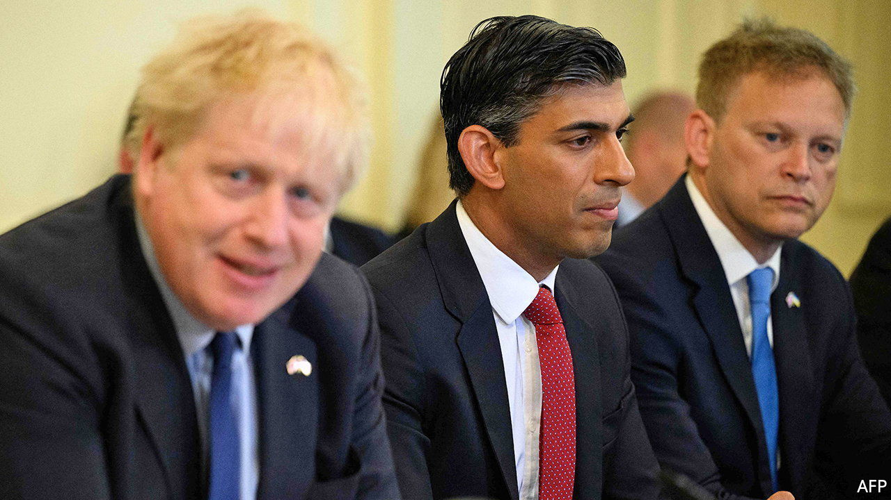
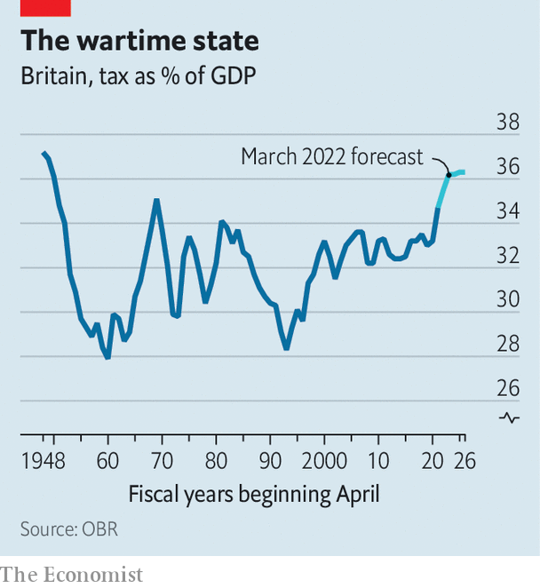

###### The rift with Rishi

# Many British Conservatives now prefer tax cuts to balanced budgets 

##### But high inflation makes it risky to stimulate the economy 

 

> Jul 7th 2022 

British politics has become so tumultuous and scandal-ridden that disagreements over policy seem almost courtly. But their consequences can be profound. A rift with Boris Johnson over the economy lay behind the resignation of Rishi Sunak as chancellor of the exchequer on July 5th. This philosophical divide may result in Britain throwing fiscal caution to the wind at precisely the wrong time.

The Conservatives have spent most of their 12 years in government trying to balance budgets: cutting the deficit was their flagship policy when David Cameron was prime minister. Yet some British right-wingers have recently started following a path laid down by America’s Republicans, whose pivot from fiscal hawkishness to embracing deficits under President Donald Trump was a sight to behold. These Tories want Britain to cut taxes without worrying about how to pay for it.

 


The pressures brought about by an ageing population and slow economic growth have for years deprived tax-cutters of red meat. As a share of gdp, Britain’s tax take is on course to rise to its highest in decades (see chart). In part this is because Messrs Johnson and Sunak raised national insurance, a payroll tax, to help fund the creaking nhs and social-care system. Corporate tax is scheduled to rise sharply in 2023. The electorate has noticed the growing tax burden. YouGov, a pollster, found that in June over two-thirds of adults thought the government was handling tax badly, up from under two-fifths a year earlier.

Mr Sunak had begun to loosen the purse-strings in response to soaring energy bills. In March he cut fuel duty and announced a partial reversal of the national-insurance increase. He had also planned to cut the main rate of income tax in April 2024. Yet reports suggest Mr Johnson wanted Mr Sunak to scrap the planned increase in corporation tax. One of his advisers had floated a temporary cut to value-added tax (vat). Nadhim Zahawi, Mr Sunak’s successor, reportedly thinks that tax cuts are necessary to achieve growth.

Mr Trump’s tax cuts did indeed stimulate America’s economy but at a time when inflation was low and there was therefore room to boost growth. British annual inflation is 9.1% and the Bank of England is trying to reduce economy-wide spending by raising interest rates. Tax cuts would, by injecting cash into the economy, work in the opposite direction. Well-designed ones could encourage work and investment, or deliver targeted relief to the poor. A vat cut would do neither.

The push for tax cuts comes at a time when the public finances are being squeezed. High inflation is leading public-sector workers to demand big pay rises. Mr Zahawi, who was education secretary before his promotion this week, has already promised to increase teachers’ starting salaries by 9%. Generosity in one area of spending will make demands in others harder to resist. 

If the central bank raises interest rates even higher as a result, the government’s bills will follow. The pandemic sent Britain’s public debt soaring to almost 84% of gdp (excluding the Bank of England). A one-percentage-point rise in interest rates causes the government’s annual debt-service costs to rise by 0.5% of gdp within a year, according to the Office for Budget Responsibility, a watchdog. Britain’s inflation-linked debt, a quarter of its total borrowing, is proving especially painful to service: in March interest costs in the current fiscal year were projected to reach 7.6% of gdp, the highest since 1997. 

The likely path of both interest rates and inflation has risen since that forecast was issued. The outlook for economic growth has worsened, too. Though sterling barely budged against the dollar when Mr Sunak announced his resignation, it is down by 4% this year, on a trade-weighted basis. Britain’s current-account deficit has grown to an astonishing 8.3% of gdp, rekindling fears that the economy is too dependent on external financing.

There is room for some giveaways, especially temporary ones, without causing a crisis in the public finances. Inflation is boosting tax receipts and eroding the real value of debts that are fixed in nominal terms; the Treasury can still borrow for ten years at an annual interest rate of just 2.1%. But the population continues to age, raising the cost of the nhs and pensions. The need to decarbonise the economy is becoming more urgent. The war in Ukraine makes the case for defence spending stronger. Many argue that the austerity policies of the 2010s went too far. With the battle to succeed Mr Johnson now under way, the danger is that the Tories will veer towards fiscal populism just when hard-headedness is needed. ■

