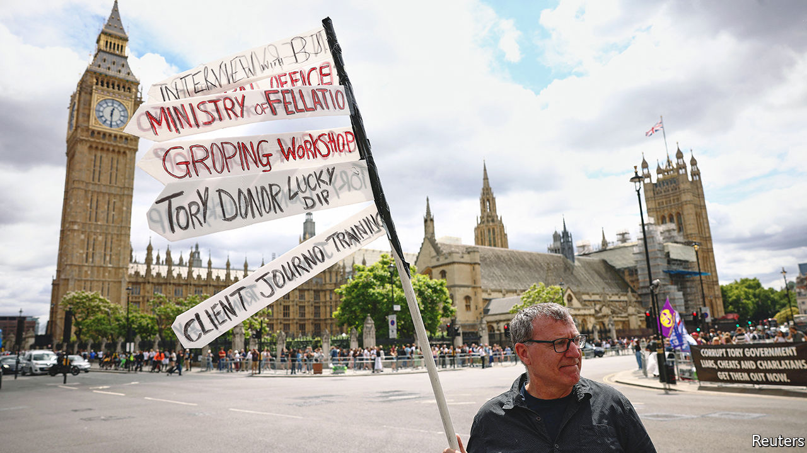

###### Pestminster, a history

# The House of Commons has a long history of sexual misconduct 

##### Fixing the culture of Parliament is not easy 

 

> Jul 6th 2022 

When the school nurse walked into the London schoolroom in 1815, she found the member of Parliament for Barnstaple already there. Sir Eyre Coote was distinguished by a history of public service and a surpassing fondness for flagellation. He had popped into the school that day to pay the young boys to flog him. The nurse arrived as Coote was buttoning up his breeches. Scandal duly ensued and, in the words of Robert Morrison, a historian, Coote became “the most infamous Regency flagellant”. 

Parliament has been synonymous with sexual misbehaviour for centuries. As well as Coote and his switch there was John Profumo in the pool with the showgirl; the rumour about Lord Palmerston on the billiard table with the housemaid; and David Lloyd George (“the Goat”) in the cabinet room with more or less anyone. Not to mention Jeremy Thorpe and the inept assassin, and Ron Davies in the bushes with the badgers.

A list of parliamentary scandals reads like a concupiscent “Cluedo”—and as with “Cluedo”, more details often only deepen the mystery. When Lord Lambton, a Tory mp, was questioned over his misconduct in the 1970s he confessed to indulging in a “frenzied” bout of “gardening and debauchery”, a pairing that almost certainly raised more questions than it answered. 

Parliament, then, has always been a peculiar place. But the current litany of scandals still surprises for its quantity and severity. Chris Pincher, whose resignation as deputy chief whip on June 30th led to this week’s collapse in support for Boris Johnson, is just one of many men (for it is almost always men) under scrutiny. Some of what is alleged is salacious; much of it is straightforwardly criminal. In May one unnamed Tory mp was arrested on suspicion of rape and released on bail, and another was jailed for molesting a child; a third had just been suspended after allegations of drug abuse and sexual harassment. 

Conservative mps are at the centre of most of these stories, but not all of them. Trade unions say that the seat of British democracy is an unsafe workplace. The Independent Complaints and Grievance Scheme (icigs), a parliamentary watchdog, investigated 43 cases against mps for bullying, harassment and sexual misconduct in the three years to June 2021.

Whether things are getting worse is hard to tell. “We absolutely don’t know,” says Sir Anthony Seldon, a political biographer. “We are dealing here with the shadow world.” Although tabloid attention can help to raise standards, it can also occlude. The larky language of newspaper scandals—of romps and love rats and Lotharios—can make the reader forget that for many of those involved, such scandals are not amusing at all. When Matthew Parris, a writer and former Conservative mp, researched a history of parliamentary scandals he wrote that it had “proved less of a giggle than perhaps I hoped”. Each story, while often “richly comic”, was also a chronicle of lives ruined. 

Many of those involved had little choice in the matter. Look at a list of those caught up in famous scandals, not the romping mps but those with whom they “romped”, and you see schoolchildren and prostitutes and, particularly in the first half of the 20th century, gay men. People without power, those who couldn’t speak or couldn’t be heard. 

How can things be improved? Various sensible reforms were implemented after a previous wave of scandals in 2017, including the establishment of the icigs. But plainly none of the hotlines and codes of conduct have resolved the issue. Parliament’s blend of late nights, raging egos and multiple bars is one reason why misconduct persists. But other organisations have toxic cultures and predatory men. If Westminster were a company, there would be a cull, a new ceo and a revamped logo. But this organisation has features that make it easier for miscreants to hide. 

One is the way political parties work. In the corporate world, good employees will quickly leave for other firms; consumers will boycott tarnished brands. Neither force operates in Westminster. A system of adversarial partisanship also makes it harder to hold the line on standards: even Theresa May, a figure of unquestioned integrity, gave the (metaphorical) whip back to two sexual predators when she was prime minister in order to win a vote. The constituency system creates a system of, in effect, 650 independent employers. A central hr function with power would have to be reconciled with the democratic mandates given to mps. 

Parliament does make periodic attempts to improve itself—as some mps have found to their cost. In the 1920s a prison visitor found Horatio Bottomley, a former mp who had been convicted of fraud and sentenced to penal servitude, mending mailbags. “Sewing, Horatio?” he asked. “No, reaping,” came the reply. But any lasting solution lies in the hands of the parties themselves. More women in Parliament would help, particularly in the Conservative Party, which has the lowest proportion of female mps of the four main parties. So would a Tory leader with the mandate and the determination to root out misconduct. Till then, the harassment will continue. ■

