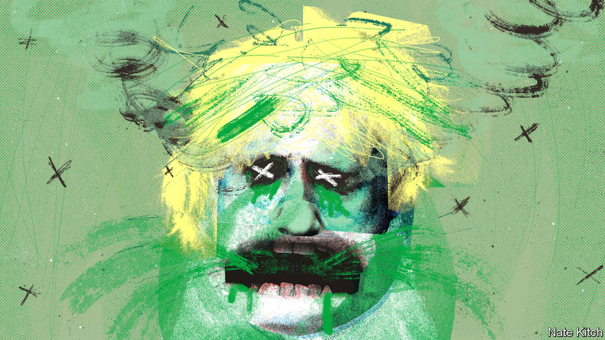

###### Bagehot

# The toxicity of Boris Johnson 

##### No one’s reputation could survive contact with the prime minister 

 

> Jul 6th 2022 

Every good disaster movie has a scene in which the characters realise that they are in mortal peril, that the threat they all fear is much closer than anyone had thought. The shark is in the water, the caller is in the house, the virus is airborne. Footage of a cabinet meeting on July 5th—taken before the watershed  of Rishi Sunak, the chancellor of the exchequer, and Sajid Javid, the health secretary—provided an equivalent moment in Westminster’s current horror show. The faces of Britain’s most senior politicians are ashen, the mood is palpably grim. A deadly toxin menaces them and their party, and it is chairing the meeting. 

The fact that Boris Johnson is a serial liar and lacks the self-discipline to apply himself to hard problems was well-known. One of those grey-faced cabinet ministers, Michael Gove, said that Mr Johnson was not up to the task of leadership in 2016. (Mr Gove himself was sacked on July 6th, a day before the prime minister said he would resign.) But the extent to which Mr Johnson has poisoned the reputations of those he works with seems to have been less appreciated. This toxicity is not just a personal characteristic. It also says something about the political system he sat atop. 

Take a moment to consider some of the people tarnished by exposure to Mr Johnson. Many were politicians, sent out to defend the prime minister’s integrity only to find their own impugned as a result. The end of the Johnson era was sparked by the demise of Chris Pincher, who resigned as deputy chief whip on June 30th after being accused of drunkenly groping two men. Ministers dutifully told interviewers that Mr Johnson had not been aware of prior allegations about Mr Pincher’s behaviour, and quickly found out this was untrue. At best such politicians looked like idiots, at worst as slippery as their boss. 

Reputations for competence as well as honesty were also irradiated by Mr Johnson. Steve Barclay was brought in as his chief of staff in February to help shake up Number 10 in the wake of , a series of gatherings in Downing Street which broke covid-era lockdown rules. Mr Barclay was feted as a fearsomely efficient manager. A matter of weeks in proximity to Mr Johnson, and he seemed to have as much grip as a tea tray on a ski jump. His elevation this week to replace Mr Javid placed him in the category of Johnsonian flunkey rather than besuited machine. 

But the real victims of Mr Johnson’s toxicity have been non-politicians. A parade of people with distinguished reputations and an alphabet’s worth of honours after their names were infected. Taking the position of independent ethics adviser to the prime minister sounds like a nice way to top off a distinguished career of public service. Under Mr Johnson it was anything but. 

Sir Alex Allan held the role for nearly eight quietish years under David Cameron and Theresa May, but lasted for just over a year under Mr Johnson; he quit after the prime minister ignored his finding that Priti Patel, the home secretary, had been bullying civil servants. His successor was Sir Christopher Geidt (gcb, gcvo, obe, qso), who resigned in June after cutting an increasingly sad figure. He found that the prime minister had acted “unwisely” over a donor-funded refurbishment of his flat. His discomfort over Partygate was painful to watch. The post remains vacant: at some point it isn’t ethical to advise someone without ethics on ethics. 

Sue Gray, a civil servant who wrote a report on Partygate, was lauded by all and sundry for her , only to be accused of pulling her punches when she failed to look into every drunken bash. Simon Case, the head of the civil service, is meant to be the brightest and the best of his generation. Now he’s just that guy with the beard who partied with Boris when everyone else was isolating at home. 

Mr Johnson’s character flaws have not always corroded those around him. He was a lazy, selfish dilettante when he was mayor of London, and the people who worked with him then did not all suffer. But the position of prime minister is not simply different from mayor in its importance and in its nature: less cheer and more leader. The prime minister is also central to the entire system of government. In several respects, the position is peculiarly designed to spread poison if the person in charge is toxic.

Blond Chernobyl

Most obviously, standards in British public life depend on the person at the top. The ministerial code says that the prime minister is the ultimate judge of what constitutes acceptable behaviour. When the wrongdoer is the prime minister, he judges himself. Mr Johnson’s own misconduct, and his tolerance of it in others, leached straight into the body politic. 

Second, the cabinet is bound by a system of collective responsibility. Defending the prime minister’s behaviour on the broadcast rounds is an act of loyalty. Private differences over policy are papered over in the name of unity. That works when a government is led by someone who is competent and trustworthy. But in Mr Johnson’s case, it served to make colleagues complicit in his failures. Mr Sunak says he fell into line repeatedly, until his disagreements with his boss became too great to sustain. Mr Javid told Parliament on July 6th that “treading the tightrope between loyalty and integrity has become impossible”.

Finally, the civil service is particularly exposed to a virulent pm. Although civil servants are impartial and independent, the prime minister is still their ultimate boss. They are meant to work hand in glove with ministers; Mr Case sits in cabinet, a literal right-hand man to Mr Johnson. When they appear before mps they represent the views of their elected masters. And when the prime minister is toxic, they have no immune system to protect them.

Mr Johnson is not the cause of all that ails Britain. He has brio and charm. But the dangers of sitting around that cabinet table with him were real. His flaws tarnished good people. They poisoned the government—and by extension, the country.■


