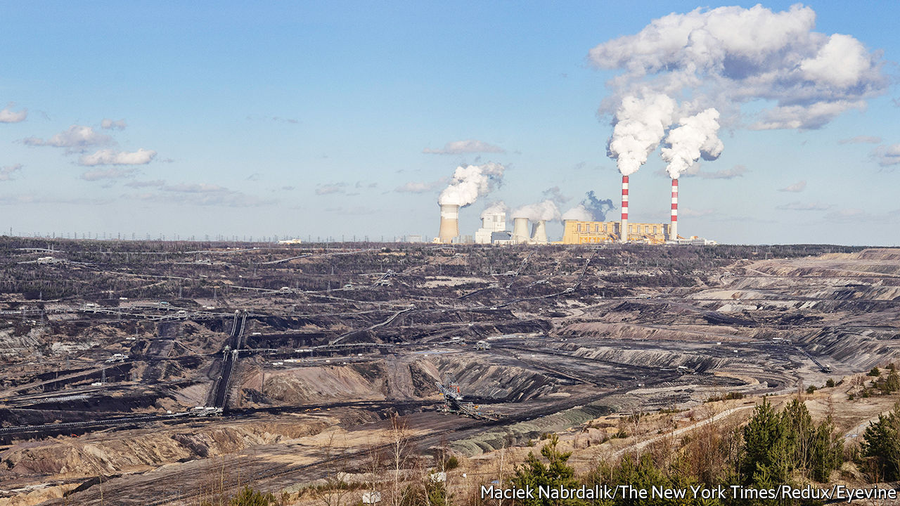
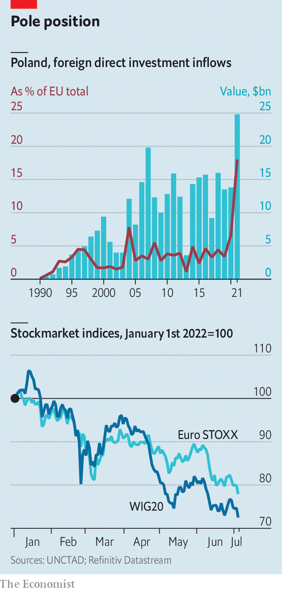

###### Business in Poland

# Business in Poland faces strong headwinds 

##### War raging in neighbouring Ukraine makes life difficult 

 

> Jul 7th 2022 

After an astonishingly robust recovery last year from the pandemic-induced contraction of the economy, Polish industry also had a strong start to 2022. Beating expectations, industrial output increased by 17.3% year on year in March, the first full month after Russia attacked Ukraine, and manufacturing grew by 12.4%. Higher output from energy and mining as well as heavy industries compensated for a decrease in production of cars and parts. But the rebound is likely to be short-lived.

The war in neighbouring Ukraine had no big impact on businesses in the first quarter, as companies still had full order books. But the outlook for the rest of the year is far less optimistic, according to ing, a Dutch bank. The fighting in Ukraine has increased the risk of serious disruptions to supply chains, creating a deep crisis of confidence. The rate of inflation was already high before the war, but it is now in double digits and continues to climb, putting pressure on production costs. And the anti-business bent of Law and Justice (pis), the populist party in power, will become even more pronounced as Poland prepares for parliamentary elections that will take place in the autumn next year.

Economists disagree about which is the strongest of the multiple headwinds blowing against business in Poland, though nearly everyone forecasts a recession this year. For Ignacy Morawski, chief economist of , a business daily, the macro-economic picture is the biggest cloud for foreign investors. Consumer prices rose by 15.6% in June compared with last year, a level unseen in more than 20 years, and up from 13.9% in May, according to Poland’s statistics agency. Interest rates have shot up from 0.5% last October to 6%. That has squeezed borrowers as about 90% of loans to households and businesses are at variable rates. This in turn creates even more uncertainty, says Mr Morawski. The zloty, Poland’s currency, is weak, which helps exporters but makes the imports needed by producers pricier still.

Adam Czerniak of Polityka Insight, a research outfit, thinks concerns over the rule of law and “economic patriotism” are the biggest worries for foreign investors, in particular those from euro-zone countries. Since coming to power in 2015 pis has neutered the judiciary and placed judges firmly under the control of the government. It extols the virtues of “repolonisation”. State-controlled companies bought foreign-owned banks (on a voluntary basis); the government is now targeting bank profits with a moratorium on loans. And pis tried to limit foreign investors to a stake of no more than 30% in Polish media firms.

 


Last year foreign direct investment (fdi), both greenfield and other funding, was still strong owing to Poland’s well-trained labour force, relatively low wages and closeness to western Europe. fdi flows were up by 79% (see chart) and the stock grew by a healthy 7.8% compared with a slump by 2.7% for the entire European Union. This year fdi is set to decline, though it is unclear how cold foreign investors’ feet will become. Since the start of the year investors have dumped Polish stocks in droves. The wig20, the stock-market index of the 20 largest companies listed on the Warsaw stock exchange, declined by 28% from the start of the year to July 6th. Polish mutual funds are reporting redemptions, which means the wig20 is unlikely to make up lost ground soon.

Mr Czerniak forecasts that the economy will be in recession in the second quarter. Poland’s manufacturing sector contracted for a second month in June, when Standard &amp; Poor’s Polish manufacturing purchasing-managers’ index fell to 44.4 from 48.5 in May, remaining below the line of 50 that divides growth from contraction. Like most of his colleagues Mr Czerniak expects a soft landing in which the heat is gently taken out of the economy and the unemployment rate remains low.

Business leaders are holding their breath. The government has in recent months stimulated demand with generous tax cuts, which is fuelling the inflationary spiral. Adam Glapinski, the head of the central bank, recently said that the rate-raising cycle is nearing the end, but he did not name a specific timeline. Foreign investors expect both inflation and interest rates to stay high for some time to come and they do not anticipate that the war in Ukraine will come to an end at any time soon. On top of which pis is forecast to win the election next year, giving business little hope of relief. ■


