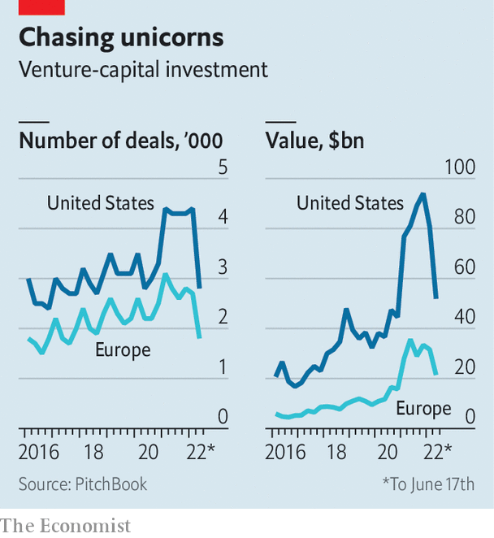

###### Venture capitalism in Europe

# How sturdy are Europe’s tech unicorns? 

##### The downturn is unlikely to lay waste to tech on the old continent again 

 

> Jul 4th 2022 

“None of my friends stayed in tech.” Fred Plais, the boss of Platform.sh, a cloud-computing company based in Paris, still remembers vividly what happened in Europe in 2001. The firm he ran back then, an online-search engine, closed down after the dotcom bubble burst—along with most of the other startups he knew. 

The story was much the same in 2008 as a result of the global financial crisis. European technology firms again suffered more than their American counterparts. Fears that the looming downturn and  will once more hit harder in Europe than across the Atlantic were stoked on July 1st, when the  reported that Klarna, a Swedish buy-now-pay-later darling, was trying to raise fresh capital at less than a fifth of its peak valuation of $46bn.

Such stories notwithstanding, both Europe’s startups and its venture capitalists look much sturdier than they have in the past, and much less reliant on foreign know-how and capital. They may even weather the storm better than American counterparts this time around. 

 


To understand why, start by considering the boom. Last year was a smasher in Europe even by frenetic global standards. For the first time, venture-capital (vc) investments on the old continent exceeded €100bn ($118bn) in a single year, reports PitchBook, a data provider. Startup valuations rocketed accordingly, pushing the number of European “unicorns”, private firms worth more than $1bn, to nearly 150 today, about 13% of the world’s total. Although Europe’s tech ecosystem is still only about a third as big as America’s in terms of vc investments, it has more than doubled in size since 2020.

Some of this growth is a mechanical consequence of excess capital flooding into Europe, where startup valuations had lagged behind those in America and Asia. In 2021 American vc firms invested in European deals worth $83bn, a threefold increase on the previous year, according to PitchBook. Non-traditional investors, both American and from elsewhere, such as hedge funds and big companies’ vc arms, discovered Europe, too, participating in nearly $100bn-worth of deals, an increase of 150% from 2020.

As Klarna’s attempt to raise funds implies, this surfeit of capital is poised to end this year in Europe as elsewhere. Happily for European tech, that isn’t the whole story. “The European flywheel has taken off,” says Sarah Guemouri of Atomico, a vc firm in London, referring to the idea that success in tech breeds further success. Flywheels spin at the level of the individual firm, when more users translate into better services, which draws in more users, and so on. They can also help to rev up the whole industry. 

Nothing ventured, nothing gained

European venture capitalism indeed looks capable of powering itself. A critical resource is talent. Last year Dealroom, another data provider, analysed the careers of 38,000 startup executives. Almost two-fifths had already worked for both small startups and established firms, signalling a growing collective experience. Similarly, when Mosaic Ventures, another European vc firm, recently looked at nearly 200 founders of unicorns, it discovered that two in three were repeat entrepreneurs. “It is the second or third time that produces a unicorn,” says Simon Levene, one of the firm’s partners.

As they become more experienced, European entrepreneurs are not only becoming more ambitious, but better at telling a convincing story about what they want to achieve. Nadine Hachach-Haram, founder of Proximie, a health-care startup which uses augmented reality to allow doctors to remotely watch a surgery, is on a mission to create the “borderless operating room”. Avi Meir, who runs TravelPerk, a site to manage business travel based in Barcelona, wants it to become the place to facilitate “human connections between remote workers”, for instance by offering tools to organise real-life team meetings. Nicolas Brusson, the boss of BlaBlaCar, which started as a Parisian service to arrange shared car rides between cities, aims to turn it into a “multimodal platform” that also aggregates demand for buses and perhaps even trains globally. To some this may sound like marketing guff but it is precisely the sort of thing investors and prospective staff still want to hear. 

Capital is being accumulated and fed back into the industry, too. According to PitchBook, nearly €100bn in vc was raised by European funds over the past five years. Almost half of that has yet to be deployed, leaving Europe’s venture capitalists with plenty of “dry powder” to tide over startups even if the crisis drags on. European investors also tend to plough a lot of cash into early-stage startups. In 2021 European startups attracted a third of all investments in financing rounds of up to $5m globally, estimates Dealroom—almost as much as their American counterparts.

The number of “angels”, successful entrepreneurs who funnel some of their tech wealth back into other startups, is also growing. Some create their own vc firms. On June 28th Taavet Hinrikus, co-founder of Wise, an international-payments service, and three other European entrepreneurs, launched Plural, a €250m fund. Executives lower down the food chain have also started to invest, in part because more and more European tech workers are compensated in part with their employer’s stock. A few years ago only about 10% of shares were allocated to employees, says Dominic Jacquesson of Index Ventures, a transatlantic vc stalwart. Thanks to legal changes, and a growing cultural acceptance of stock options in Europe, the figure is about 17%, not far off the 20% or so common in America.

The structure of the tech ecosystem is also more robust now whereas once it was a disparate collection of unlikely success stories, such as Skype, a video-conferencing service now owned by Microsoft, or Spotify, a Swedish music-streaming app. In a recent report on European unicorns Richard Kersley of Credit Suisse, an investment bank, and his colleagues split the firms into “enablers”, for example payment services like Klarna and Checkout.com, and “disrupters” (such as Getir, a Turkish delivery app) which thrive by piggybacking on such infrastructure.

On top of more home-grown experience and capital, as well as a hardier structure, European firms boast certain comparative advantages that will come in handy in a leaner, post-pandemic era. One is their relative thriftiness. Although private companies are not required to disclose such numbers, indications are that their “burn rate”, the speed at which they spend money they have raised, is lower, at least at younger startups. It helps that hiring software developers in Barcelona or Berlin costs on average only half what it does in San Francisco or Seattle.

Burning ambition

As they become unicorns, however, such differences seem to disappear. On average, American and European startups have raised about the same amount of capital before reaching that status: $378m compared with $392m for firms that have achieved a valuation of more than $1bn since the beginning of 2021.

Mature startups in Europe, meanwhile, are less geographically concentrated than their counterparts in America, both in terms of their markets and their vc support. Because Europe’s domestic markets and talent pools are limited, firms quickly expand abroad. Veriff, an Estonian online-identification service, recently opened a site in Barcelona because it could not hire enough engineers in Tallinn.

As a result, about 80% of European tech companies have an international presence, compared with 61% of firms based in Silicon Valley, according to Atomico. Only one in five European firms has an office in its home territory alone and just over half are present in three or more countries. In Silicon Valley the ratio is reversed. In a crisis, such diversification is a boon.

Europe’s thematic unicorn mix may also help. According to the classification used by Credit Suisse, recession-prone businesses such as consumer services are less prevalent than in America. A third of European unicorns operate in fintech, often providing payment services to other firms, thanks to the eu’s more open financial regulations. Nearly a quarter of unicorns, the bank estimates, could be put in the bucket labelled “sustainability”—a type of business that is likely to benefit as the world gets more serious about fighting climate change.

All this helps explain why the number of unicorns has risen in Europe this year. PitchBook counted another 42 in the first six months, compared with 37 created in the same period in 2021. The coming quarters are certain to be tougher. But so are Europe’s tech companies. Platform.sh recently managed to raise $140m (the valuation was not disclosed, but is approaching unicorn territory). And that means Mr Plais, its boss, is unlikely to have to go job-hunting again soon. ■


