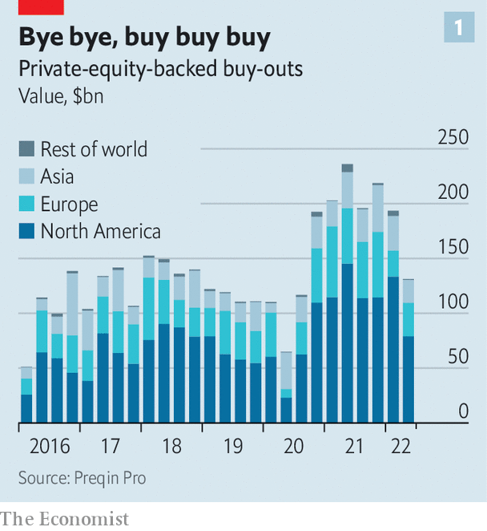
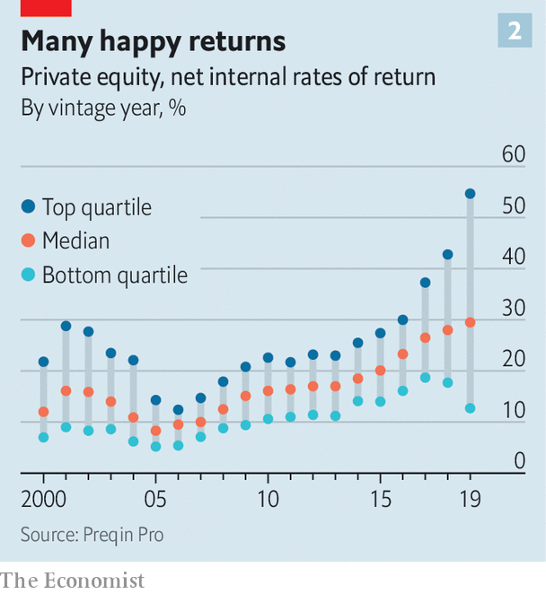

###### PE lesson

# Private equity may be heading for a fall 

##### The era of rising valuations and cheap debt is over 

 

> Jul 7th 2022 

If investors in equities and debt markets will remember anything of the first half of 2022 it will be generational sell-offs. But the turmoil in public markets has not yet fully bled into private equity: fundraising has marched on, large deals are still being consummated and paper returns look strong. The blood, however, may be about to flow. Buy-out barbarians made their names in the late 1980s, not the 1970s, for good reason. The corporate buy-out is a financial ploy unsuited to the coming period of slow growth and high inflation; no previous boom-and-bust cycle in private-equity’s 40-year history has been like it. Most important, cheap debt is unlikely to be able to save the day. 

If trouble is to strike, it will hit an industry that is now hubristic and vast. The amount of money invested, or waiting to be invested, by private-equity funds has swelled from $1.3trn in 2009 to $4.6trn today. This was driven by a scramble for yield among pension funds, insurance companies and endowments during a decade of historically low interest rates in the aftermath of the global financial crisis of 2007-09. Many have more than doubled their allocations to private equity. Since 2015 the ten largest American public-sector pension funds have collectively committed in excess of $100bn to buy-out funds.

 


In the search for market-beating returns, some $3.3trn managed by private-equity firms is currently invested in private companies. A chunk of this reflects the $850bn of buy-out deals done during 2021 (see chart 1). It is not by the genius of private-equity bosses that this capital has been posting impressive paper gains (see chart 2). Rather, company valuations have until recently been on a tear; low interest rates push up the valuations of firms, which have been chased by buy-out firms armed with cheap debt. Buy-outs have been increasingly common in sectors with the highest valuations, including technology, driving the average valuation multiple for American transactions to take firms private to 19.3 times ebitda (earnings before interest, tax, depreciation and amortisation) in 2021, compared with 12.6 in 2007, according to Bain &amp; Company, a consulting firm. 

 


The stockmarket crash this year will take months to wash through private markets. But a reckoning is on the horizon. Private equity benefits from a fig leaf of illiquidity, resulting in a delay between real and reported fund valuations. In the absence of a liquid market to price investments, private-equity funds assess the current “fair value” of their portfolio based on the price an investment would realise in an “orderly transaction”, which should look similar to the valuations of comparable companies in the public markets.

But such “orderly” exits are drying up fast. Market turmoil means stockmarket listings are off the table and companies are thinking harder about spending cash on acquisitions ahead of a recession. Sales from one private-equity fund to another will not sustain an alternative reality of high valuations. For some fund managers, adjusting valuations will be painful. Funds which bought companies at a premium to sky-high stockmarket prices will suffer significant mark-downs. Fund managers and investors accustomed to stable, market-beating returns must accept the true underlying volatility of their investments. Only the smartest fund managers, who have kept their discipline and sought bargains outside frothy sectors, need not fear the accountant’s scythe.

Public markets are a useful window on the future of private-equity returns. The view is not a pleasant one. One index, which maps private-equity portfolios to their public stockmarket equivalents, is down by 37% this year. Another proxy is the share-price performance of investment trusts, a type of publicly traded investment vehicle, which invest in private equity. Usually, these trusts trade close to their underlying asset values, which are based on “fair value” assessments provided by the private-equity funds. These spreads have widened, sometimes cavernously. HgCapital Trust, a technology-focused private-equity investor, currently trades at a 25% discount to its most recent net-asset value; the trust’s largest investments are held at 27 times ebitda.

Private-equity bosses often claim it is their skills as business-operators, rather than financial engineers, which generate returns (and handsome fees). Their investors should hope this is true. But these masters of the universe will find that they are not immune from the difficulties of managing a business during a period of stagflation; growth and margin worries keep bosses of private companies up at night, too. According to one study, expanding margins accounted for only 6% of private-equity value-creation during the past five years; as pricing-power becomes the focus of all firms, defending profitability will take priority over growth. The penalties for failing to adapt will be harsh. Hefty debt piles (average leverage in large American buy-outs is now more than seven times ebitda, the highest since 2007) make getting this right critical to avoiding the bankruptcy courts. 

The fate of the $1.3trn waiting to be invested by private-equity firms, known as “dry powder”, is also uncertain. Volatile valuations are one immediate obstacle to spending it. A widening gap in price expectations between buyers and sellers of companies is proving fatal to would-be deals. On 28th June Walgreens Boots Alliance, the American parent company of Boots, a British pharmacist-cum-retailer, called it quits on the sale of the well-known British brand after lengthy talks with potential private-equity suitors failed. A dramatic adjustment in valuations is needed to push buy-outs over the line: on June 24th Zendesk, an American software firm, announced it had agreed to a $10.2bn buy-out by Hellman &amp; Friedman and Permira, two private-equity firms. Only four months earlier, Zendesk had rejected a $17bn proposal from the same funds.

Interest rates will prove a more enduring challenge to the buy-out playbook. Cheap debt is a red rag to private-equity bulls: around half a typical buy-out is paid for using debt, magnifying the returns to investors’ capital. It has played a critical role in each buy-out boom period; the present one can trace its genealogy directly to rate cuts by central banks during the global financial crisis.

As these policies are unwound in response to rising inflation, buy-out debt has become significantly more expensive. That is not going to change soon. Investors not fleeing these risky assets are demanding far higher returns than before, and American junk-bond yields have reached 9%. The availability of leveraged loans, critical for executing buy-out transactions, has collapsed; in June, loan issuance was down by 41% compared with the same month last year. Investment bankers, who typically underwrite these loans, are bracing for significant losses as the ground shifts beneath their feet and they struggle to offload the debt to investors.

A heady mix of stockmarket mania and historically low interest rates has sustained the fourth buy-out boom; it has been scaled-up by immense pools of capital increasing their exposure to private markets. Private equity is coming back down to earth. It will be returning to an unfamiliar planet. ■


