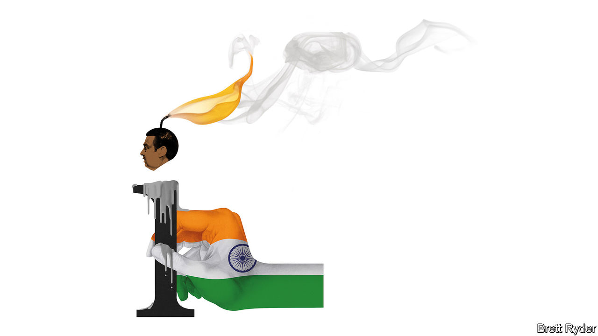

###### Schumpeter

# What does the future hold for Reliance, India’s biggest firm? 

##### Is it on the verge of a break up? 

 

> Jul 7th 2022 

India inc’s business calendar has only one contender to rival Berkshire Hathaway’s famous shareholder gathering. The subcontinent’s equivalent of that “Woodstock for capitalists” is the annual general meeting of Reliance Industries. Like Warren Buffett’s shindig it usually features a celebratory crowd of devoted investors (although not the same quality of corporate-finance insights). The company’s founder, Dhirubhai Ambani, an upstart entrepreneur from Gujarat, was also an outsider with a nose for opportunities. He built India’s largest company from a humble trading and textiles firm into a vast conglomerate. It has continued to expand after his death under the leadership of his son Mukesh Ambani and today encompasses petrochemicals, refining, telecoms, a shopping app and retail stores—among other things. 

The importance of the resulting entity to India is impossible to overstate. With a market value of $206bn, the firm’s revenues are the equivalent of 3% of the country’s gdp. Among India’s largest 500 public companies, it is responsible for 6% of sales and profits, 7% of total capitalisation and a staggering 18% of capital investment. Jio, the telecoms division, provides service to 410m Indians, and is the latest in a series of massive, stomach-churning capital-intensive bets that have paid off over the years. The retail operations are by far the largest in India, encompassing 15,000 shops. Its refinery and petrochemicals operation in the north-west of the country is among the biggest in the world. In short, any change at Reliance affects India as a whole—and it appears that change may well be on the way.

The rumour mill has been abuzz because this year the annual meeting, usually held in June or July in Mumbai, has yet to be scheduled. Mr Ambani seems to have largely withdrawn from public appearances. The company says he is spending time in Jamnagar, the site of the company’s massive oil refinery. India’s gossipy business world, where no figure receives more attention, is alight with talk that he may be suffering from health problems. The company says he is well and continues to attend public functions within the restrictions of a pandemic. 

On June 28th the company said that Mr Ambani would step aside from the chairmanship of Jio Infocomm, a subsidiary of the telecoms arm, in favour of his 30-year-old son, Akash. The next day reports emerged that Akash’s twin sister, Isha, would soon head Reliance’s retail operations. And on July 3rd the , a newspaper, said that Mr Ambani’s wife, Nita, already a director of Reliance, was favoured by some on the board to become a vice-chairman of the company. Another son, Anant, is also said to be positioned to take over running part of its energy operations.

Interpreting these rumours is tricky. Perhaps they reflect prudent succession planning. Mr Ambani is 65, not old for an Indian tycoon, but it is time to start teeing up the next generation of leaders. Even if his children were to take over the running of some of the group’s major subsidiaries, they would ideally have years more experience at management and building teams before even being considered as candidates qualified to take over Reliance itself. And Reliance’s history shows the drawbacks of leaving it too late. Soon after Dhirubhai died in 2002 a brutal succession battle broke out between Mr Ambani and his brother, Anil, which ended with the company being split into two, and Anil’s side of the business fading into obscurity. 

Whenever he departs, there is little debate that Mr Ambani’s exit would constitute a huge loss for the company. Reliance has a loyal cadre of managers but he is regarded as the driving force behind every facet of Reliance’s business from strategy to finance. He is seen as having the ability to deal with the complicated judicial, political and economic currents of India better than anyone. Whether in telecoms, energy or retail, Reliance has navigated and benefited from innumerable rules and rulings that make hamstrung competitors seethe with envy. Ensuring that this continues will be a tall order for the next generation at Reliance. 

Perhaps most important, Mr Ambani has continued a pattern that his father began: betting the firm on enormous and risky projects within India. Some of these wagers have not worked well: Reliance’s attempt to develop gas fields in the Bay of Bengal has been underwhelming, for example. But some have been been both jaw-droppingly daring and successful. Reliance’s telecoms and digital operation required huge upfront investments—its assets are now $49bn, according to Bloomberg data, up from close to zero a decade ago. And by bringing cheap communications to the masses it has helped transform Indian society. 

This may go some way to explaining the respect now shown to Reliance even by its critics. Unlike classic crony capitalism where the extraction of rents is paramount, Reliance’s huge level of reinvestment mean its return on capital is modest: below 10% every year for the past decade. Already the next big bet is being lined up. Profits from refining are providing tens of billions of dollars for investments in renewable energy infrastructure in a country with a shortage of power generation and an over-dependence on fossil fuels that will need to be remedied soon.

A reliable appetite for risk

One theory is that the annual meeting has been delayed while a break-up of the company is debated. The firm is certainly in good nick. After India went into lockdown in 2020 it brought minority investors, including Google, into its digital arm. The cash was used to slash debt. Refining profits are at high levels, notwithstanding the recent imposition of a windfall tax by the government. Jio enjoys a steady subscriber base and rising tariffs. Reliance’s retailing arm is profitable and expanding. All this suggests Reliance, or its constituent parts, could plod on without Mr Ambani at the helm. But would the group still have the appetite to undertake some of the boldest bets in global business?■


 


