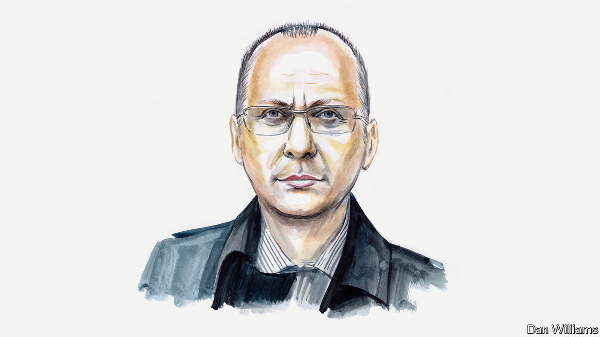

###### Russia and Ukraine

# Boris Bondarev on Vladimir Putin’s craven diplomats 

##### And why the war in Ukraine drove him to resign from Russia’s UN team in Geneva 

 

> Jul 2nd 2022 

VLADIMIR PUTIN’S attack on Ukraine on February 24th was a moment of truth for me. It led to my resignation as a senior Russian diplomat just weeks later. That is because it became crystal clear that to stay in the foreign service and to continue to work for the government unequivocally meant supporting Russian aggression. The war against Ukraine, and against the entire West, has been the gravest blunder of today’s Russia and I consider it a crime against the country’s future.

During my childhood in the Soviet Union people imagined diplomacy was all grand receptions, balls and sublime men wearing 19th-century-style attire or white tie. Diplomats were thought to be vastly capable: fluent in foreign languages and knowledgeable across a plethora of topics. In short, they were assumed to be people of high intelligence and subtlety.

Soviet diplomats were truly privileged, too. They were able to travel abroad and even live there—something absolutely impossible for the vast majority of the USSR’s population. And diplomats usually brought home wondrous Western consumer goods, from jeans and bubblegum to electronics and films. They were also supposedly privy to politics and state secrets. Quite a romantic profession, indeed.

The collapse of the Soviet Union destroyed that luxurious picture. Diplomats lost their status and their fortunes were drastically diminished. Many left the Ministry of Foreign Affairs (MFA) to try their luck in the fast-growing private sector. Those who stayed were, by definition, the less ambitious, talented and promising. They were ordinary, grey bureaucrats. But a handful had had stunning careers after taking over newly vacated posts. They are now at the helm of the MFA.

About 22 years ago I entered the inner sanctum of Russian diplomacy—the High Administrative Building of the MFA—for the first time, to spend a month there as a trainee. The diplomats were weary, unhappy and loth to learn anything new. Many of them couldn’t even turn on a computer! And they saw nothing wrong with that. They wanted to maintain their own comfort and largely ignored trainees. 

Just a couple of years later I started my diplomatic career already somewhat disillusioned. Yet I still believed that we, the MFA, worked to protect and promote Russian national interests. These interests, as I saw them, were to develop peaceful and beneficial co-operation with other countries. The diplomats I encountered during my first postings abroad or later were no different from the grey bureaucrats I had met before. Mostly they wanted to save to pay for improvements to their homes in Moscow, rather than coming up with new ideas to enhance relations with the countries they were stationed in.

One anecdote particularly stands out. When I was posted in Mongolia between 2009 and 2013, the UN Habitat office there wanted to improve sanitation and street lighting in the poor suburbs of Ulaanbaatar. Searching for a donor, they approached us. I thought that it was a good idea and that it would enhance our “soft power”. And the required sum for the project was modest. But my ambassador didn’t even want to look at the proposal. “Moscow will never like this idea,” he declared.

This basic principle, that nothing should be done to upset Moscow, has long been the credo of our diplomats. It was respected then, and is adhered to unquestioningly now. Whatever happens, whatever errors and mistakes we make, all cables translate them into great triumphs of Russian diplomacy.

The MFA has declined as a result. A lack of initiative and a desire to avoid all responsibility has led to a puerile cohort of diplomats. Questioning the rationale for certain political decisions at first became rare and then became intolerable. “The big bosses know better,” or “they see the bigger picture,” were the catchphrases of my seasoned colleagues. Such weakness has devalued the ministry. It is almost a purely technical agency now, and its only task is to implement decisions taken by the Kremlin and its allies. 

President Vladimir Putin’s increasingly confrontational stance towards the West met no doubt or resistance within the MFA. Even those who were not delighted by the annexation of Crimea and the fighting in the Donbas region in 2014-15 didn’t dare to protest openly. I was among them. I thought the situation might yet be somehow settled by diplomacy. That proved to be, of course, very naive.

Those events shaped working processes in the MFA. As anti-Western propaganda intensified, older diplomats immediately recalled their seemingly forgotten Soviet-era skills. Cables from all over the world began resembling old Soviet headlines from the 1930s. The poisoning of Sergei and Yulia Skripal in Britain in 2018 raised tensions to another level. I read cables which contained almost only slogans, insults of Western delegations and low-quality clichés. Professionalism was finally replaced by propaganda. Now it has become much more dangerous, as the Russian leadership relies, , on such reports and configures foreign policy on information that is either entirely or almost entirely false. 

Russia’s recent aggression stems from brooding resentment left over from the 1990s. The Putin regime has been able to exploit such feelings in society, particularly because of the large number of people living in poverty and ignorance (worsened by domestic policies, of course). The tsunami of servility shown by my colleagues was the last straw. There was no other choice for me but to quit the Russian diplomatic service. It had finally abandoned its last great remaining principle: to serve peace, not war. ■

_______________


