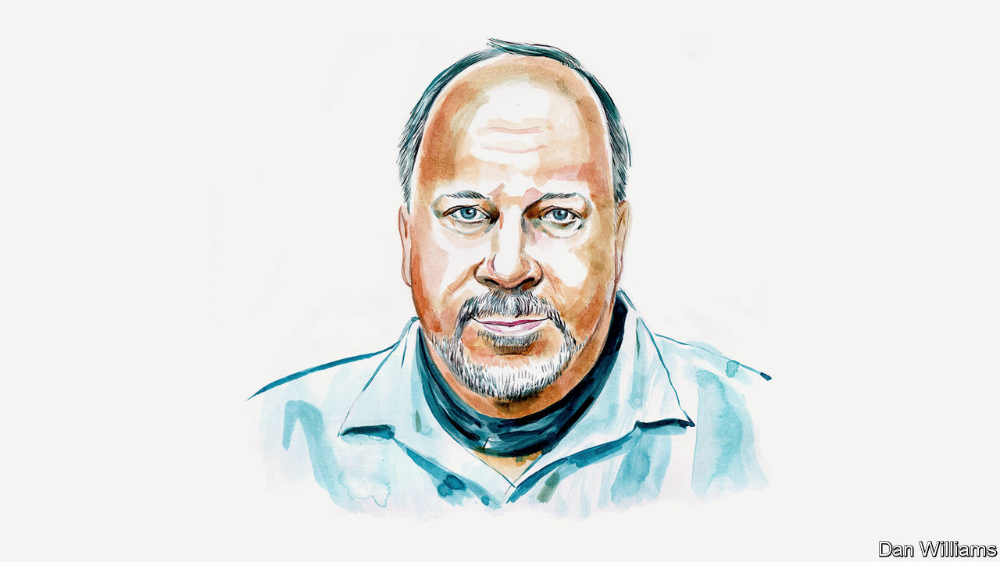

###### Finance and economics

# Brad DeLong asks what America can learn from its past bouts of inflation 

##### In 1947 and 1951 the problem went away by itself. In 1920 the Fed tightened too much, says the economist 

 

> Jul 5th 2022 

THE FIRST and most important thing to recognise about the macroeconomic situation in America is that Jerome Powell and his Federal Open Market Committee (FOMC) should be taking victory laps. Two and a half years after the start of the financial crisis in 2007, America’s unemployment rate was kissing 10%, the Federal Reserve realised that it was out of firepower and the Obama administration had just thrown away its ability to help by promising to veto spending and tax bills that were insufficiently austere. After that moment it would take six years for America’s economy to approach full employment. The impact of deficient employment meant that output was $7trn lower in 2013 than it would have been otherwise. Additional losses stemmed from the investments not made, business models not experimented with and workers not trained during the decade of anaemic recovery.

We have avoided all that this time around. Relative to the Fed presided over by Ben Bernanke between 2006 and 2014, Mr Powell’s team are public benefactors to the residents of America to the tune of $20trn, if you consider that there are more jobs and fewer idle factories now and in the future because of their actions. We have an uptick in inflation partly because the Fed—alongside Congress and the presidency—responded far more aggressively to the pandemic-induced recession than to the global financial crisis. A world in which the economy recovers so quickly that inflation emerges is better than one in which recovery drags on painfully for years.

America has faced five bouts of inflation in the past century or so—or six, depending on whether you count the 1970s as one or two episodes. The inflation during the second world war, which was tamed by price controls, is not relevant to our situation. That leaves four (or perhaps five) historical parallels which provide lessons in how to deal with the current inflation problem.

The first is the inflation of the first world war, which was brought under control when the newly established Fed raised its discount rate from 3.75% to 4.5% between November 1917 and April 1918, and then again to 7% between October 1919 and June 2020. This triggered a short but very deep recession accompanied by substantial deflation. Milton Friedman later judged that the Fed moved too late—it should have started raising interest rates a year or more before it did—but that it moved too far when it did move.

The second is the inflation which emerged after the second world war. It peaked at 19.7% in the year to March 1947 as America’s economy reoriented itself from its wartime to its post-war structural configuration. Tank factories turned back into car factories. Resources that had been devoted to building factories and equipping them with tools were released to make all the consumer goods that had been rationed during the war. The second world war’s military-industrial complex was dismantled. Prices and wages went up in sectors where demand was high but supply constrained in order to pull resources to where they were wanted. The Fed did nothing. It was focused instead on propping up the value of all the Treasury bonds that had been issued to fight the war. Inflation averaged 8% over the following year and then went negative in 1949, when a minor recession came. Once supply had shifted to match the sectoral pattern of demand, the bottlenecks and the upward price pressure disappeared. Because few expected the inflationary trend to continue, nobody was able to demand a high wage increase or get away with a price increase, as those who paid them shrugged and said “it’s just inflation”.

The third bout came in 1951. Inflation peaked at 9.4% in the year to February that year as America geared up to fight the Korean war and, perhaps more important, as it built up its global military capabilities in the early years of the cold war. The military-industrial complex was rebuilt, and rebuilt for a nuclear and aerospace age. Again, the Fed did nothing. And the inflation wave passed. By March 1952 it was below 2%. And recession was avoided until a minor one in late 1953. Again, once supply had shifted to match the sectoral pattern of demand, the bottlenecks and the upward price pressure disappeared. Once again, because few expected the inflationary trend to continue, no one was able to ask for a high wage increase or get away with a price increase.

The fourth, or the fourth and fifth, came between 1966 and 1984. Inflation rose from 2% at the start of 1966 to 4.4% on Richard Nixon’s inauguration in January 1969. It then rose and fell throughout the 1970s before soaring to a peak of 12.8% in March 1980. The Fed dithered. Arthur Burns, its chairman from 1970 to 1978, was too interested in maintaining a strong economy while his friend and patron Nixon ran for re-election in 1972. He did not believe that Congress would let him keep interest rates high enough for long enough to cure inflation through monetary policy. It was only when Paul Volcker became chairman that interest rates were raised to a peak of 16.9% in December 1980, and were not lowered below 10% until August 1982.

Which of these is our current situation most like? In my view, the second and third bouts of inflation, in 1947 and 1951, are the right models. That is because the long-term inflation expectations implicit in the bond market are still trading at their normal “in-the-long-run-inflation-will-be-about-2.5%” range. Bond traders appear to expect a little extra inflation over the next couple of years, but after that a return to what has become considered normal. Unless workers and managers see more inflation in the future than bond traders—something that seems unlikely to me—they have no warrant for pushing for high wage increases or thinking that they can get away with price increases ahead of a continuing inflation wave. So there is considerable hope (though hope is not confidence) for a soft landing. 

But there are two risks of a hard landing. One thing to fear is that the inflation episode today is like that of 1920. Back then the problem would have passed on its own, but the Fed tightened too much in response. There are no indications of overtightening yet, but then there wouldn’t be: the effects of the roughly two-percentage-point rise in both nominal and inflation-indexed ten-year Treasury rates since December 2021 will not begin to show in the real economic data until 2023. 

The second risk is that this is indeed like the 1970s, and so it is imperative to scotch any expectations of an inflationary spiral before they are even formed. Turn on the news, and there is constant chatter that likens our situation to that of the 1970s, with suggestions to hedge against inflation.This may reflect the tendency of social and professional media towards clickbait, but it could nonetheless shift expectations. There is little indication so far of such a shift in the prices of long-term bonds. Possibly it is imprudent to place too much weight on this particular harbinger alone.

Most of the time I think it would be great fun to be a member of the FOMC. Not today. The risks inherent within our current situation are immense. And misjudgments caused by a failure to listen to the right signals would be devastating. ■

_______________


