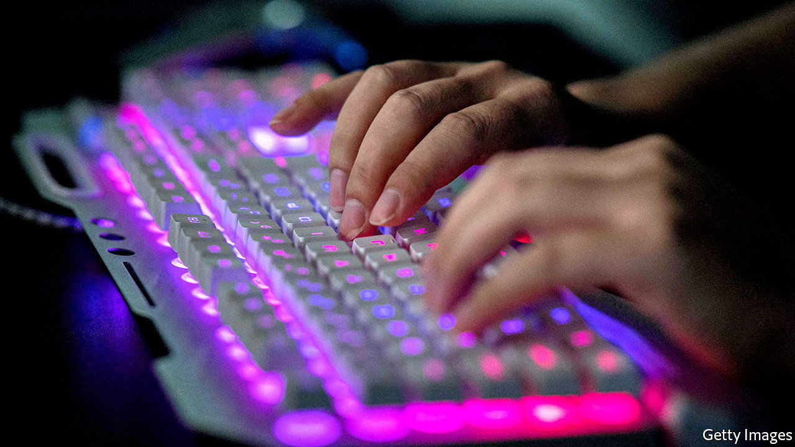

###### Hacked

# A huge data leak in China was not unexpected 

##### The need for unencrypted data for spying on its people has consequences 

 

> Jul 7th 2022 

The Communist party’s obsession with surveillance may have come back to bite it on June 30th. A hacker using the name “ChinaDan” claimed to have stolen a database from Shanghai’s police department, containing information—including names, phone numbers, national id numbers and case details—of 1bn people. For the price of ten bitcoin (around $200,000), ChinaDan was willing to sell the data. To prove authenticity, the hacker released a data set containing 750,000 records. 

Chinese authorities have refused to comment. But the leaked data appear to be real. When journalists from the  called five people exposed by the hack, they confirmed that the information about them was correct. 

If the news is true, the breach would be one of the largest ever in China, or indeed anywhere. The leak is not, however, a surprise. China is notorious for its lax datasecurity practices, caused, in part, by the government’s desire to spy on its own citizens, which means much data is left unencrypted. Experts have been saying for years that such a leak was likely. 

Yet the timing of the breach is especially embarrassing, says Paul Triolo of Albright Stonebridge Group, a consultancy, as the government has recently tried to improve data security. Last year it passed a “personal-information protection” law, requiring companies and public bodies to make better efforts to protect citizens’ data. But, unsurprisingly, the law is enforced less strictly on officialdom, and there is little evidence of any change. 

Ordinary citizens seem unlikely to be too inconvenienced. There appear to be no credit-card details leaked, and experts say the data will not be very useful for carrying out fraud. Rather, says Rogier Creemers of Leiden University, the question is how bad the leak will make the party look to its own people. “China is a dictatorial state but that does not mean the state can do anything it likes, because individuals are going to get a bit angry,” he says. The authorities are busy trying to clamp down on discussion. The hashtag “data leak” was blocked on Weibo, a microblog, soon after news started to circulate. Discussion on WeChat, a messaging app, is also constrained. 

The leak could add to growing discontent about the party’s competence. Many Chinese people are already exasperated by the government’s handling of covid-19 lockdowns and the resulting harm to the economy, which is faltering. Ahead of this autumn’s party conference, where Xi Jinping is seeking a third term as leader, the top brass could do without additional causes of popular annoyance.

More hacks are likely in future. Indeed, they may have already happened. China’s lack of strict disclosure laws in the event of a breach means that other leaks may have gone unreported. And as long as the country continues to harvest its citizens’ data indiscriminately, those data will be at risk. The party can probably tighten security in its own internal networks. But governing in China, as elsewhere, is all about priorities. And continued surveillance over its own citizens will remain far more important to the authorities than protecting those citizens’ data. ■

