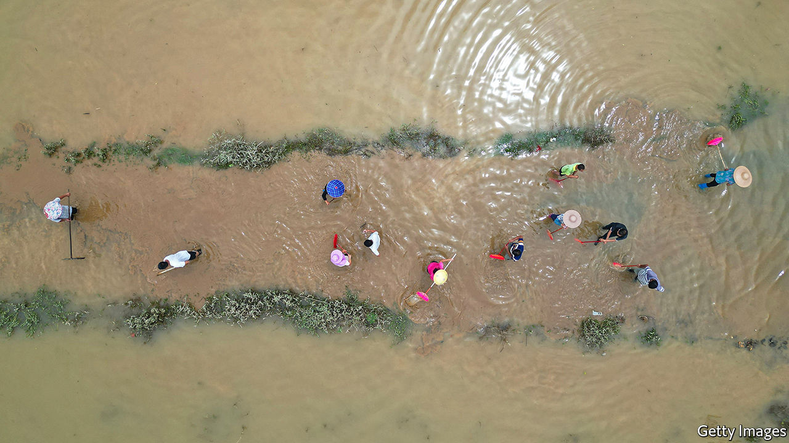

###### Above the water line

# Fewer people are dying in floods in China 

##### Money, dams and better planning are helping; climate change is not 

 

> Jul 7th 2022 

As the waters submerged her village’s ancestral shrine, Yu Jingyu and her family put their chickens upstairs and fled to the upper floor of their neighbour’s taller house. In the bamboo-clad hills of Yingde, in the southern province of Guangdong, locals say these are the worst floods they have ever seen. The nearby river has risen to its highest level since records began in 1951. “Everything is gone,” says Ms Yu, cradling her baby.

Yet there have been no reported deaths in Yingde in June and July, despite the severity of the flooding. This is telling. Between 1990 and 1999, there were more than 1,000 deaths across China from flooding and landslides every year and, in three of those years, more than 3,000. Since 2011 the toll has topped 1,000 only twice. Data are imperfect and the government tries to hide its failures. But experts agree that the downward trend in deaths from flooding is clear, even though overall levels of precipitation have remained steady and, for the past three years at least, there have been more “intense rain events”. 

There are a few reasons for this. First, the Communist Party has spent lavishly to respond to emergencies, especially since a devastating earthquake in 2008, says Scott Moore of the University of Pennsylvania. “High-profile disasters were perceived as being significant challenges to the Party’s ability to protect the people, which of course it claims to do,” he says. Political pressure means disaster response has become one of the few areas where government departments work well together, he says. Rescue efforts by heroic officials and soldiers also provide good propaganda.

The government has got much better at moving people to safety. In 2020’s rainy season, 4.7m people were evacuated from floods, nearly 50% more than the average of the previous five years. More accurate weather forecasts and fast communications are crucial. Villagers in Yingde were warned on WeChat, a ubiquitous messaging app, that a flood was coming and they should be ready to flee. 

The thousands of dams and dykes built over the past few decades are also life-savers. So many of them block China’s big rivers that officials are running out of good sites to build new ones. The infrastructure came with huge costs in concrete, forced resettlement and damage to the environment. But officials can now protect big cities by holding floodwaters upstream and staggering their release. Not everyone benefits. “The logic is to protect more populated regions,” says Ma Jun, an environmentalist. “But this may induce a cost upstream.” In Yingde some grumbled that their villages were used as a reservoir to protect Guangzhou, a city downriver.

Despite lower death tolls, China’s age-old battle against floods is likely to get harder as extreme weather becomes more common. China is “probably the most exposed of any large country or economy” to climate risks, says Mr Moore. For one thing, river dams do not protect against rising sea levels. More investment in building sea walls will be needed, he says. 

Upstream dams do not help much if enough rain falls directly on cities, overwhelming storm drains and sewers. Making cities more absorbent with parks and wetlands can help. China has invested billions of yuan in creating such “sponge cities”. But even these struggle to cope if rains are too intense, says Faith Chan of the University of Nottingham in Ningbo. Floods that killed around 400 last year in Zhengzhou, a showcase sponge city, came after a year’s worth of rain fell in three days. 

And although China has reduced deaths from rising waters, it is poorly prepared for the economic damage that they bring. Floods in 2021 caused $23bn in losses, second only to Europe. Only 10% of those losses were insured, according to estimates by Swiss Re, a reinsurance firm. In Europe, in contrast, 32% of losses from floods were insured last year. 

Ms Yu and others in Yingde say the floods have cost them tens of thousands of yuan. Most make around 3,000 yuan ($440) a month and few have insurance. What they do possess is the stoicism of the ages in the face of tragedy. “If there’s rice we’ll eat rice,” says one. “And if there’s just porridge, then we’ll eat porridge.” ■


